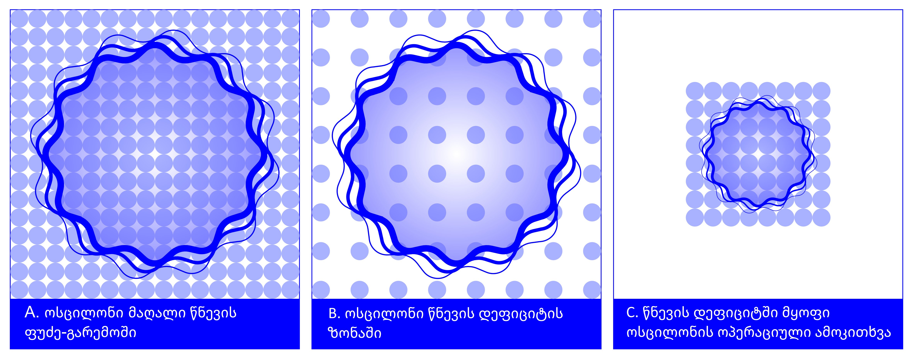

# რეფრაქციული გრავიტაცია: ონტოლოგიური სურათი და მათემატიკური ფორმალიზმის საფუძვლები

**ვერსია:** 3.3

**ავტორი:** გიორგი ლოთიშვილი

**აფილაცია:** აღმოსავლეთ ევროპის უნივერსიტეტის ასოცირებული პროფესორი

**ადგილმდებარეობა:** თბილისი, საქართველო, 2026 წ.

**ელფოსტა:** g_lotishvili@eeu.edu.ge

**Zenodo DOI:** [10.5281/zenodo.21325652](https://doi.org/10.5281/zenodo.21325652)

## სარჩევი

- წინასიტყვაობა
- შესავალი
- თავი I — ონტოლოგიური ფუძე
  - 1.1 ერთი ფუძე და მისი გამოვლენილი გარემო: სუბსტანცია, სიცარიელე და არსებობის დინამიკა
  - 1.2 ერთი არსებობიდან სიმრავლემდე: გაზომვადობისა და ოპერაციული სივრცის წარმოშობა
  - 1.3 კვანძური გადაცემა: ტალღა, დრო და თვითდაკალიბრება
  - 1.4 ლოკალური საერთო ტაქტი და რეზონანსული ჩაკეტვა
  - 1.5 ოსცილონი, წნევის დეფიციტი და მასის წარმოშობა
- თავი II — გრავიტაცია როგორც რეფრაქცია
  - 2.1 სამი ერთდროული ოპერაციული ცვლილება
  - 2.2 კვადრატული კავშირი და ფაქტორი 2
  - 2.3 რეფრაქციული მიზიდულობა, ინერცია და ხახუნის არარსებობა
  - 2.4 ლოკალური შეუმჩნევლობა და ფარდობითობის პრინციპი
  - 2.5 ისტორიული კონტექსტი და RefG-ის ადგილი
- თავი III — სამი მასშტაბი და კოსმოლოგიური ჰორიზონტები
  - 3.1 ლოკალური მასშტაბი: კომპაქტური ობიექტები, შინაგანი მდგომარეობა და გარე ამოკითხვა
  - 3.2 გალაქტიკური მასშტაბი: გრიგალური დინება და MOND
  - 3.3 კოსმოლოგიური მასშტაბი: ფუძის გაფართოება და მისი შინაგანი ამოკითხვა
  - 3.4 კვანტური შემთხვევითობა და ორდონიანი დრო
- თავი IV — ოსცილონები და მატერიის წარმოშობა
  - 4.1 ერთი ოკეანის მრავალი ნახაზი
  - 4.2 ლოკალიზებული თვითშეკავება: მასიანი და უმასო რეჟიმები
  - 4.3 თვითფორმირებადი რეზონატორები და ორდონიანი ფილტრი
  - 4.4 გლობალური რეზონატორი: მიკროსკოპული და მაკროსკოპული სპექტრების ერთიანობა
  - 4.5 დისკრეტულობა და თაობების $C_3$-სიმეტრია
- თავი V — ტოპოლოგია და კვანტური რიცხვები
  - 5.1 ფაზა, ორიენტაცია და ტოპოლოგიური კვანტიზაცია
  - 5.2 სპინი და ფერმიონული სტატისტიკა
  - 5.3 მუხტი, ფოტონი და ელექტრომაგნიტური არხი
  - 5.4 ფერის შეკავება და სამი თაობა
  - 5.5 სტანდარტული მოდელის გეომეტრიული რუკა
  - 5.6 ფუნდამენტური მუდმივები: $\alpha$ და გრავიტაციული იერარქია
- თავი VI — ეპილოგი: შემეცნების საზღვრები
  - 6.1 რატომ ერთი ფუძე და ერთი გამოვლენილი გარემო?
  - 6.2 სამი ოპერაციული ზღვარი
  - 6.3 მეთოდოლოგიური პრინციპი
  - 6.4 სად წყდება თეორიის გზა: ფალსიფიკაციის რუკა
- დასკვნა
- კვლევითი პროგრამის მიმდინარე სტატუსი
- ლიტერატურა

---

## წინასიტყვაობა

სამყაროს ჩვენ გარედან ვერ ვზომავთ. საათიც, სახაზავიც, სინათლეც და თავად დამკვირვებელიც მისი შემადგენელია. რეფრაქციული გრავიტაცია (RefG) სწორედ ამ ფაქტიდან იწყებს და სვამს კითხვას: რას დაინახავს სამყარო, რომელიც საკუთარ თავს საკუთარი მატერიით ზომავს? ამ კითხვიდან იშლება ერთი ფუძის, მისგან წარმოქმნილი გეომეტრიის, მატერიისა და დროის ერთიანი ონტოლოგიური სურათი. განსაზღვრულ დაბალენერგიულ ზღვარში იგივე რელაციური კოფრეიმი აინშტაინ–ჰილბერტის გეომეტრიას ატარებს, ხოლო ოსცილონური მოქმედების მკაცრი ვაკუუმის კვადრატული სექტორი მასზე თავისუფალ კომპლექსურ სკალარულ კვანტურ ველად იკითხება. ტექსტი აგებულია როგორც ინტუიციური მოგზაურობა; შესაბამისი ფორმალიზმი და გამოთვლები Zenodo-ს საჯარო სამეცნიერო არქივშია განთავსებული.

ნაშრომში წარმოდგენილი საკითხები განვითარების სხვადასხვა საფეხურზეა. ნაწილი ფორმალურადაა მიღებული და შემოწმებული, ნაწილი ფიზიკურად ჩამოყალიბებული კონსტრუქციაა, ნაწილი კი იმავე სურათიდან გახსნილი შემდგომი მათემატიკური მიმართულება. მათი ზუსტი და სრული სტატუსები თავმოყრილია ბოლო განყოფილებაში — „კვლევითი პროგრამის მიმდინარე სტატუსი“. ასეთი განაწილება თხრობას მთლიანობას უნარჩუნებს: იდეა სრულ კონტექსტში იკითხება, ტექნიკური საზღვრები კი ბოლოს ერთ ადგილას, მკაფიოდ ჩანს.

---

## შესავალი

თანამედროვე ფუნდამენტური ფიზიკა მონუმენტურ, თუმცა შინაგანად გაყოფილ არქიტექტურას ემყარება. ალბერტ აინშტაინის ზოგადი ფარდობითობა გრავიტაციას სივრცე-დროის დინამიკურ გეომეტრიად აღწერს. კვანტური ველის თეორია კი მატერიასა და ყალიბურ ძალებს უმეტესად წინასწარ მოცემულ ფონზე არსებულ ოპერატორულ აგზნებებად წარმოადგენს.

ორივე სვეტი ექსპერიმენტულად საოცარი სიზუსტითაა დადასტურებული. მათი ონტოლოგიური საწყისები მაინც სხვადასხვა ენაზე მეტყველებს: გრავიტაცია თავად ქმნის ფიზიკურ არენას, კვანტური თეორია კი დინამიკას წინასწარ განსაზღვრულ დროით პარამეტრზე აგებს.

ამ ფუნდამენტური გათიშულობის ზღვარზე თანამედროვე ფიზიკა გადაუჭრელი პრობლემების მთელ წყებას აწყდება:

1. **სინგულარობის პრობლემა:** შავი ხვრელებისა და კოსმოლოგიური საწყისის კლასიკური აღწერა გეოდეზიურ არასრულობამდე მიდის და მნიშვნელოვან შემთხვევებში სიმრუდის დივერგენციაც ახლავს; აქ კლასიკური აღწერის მოქმედების ზღვარი იკვეთება.
2. **ასტროფიზიკური და კოსმოლოგიური ანომალიები:** გალაქტიკების ბრუნვის მრუდები, რადიალური აჩქარების კანონზომიერება (RAR) და ტალი–ფიშერის კავშირი (BTFR) სტანდარტულ კოსმოლოგიურ მოდელში ბნელი მატერიის ჰალოებისა და ბარიონული გალაქტიკათწარმოქმნის ფიზიკის ერთობლიობით აიხსნება, ხოლო სამყაროს აჩქარებული გაფართოება — ვაკუუმური ენერგიის კოსმოლოგიური მუდმივით. ველის თეორიის პლანკურ ჭრამდე გულუბრყვილო გაგრძელებამ დაკვირვებით ვაკუუმურ სიმკვრივეს დაახლოებით 120 რიგით შეიძლება გადააჭარბოს.
3. **სტრუქტურული და იერარქიული გამოცანები:** კვანტური გაზომვის შემთხვევითობასა და დროის ისრის ბუნებას ერთიანი სტრუქტურული ახსნა აკლია; დამუხტულ ლეპტონთა და კვარკთა მასების მკვეთრი იერარქია, უგანზომილებო მუდმივების (მათ შორის $\alpha \approx 1/137$) მნიშვნელობები და გრავიტაციული ძალის უკიდურესი სისუსტე ელექტროსუსტ მასშტაბთან შედარებით ($M_{\rm Pl}/v_{\rm EW} \sim 10^{17}$) კი სტანდარტულ პარადიგმაში დაუკავშირებელ ემპირიულ მონაცემებად შემოდის.

ფიზიკის ისტორია გვიჩვენებს, რომ განცალკევებული პარადოქსები ხშირად უფრო ღრმა საერთო საფუძვლის კვალს ატარებს. აინშტაინი სიცოცხლის ბოლომდე ცდილობდა ელექტრომაგნეტიზმისა და მატერიის გეომეტრიულ გაერთიანებას. ჯონ არჩიბალდ უილერი სამყაროს გეომეტრიისა და ინფორმაციის საზღვარზე იკვლევდა და ამ ძიებას ორი ძლიერი ფორმულა მისცა — „მასა მასალის გარეშე“ (*Mass without Mass*) და „არსი ბიტიდან“ (*It from Bit*) (Wheeler 1955, 1990).

ანდრეი სახაროვმა გრავიტაცია ვაკუუმის კვანტური ფლუქტუაციებიდან აღმოცენებულ ელასტიკურ ეფექტად წაიკითხა (Sakharov 1967). ტედ იაკობსონმა აინშტაინის განტოლებები ლოკალური ჰორიზონტების თერმოდინამიკური მდგომარეობის განტოლებიდან გამოიყვანა (Jacobson 1995). ერიკ ვერლინდემ მიზიდულობა ჰოლოგრაფიულ ენტროპიულ ძალად წარმოადგინა (Verlinde 2011), როჯერ პენროუზმა კი სივრცე-დროის მიზეზობრივი სტრუქტურა გრავიტაციულ კოლაფსს სინგულარობის თეორემით დაუკავშირა (Penrose 1965).

ეს მიდგომები განსხვავებულ მათემატიკურ ენებს იყენებს, მაგრამ მათ ერთი საერთო ფუნდამენტური კითხვა აერთიანებს: **შესაძლებელია თუ არა, რომ სამყაროს მთელი მრავალფეროვნება — სივრცე, დრო, გრავიტაცია და ნაწილაკთა სპექტრი — ერთი პირველადი ონტოლოგიური სუბსტანციის დინამიკური გამოვლინება იყოს?**

წინამდებარე ნაშრომი ამ კითხვას **რეფრაქციული გრავიტაციის (RefG)** ერთიანი ცნებითი და ონტოლოგიური ჩარჩოთი პასუხობს.

### ოპერაციული საწყისი და სამი ფუნდამენტური პრინციპი

ფიზიკის ტრადიციული ენა, როგორც წესი, უკვე აგებული საზომი აპარატით იწყება: გლუვი კოორდინატები, დროითი ღერძი და ველთა ოპერატორები წინასწარ მოცემულ საწყისებად მიიჩნევა. RefG-ის ამოსავალი კითხვა პერსი ბრიჯმენის მკაცრ ოპერაციონალიზმს უფრო პირველად დონეზე აგრძელებს (Bridgman 1927): *სანამ სივრცეზე, დროზე ან მასაზე ვისაუბრებდეთ, რა ფიზიკური პროცესი ქმნის თავად იმ ლოკალურ განსხვავებებს, რომელთა საფუძველზეც საზომი სახაზავები და საათები ფუნქციონირებს?*

1905 წელს აინშტაინმა დროის აბსოლუტურობა უარყო და ერთდროულობა საათებითა და სინათლის სიგნალებით ოპერაციულად განმარტა (Einstein 1905). RefG ამ ოპერაციულ კითხვას კიდევ უფრო პირველად დონეზე სვამს: **რა ფიზიკური მექანიზმი აყალიბებს თავად იმ სტაბილურ საათს, მატერიალურ ნაწილაკსა და ტალღურ სიგნალს, რომლებსაც ეს გაზომვები ეფუძნება?**

ამ კითხვაზე პასუხად, RefG სამ ფუნდამენტურ პოსტულატს აყალიბებს:

1. **მონისტური ონტოლოგიური ფუძე:** ბუნებაში არსებობს მხოლოდ ერთი უნივერსალური, წინასივრცითი და წინასაათური ფუძე. მისი რეზონანსული თვითგარჩევა წარმოშობს გამოვლენილ გარემოს, რომლის ფაზური, წნევითი, ძვრითი, ბრუნვითი და ტოპოლოგიური რეჟიმებიც ელემენტარულ ველებად, ძალებად და ნაწილაკებად იკითხება.
2. **მატერიის ოსცილონური ბუნება:** სტაბილური მასიანი მატერიალური ერთეული წარმოადგენს *ოსცილონს* — გამოვლენილი გარემოს ლოკალურად თვითშეკავებულ, თვითშენარჩუნებად არაწრფივ ტალღურ სტრუქტურას. უმასო გადამტანი რეჟიმები იმავე გარემოს თავისუფლად გავრცელებადი ტალღებია. ოსცილონის ინტენსიური შინაგანი რხევა გარემოში სტატიკური წნევის დეფიციტის მდგრად პროფილს ქმნის.
3. **გრავიტაცია როგორც ეფექტური რეფრაქცია:** ოსცილონური მატერია გარემოში არაერთგვაროვან წნევით დეფიციტს აყალიბებს. ეს დეფიციტი ეფექტურ გეომეტრიას ამრუდებს, ხოლო სინათლისა და მატერიის ტალღური ფორმები ამ გეომეტრიაში რეფრაქციულად იხრება. გრავიტაციული მიზიდულობა ამგვარად სივრცის გამრუდების ფიზიკურ მექანიზმად იკითხება. რელაციურ-კოფრეიმულ აღწერაში წნევითი დეფიციტი სრული ადგილობრივი გეომეტრიის მოცულობითი სკალარული ამოკითხვაა. სიმეტრიული ფორმა და ძვრა გრავიტაციის ტენზორულ აგებულებას განსაზღვრავს, ხოლო ჩარჩოს ორიენტაცია ინერციული ყალიბური თავისუფლებაა.

### ლორენც-ინვარიანტობა და ისტორიული პარადიგმა

1887 წლის მაიკელსონ–მორლის ცნობილმა ექსპერიმენტმა დედამიწის მოძრაობით მოსალოდნელი „ეთერული ქარი“ ვერ აღმოაჩინა და მე-19 საუკუნის უძრავი, მატერიისგან დამოუკიდებელი „ლუმინიფერული ეთერის“ მოდელი მკაცრად შეზღუდა (Michelson & Morley 1887). RefG-ის ფუძე-გარემო სხვა ონტოლოგიურ კლასს ქმნის: საზომი ხელსაწყოები, დამკვირვებელი და თავად სინათლე ერთი გარემოს კოლექტიური ტალღური აგზნებებია.

როდესაც დამკვირვებელი და მისი საზომი აპარატი ერთი გარემოსგანაა ნაქსოვი, თანაბარი გადატანითი მოძრაობა ტალღური ფორმის სიმეტრიული ფაზური ტრანსლაციაა. ლორენც-კოვარიანტულ განშტოებაზე ეს მოძრაობა უდანაკარგოდ მიმდინარეობს და „ეთერულ ქარს“ არ ტოვებს. ასე იძენს ლორდ კელვინის „გრიგალური ატომების“ ინტუიცია თანამედროვე არაწრფივი ტალღური დინამიკის ენას (Thomson 1867): **მატერია თავად გარემოს ორგანიზებული მოძრაობის ფორმაა.**

### ნაშრომის რვა საყრდენი

ეს ტექსტი RefG-ის ონტოლოგიურ ხერხემალს აგებს და Zenodo-ში წარმოდგენილ გამოთვლით ფორმალიზმს ფიზიკურ შინაარსს უკავშირებს. გარემოსეული გაერთიანების მოდელებს ცნობილი წინამორბედები ჰყავს, მათ შორის ფრიდვარდტ ვინტერბერგის პლანკის ეთერის მოდელი (Winterberg 2002). RefG-ის გამორჩეული საწყისია თავად გაზომვადობის დაბადება და მატერიის მდგრადობის პოპულაციური რეზონანსული მექანიზმი.

RefG-ის ერთიანი სურათი რვა საყრდენზე დგას:

1. **დროის დაბადება და ოსცილონთა საერთო ტაქტი:** RefG-ის გენეზისის სცენარში დრო მთელ ფუძეს მომცველი უცენტრო გადასვლით იწყება. პირველი გარჩევადი ფარდობები ქმნის მოვლენათა რიგს; მათგან წარმოქმნილ ქსელში კი ოსცილონური ჩანასახები და შემდგომ სტაბილური მატერია ყალიბდება. ადგილობრივი წნევის ცვლილება ნაწილაკურ სპექტრს საერთო $\Omega_t$-ტაქტით გადააწყობს, ხოლო ოსცილონთა შინაგანი აგებულება უგანზომილებო $s_i$ ნიშნებსა და მათ ფარდობებში ინახება.
2. **მასის ორარხიანი აღრიცხვა:** ოსცილონის შინაგანი ტოპოლოგიური მდგომარეობა მის შენახვად ენერგეტიკულ მარაგს აღწერს; გარედან ამოკითხული გრავიტაციული მასა კი გარემოში შექმნილი წნევითი დეფიციტის ინტეგრალური პასუხია. ამ ორი არხის გამიჯვნა ერთი და იმავე ენერგიის ორმაგ დათვლას გამორიცხავს.
3. **ბიკონფორმული $p/p^2$ მასშტაბური კანონი და სრული 1PN პასუხი:** ადგილობრივი სახაზავის გარე კვალი, გარედან ამოკითხული მასა და საათის ტემპი $p$-ს მიჰყვება, სინათლის კოორდინატული სიჩქარე კი $p^2$-ს. სტატიკურ, სფეროსიმეტრიულ სუსტ ველში ეს გეომეტრია $\gamma=1$-ს იძლევა; კანონიკური გრადიენტული წევრით, გაუსისეული პროფილის მქონე აქტიურ წყაროსთან ხაზოვანი ბმითა და დამატებითი დაუთრგუნავი წევრის გარეშე ლოგარითმული პასუხი $u=-\ln p$ ასევე იძლევა $\beta=1$-ს. პოსტგენეზისური რელაციურ-კოფრეიმული მოქმედების შესაბამის დაბალენერგიულ კლასში TEGR-ის კოეფიციენტები მიიღება, ტორსია–სიმრუდის ზუსტი იგივეობა კი მოქმედებას აინშტაინ–ჰილბერტის ფორმად გარდაქმნის. სრული 1PN პირობების შესრულებისას მიიღება სტანდარტული PPN ვექტორი.
4. **ერთი კოფრეიმი გრავიტაციისა და თავისუფალი კვანტური მატერიისთვის:** ოსცილონის ამპლიტუდა–ფაზის არაწრფივი მოქმედების ვაკუუმური კვადრატული სექტორი იმავე რელაციურ კოფრეიმზე ზუსტად იღებს თავისუფალი კომპლექსური კლაინ–გორდონის მოქმედების ფორმას. ფიქსირებულ მინკოვსკურ განშტოებაზე ამ კვადრატული სექტორის სტანდარტული კანონიკური კვანტიზაცია წარმოქმნის ბოზონური ფოკის სივრცის დადებითი ენერგიის ნაწილაკურ და ანტინაწილაკურ სექტორებს, შენახვად გლობალურ ფაზურ მუხტსა და მიკრომიზეზობრიობას; თავისუფალ აგზნებებს აქვთ მასა $m$ და სპინი $0$. ამგვარად, აინშტაინ–ჰილბერტის გეომეტრია და სტანდარტული თავისუფალი კვანტური მატერია ერთ ოპერაციულ გეომეტრიაზე თავსდება.
5. **კოიდეს $C_3$ ფაზური სტრუქტურა:** დამუხტულ ლეპტონთა ($e,\mu,\tau$) მასების კვადრატული ფესვების სამფაზა რუკა კოიდეს $K=2/3$ იგივეობას ზუსტად აღადგენს, როცა $A_K=\sqrt2$. RefG ამ გეომეტრიას მეცხრე რიგის დაბრუნების ციკლის შესაძლო ანარეკლად კითხულობს, სადაც $h=2$ ფაზურ კუთხეს $\theta=2/9$ განსაზღვრავს.
6. **ნაზი სტრუქტურის მუდმივის ($\alpha$) კვანძური ბუნება:** $\alpha \approx 1/137$ RefG-ში ერთი კვანძური ქსელის ელექტრული ნაკადისა და ფოტონის განივი პასუხის უგანზომილებო თანაფარდობად იკითხება. საერთო გარდაქმნისას ორივე არხი ერთად იცვლება და მათი ფარდობა უცვლელი რჩება.
7. **გენეზისი, ფუძის გაფართოება და შინაგანი ამოკითხვა:** პირველი გარჩევადი ფარდობები დროს იწყებს; რეზონანსული გადაბმა ქსელს აკავშირებს; სტაბილური მატერია, გამოსხივება და ხანგრძლივი მოდუნება შემდგომ ფაზებში ყალიბდება. პოსტგენეზისურ რეალიზაციაში ფუძის კვანძთაშორისი მასშტაბის ზრდა $P_F$-ს ამცირებს, წნევის კლება კი მატერიალურ $p$-მასშტაბს. ნეიტრალური კოლექტიური ფაზური მუხტი გაფართოებულ სამგანზომილებიან მოცულობაში ნაწილდება: მისი შენახვა იძლევა $\eta_Fa^3=1$-ს, ხოლო ერთგვაროვანი მდგომარეობითი კავშირები — $P_F/P_{F,0}=a^{-3}$, $p=a^{-3/2}$ და $A=a/p=a^{5/2}$ თანაფარდობებს. შესაბამისად, შინაგანად გაზომილი $A$ ერთმნიშვნელოვნად აღადგენს ნორმირებულ ფარდობით მასშტაბებს: $a=A^{2/5}$, $p=A^{-3/5}$ და $\eta_F=A^{-6/5}$. $p_C$ და $P_F$ სხვადასხვა ფიზიკური სიდიდეა; მათი მდგომარეობითი კავშირი ფუძის მიკროფიზიკას ეკუთვნის. იდეალურ ერთგვაროვან ფონზე $A$ წითელ წანაცვლებას, სიგნალის დროით გაწელვასა და გეომეტრიულ მანძილებს ერთ პასუხში აერთიანებს.
8. **ერთი სპექტრული ოპერატორის ორი ამოკითხვა — ცენტრალური ჰიპოთეზა:** ერთიანი მოცულობითი რეზონატორის (ჰელმჰოლცის/ლაპლასის ტიპის) საკუთარი ფუნქციების მოკლეტალღოვანი მოდები იკითხება როგორც მიკროსკოპული ნაწილაკური რეჟიმები, ხოლო გრძელტალღოვანი მოდები — როგორც კოსმოსური ქსელისა და გალაქტიკათა გროვების მაკროსკოპული სტრუქტურა.

### ისტორიული ხაზი და პრიორიტეტის საზღვრები

RefG-ის თითოეულ რგოლს მყარი კავშირი აქვს თეორიული ფიზიკის დამკვიდრებულ მემკვიდრეობასთან:

- $p/p^2$ მასშტაბური კანონი ენათესავება რობერტ დიკესა და ჰაროლდ პუტჰოფის პოლარიზებადი ვაკუუმის (PV) მიდგომებს (Dicke 1957; Puthoff 2002); RefG მას კვანძთა ქსელის ონტოლოგიასა და მასის ორარხიან ბალანსს უკავშირებს.
- კოიდეს სამფაზა გეომეტრიული წაკითხვა აგრძელებს კარლ ბრანენისა და რობერტ ფუტის ხაზს (Brannen 2010; Foot 1994), ხოლო $2/9$-ის ჰოლონომიური წარმოშობა კონსტანტინ შულგას მიერ შესწავლილ ჩაკეტილ ოჯახურ ციკლებს ეხმიანება (Shulga 2026). RefG ამ სტრუქტურას აერთიანებს $\theta$-სიბრმავის არგუმენტთან და 3D მოცულობითი რეზონატორის $C_3$-სიმეტრიასთან.
- ფონური წნევის მოდუნებისა და $\Lambda$-ს შესაძლო მიკროსკოპული წარმოშობის ისტორიულ მოტივაციას ფრანს კლინკჰამერისა და გრიგორი ვოლოვიკის $q$-თეორია აძლევს (Klinkhamer & Volovik 2008); RefG შერჩეული განშტოების ფონურ დინამიკას აინშტაინ–ჰილბერტის გეომეტრიულ ენაში წერს. სივრცის სამგანზომილებიანობის მოტივაცია კვანძთა ტოპოლოგიური ჩახლართვისა და სტაბილურობის კვლევებს უკავშირდება (Whitrow 1955; Berera et al. 2017).

RefG ამ ცალკეულ ხაზებს ერთ უწყვეტ მიზეზობრივ სისტემად აერთიანებს: გაზომვადობის ოპერაციული დაბადებიდან და ოსცილონური მასიდან — გალაქტიკურ გრიგალურ დინებამდე და კოსმოლოგიურ ჰორიზონტებამდე.

ტექსტი მკითხველს სთავაზობს, გაჰყვეს ამ ლოგიკურ ჯაჭვს და დაინახოს, როგორ იშლება ერთიანი ფიზიკური ინტუიციიდან თანამედროვე ფუნდამენტური ფიზიკის ფართო პანორამა.

---

## თავი I — ონტოლოგიური ფუძე

### 1.1 ერთი ფუძე და მისი გამოვლენილი გარემო: სუბსტანცია, სიცარიელე და არსებობის დინამიკა

თანამედროვე ფუნდამენტური ფიზიკა სამყაროს განსხვავებულ, ურთიერთქმედ კვანტურ ველთა სისტემად აღწერს. სტანდარტული მოდელი ამ ველებს საერთო ყალიბური სიმეტრიებით, შინაგანი თავისუფლების ხარისხებითა და ურთიერთქმედების წესებით აერთიანებს. რეფრაქციული გრავიტაცია (RefG) ამ მრავალფეროვნების ქვეშ ერთ ფუნდამენტურ პრინციპს ხედავს: **ბუნებაში არსებობს ერთი უნივერსალური, წინასივრცითი ონტოლოგიური ფუძე.** მისი რეზონანსული თვითგარჩევა წარმოშობს გაზომვად, მრავალარხიან გარემოს. სხვადასხვა ფუნდამენტური ველი, ყალიბური ძალა და ელემენტარული ნაწილაკი ამ გამოვლენილი გარემოს ტოპოლოგიურ, ფაზურ, წნევით, ძვრითა და ბრუნვით რეჟიმებად იკითხება. შემდგომ ტექსტში „ფუძე-გარემო“ ფუძის ამ თვითგარჩეულ, ფიზიკურად გამოვლენილ მდგომარეობას აღნიშნავს.

ამგვარ მონისტურ ხედვას თეორიული ფიზიკის ისტორიაში ღრმა ფესვები აქვს. ჯერ კიდევ 1870 წელს, უილიამ კინგდონ კლიფორდმა გამოთქვა შორსმჭვრეტელი ჰიპოთეზა, რომ მატერია სივრცის სიმრუდის მცირე, მოძრავი „ბორცვებია“ (Clifford 1876). RefG ამ გეომეტრიულ ინტუიციას ფიზიკურ მექანიზმს მატებს: თვითგარჩეული გარემო გეომეტრიულ რეაქციასთან ერთად წნევით, ძვრით, ჰიდროდინამიკურ და რეზონანსულ არხებსაც ატარებს.

ერთიანი მატარებლიდან განსხვავებული ნაწილაკური და ყალიბური რეჟიმების აღმოცენების მკაფიო თეორიულ პრეცედენტს მაიკლ ლევინისა და სიაო-გან ვენის *string-net* კონდენსაციის მოდელი იძლევა (Levin & Wen 2005). ამ მიდგომაში კოლექტიური მრავალნაწილაკური ჩახლართულობა ყალიბური ბოზონებისა და ფერმიონული აგზნებების სტრუქტურულ ანალოგებს წარმოქმნის. ლევინ-ვენის მოდელი უკვე წინასწარ სტრუქტურირებული კვანტური გისოსით იწყება; RefG კი იმავე გამაერთიანებელ პოტენციალს ერთი უნივერსალური, წინასივრცითი ფუძის თვითგარჩევას უკავშირებს.

როდესაც სამყაროს ერთიან უწყვეტ გარემოდ ვიაზრებთ, მისი დინამიკის მინიმალური სურათი ორ ასიმპტოტურ ზღვარს მოითხოვს:

1. **სუბსტანციის აბსოლუტური მაქსიმუმი:** ზღვრული მდგომარეობა, სადაც წნევა, მასა-ენერგიის პოტენციალი და ოპერაციული სიმკვრივე მაქსიმალურია;
2. **ნულოვანი გარჩევადობის ზღვარი:** მდგომარეობა, სადაც ურთიერთქმედება და ფიზიკური გაზომვადობა ქრება.

ეს „სიცარიელე“ ლოგიკური ზღვარია, სადაც ფიზიკური გარჩევადობა ნულს უტოლდება. ობიექტური ფიზიკური რეალობა სწორედ ამ ორ პოლუსს შორის მიმდინარე შეზღუდული, არაწრფივი რხევითი დინამიკაა, რომელშიც ფუძის ლოკალური სტაბილური ერთეულები — „არსებობის კვანძები“ — ყალიბდება.

საყრდენი ფონი $\varphi=0$ ამ ორ უკიდურეს ზღვარს შორის მდებარე მშვიდი, მაგრამ ფიზიკურად აქტიური მდგომარეობაა. ნულოვანი გარჩევადობის ზღვარზე კვანძური ურთიერთქმედება და გაზომვადი კვალი ქრება; $\varphi=0$ კი უკვე გამოვლენილი გარემოს შეუშფოთებელ მდგომარეობას აღნიშნავს.

გამოვლენილი გარემოს ონტოლოგიურ ერთიანობას მრავალარხიანი სტრუქტურული სიმდიდრე ახლავს. მას შეუძლია შეიკუმშოს (მოცულობითი წნევა), განიცადოს გრეხვა (ტოპოლოგიური გრეხვა), ჩამოაყალიბოს გრიგალური დინება (ცირკულაცია) და გაატაროს განივი ტალღური აგზნება. ინტუიციისთვის წყლის ჰიდროდინამიკური ანალოგია გამოდგება: ერთი და იგივე სითხე ერთდროულად ატარებს იზოტროპულ წნევას, გრიგალურ ნაკადს, ძვრის ძაბვასა და ზედაპირულ ტალღებს. RefG-ის თვითგარჩეული გარემოც ფაზურ, წნევით, ძვრით და ტოპოლოგიურ პასუხებს აერთიანებს; სწორედ ამ მრავალარხიან დინამიკაზე შენდება ელექტრული მუხტის, სპინისა და ნაწილაკთა რთული სპექტრის ფორმირება.

ფუძე-გარემოს შეუშფოთებელი, მშვიდი მდგომარეობა, რომელსაც ფორმალურად $\varphi=0$-ით აღვნიშნავთ, ფუძის ფონური ვაკუუმური რეჟიმია. ფუძე ყველგანმყოფია; ლოკალურად იცვლება მხოლოდ მისი აგზნების ხარისხი, გარჩევადი კვანძების ოპერაციული სიმკვრივე და მათ შორის კავშირის სიძლიერე. კვანძებს შორის ოპერაციულად გაუზომავი შუალედების ზრდა ფუძეს აიშვიათებს და მის წნევით მდგომარეობას ამცირებს.

აქ „წნევა“ RefG-ის ეფექტური წნევით-ენერგეტიკული მდგომარეობის ცვლადია. $\varphi=0$ შეუშფოთებელ ფონს აღნიშნავს. მის ზემოთ $\varphi>0$ მომატებული წნევით-ენერგეტიკული განშტოებაა (კომპრესია), მის ქვემოთ კი $\varphi<0$ — დეფიციტური განშტოება (გაიშვიათება). გრავიტაციული ამოკითხვის ჯაჭვი დეფიციტური განშტოების გრადიენტულ პროფილზე იგება. კლასიკური ბერნულის წნევა ამ ენერგეტიკული ცვლადის უშუალო ფიზიკური ანალოგიაა: გარე დამკვირვებელი $\varphi$-ს ლოკალურ ცვლილებას დროის ტემპის შენელებად, სიგნალის კოორდინატული გავრცელების შეფერხებად, ობიექტის ოპერაციული ზომის ცვლილებად და ეფექტურ გრავიტაციულ მასად კითხულობს.

---

### 1.2 ერთი არსებობიდან სიმრავლემდე: გაზომვადობისა და ოპერაციული სივრცის წარმოშობა

RefG-ის გენეზისის პოსტულატით, ფუძის საწყისი მდგომარეობა სრულად გაურჩეველია: ცვლილება, მოვლენათა რიგი, ხანგრძლივობა და გეომეტრია ჯერ არ წარმოქმნილა. სამყაროს დაბადება პირველი ფიზიკური მოვლენაა და დროის ათვლის საწყისიც აქ ჩნდება.

RefG-ის სამყაროს წარმოშობის ყველაზე თანმიმდევრული სცენარი მთელ ფუძეს მომცველი უცენტრო გადასვლაა. ეს ერთი საერთო საწყისი პირობაა და გამორჩეული სივრცითი ცენტრი არ აქვს. სივრცე, ფიზიკური მანძილი, გავრცელების სიჩქარე და „გარე მხარე“ მნიშვნელობას მხოლოდ ამ გადასვლის შედეგად წარმოქმნილი კავშირების შემდეგ იძენს.

ამ საზღვარზე ფუძე პირველ მინიმალურად გარჩევად ფარდობებს წარმოქმნის. აქ იწყება მოვლენათა რიგი და დროის ორი ათვლა, $t=0$ და $\tau=0$. გარჩევად კავშირთა საწყისი ფენა არსებობის მინიმალური ქსელია; მატერიალური ნაწილაკები და სტაბილური ოსცილონები მის შემდგომ განვითარებაში ყალიბდება.

პირველ კავშირებზე არაწრფივი რეჟიმები ოსცილონურ ჩანასახებად ლოკალიზდება. მათი რეზონანსული ველები კავშირთა ფენაზე ვრცელდება და ერთმანეთს გადაეფარება. გარჩევადობის ფიზიკური ზღვრის გადალახვისას ეს გადაფარვა განცალკევებულ ოპერაციულ უბნებს ერთ ქსელად აბამს. ამგვარად მიზეზობრივი რიგი იწყება პირველი კავშირით და გრძელდება ლოკალიზაციითა და ქსელის გადაბმით. ადგილობრივი ჩაკეტვა და გლობალური გადაბმა შეიძლება ნაწილობრივ თანადროულიც იყოს; მათ ზუსტ მიმდევრობას რეზონანსული დინამიკა და გადაბმის ფიზიკური ზღვარი განსაზღვრავს.

გენეზისის სურათი სამყაროს ურთიერთდაკავშირებული ქსელის სახით წარმოაჩენს, რომელსაც საზღვარი და გამორჩეული ცენტრი არ აქვს. სასრული პერიოდული გრაფი ამ წყობის მარტივ მათემატიკურ ხატს იძლევა: ქსელი სასრული და დაკავშირებული რჩება ისე, რომ არც ერთი კვანძი უნიკალურ ცენტრად არ გამოიყოფა. ფიზიკური სამყაროს განზომილებასა და ტოპოლოგიას თავად ფუძის კავშირთა აგებულება განსაზღვრავს.

საწყისი კოჰერენტული მდგომარეობის ენერგია ოსცილონურ ჩანასახებში, მათ რეზონანსულ ველებში, თავისუფალ ტალღებში, თერმულ სექტორსა და ფუძის საერთო დეფორმაციაში ნაწილდება. უწყვეტობის კანონი ენერგიის სექტორულ განაწილებასა და მათ შორის ნაკადებს ერთ მთლიან ბალანსში აღრიცხავს; ერთი სექტორის დანაკარგი მეორის მიღებად იკითხება. ამ განაწილების ფიზიკურ მიმართულებას ფაზური ენერგიები და მდგომარეობის განტოლება განსაზღვრავს. ყინულის „დნობა“ სწორედ ამ გარდაქმნის ინტუიციური სახეა.

პირველი კოლექტიური ცვლილება ფუძის თვითგარჩევას იწყებს. ოპერაციული სივრცე გაზომვადი ხდება, როდესაც კვანძებს შორის მდგრადი ფარდობა მინიმალური გარჩევადობის ზღვარს $\ell_*$ აღწევს. ორ გარჩევად კვანძს შორის შუალედი სივრცის ფიზიკური ჩანასახია. კავშირისა და სიგნალის გადაცემის დაყოვნება გაზომვად ხანგრძლივობას ქმნის, ხოლო თვითგარჩევის ლოკალური ენერგეტიკული დაძაბულობა — მასის ონტოლოგიურ ჩანასახს. ამ დაძაბულობის მიერ გარემომცველ ფუძეში შექმნილი დეფიციტური პროფილის ინტეგრალური პასუხი მოგვიანებით გრავიტაციულ მასად იკითხება.

ფიზიკური აზრი ყოველთვის შედარებას მოითხოვს. ონტოლოგიურ საწყისთან სამი განუყოფელი ელემენტი იკვეთება:

- **კვანძი:** ფუძის ლოკალურად გარჩევადი, დისკრეტული მდგომარეობა;
- **კვალი:** ენერგეტიკული და ფაზური ცვლილება, რომელსაც კვანძი გარემომცველ ფუძეში ტოვებს;
- **ფარდობა:** ერთი ლოკალური მდგომარეობის მეორესთან ოპერაციული შედარების შესაძლებლობა.

ამ ფუნდამენტური სამეულიდან იშლება მთელი ოპერაციული ქსელი, რომელსაც მაკროსკოპულ ენაზე სივრცეს, დროსა და მატერიას ვუწოდებთ.

სრულად გაურჩეველი ფუძე ერთი განუყოფელი პირველადი იდენტობაა. მისი რეზონანსული თვითგარჩევა პირველ შენარჩუნებულ განსხვავებას აჩენს; ამავე ზღვარზე იბადება რაოდენობა და დათვლა. გარჩევადი გამოვლინებები ცალკეულ ფიზიკურ ერთეულებად იკითხება, თუმცა ფუძე ნაწილებად არ იშლება — სიმრავლე ერთი იდენტობის მდგრადი, ურთიერთგარჩეული მდგომარეობებისგან ყალიბდება.

გაზომვის პირველადი ერთეული შენარჩუნებული ფარდობაა. სრულად გაურჩეველ მდგომარეობაში შედარების მეორე წევრი არ არსებობს. თვითგარჩევა იმავე ფუძის ორ გარჩევად მდგომარეობასა და მათ შორის პირველ კავშირს წარმოშობს; სწორედ აქ იწყება დათვლა, სივრცე და მოვლენათა მიმართებითი რიგი.

ინფორმაციულ ენაში პირველი შენარჩუნებული განსხვავება ბიტის ანალოგია: გარჩევადი კვალი „1“-ად იკითხება, მოცემულ ფარდობაში მისი არყოფნა კი — „0“-ად. ამ ორი ნიშნის მრავალგვარი წყობა რთულ სტრუქტურებს ქმნის, ისევე როგორც ფუძის ურთიერთგარჩეული მდგომარეობები ქმნის გაზომვადი სამყაროს მრავალფეროვნებას.

ერთი და იმავე ნივთის სხვადასხვა დროს სხვადასხვა ადგილას ყოფნა ამ სურათის მარტივი ხატია. თუ მის მთელ გზას დროით ნიშნებს მოვაშორებთ, ერთ იდენტობას მრავალ ადგილას განფენილი კვალი ექნება. RefG ამ ინტუიციას წინასივრცით დონემდე ავითარებს: ფუძის მდგრადი თვითგანსხვავებები თავად წარმოშობს ადგილებს, რომელთა დათვლა და შედარებაც შესაძლებელი ხდება. პირველადი ფუძე დროის გარეთ განიხილება, გაზომვადი სამყაროს ასაკი კი მისგან წარმოქმნილ მოვლენათა რიგს ეკუთვნის.

ამ ხედვას დამკვირვებლის ბუნების გასააზრებლად გადამწყვეტი მნიშვნელობა აქვს. დამკვირვებლები და მათი საზომი ხელსაწყოები თავად წარმოადგენენ ამავე კვანძური ქსელისგან აგებულ რთულ, კომპოზიტურ ტალღურ სტრუქტურებს. ეს მიდგომა აღრმავებს პერსი ბრიჯმენის ოპერაციონალიზმის კლასიკურ პრინციპს, რომლის თანახმადაც ყოველი ფიზიკური ცნება მისი გაზომვის ოპერაციათა ერთობლიობით განისაზღვრება (Bridgman 1927). RefG ამ პრინციპს ონტოლოგიურ საფუძველს უდებს: იგი იკვლევს იმ ფიზიკურ პირობას, რომელიც თავად ამ საზომი ოპერაციების არსებობას ხდის შესაძლებელს.

გაზომვადი სამყარო ფუძე-გარემოს თვითგარჩევის უწყვეტ პროცესად იკითხება. ჩვენი ოპერაციული სივრცე სწორედ ამ გარჩევადობის კვალზე აღმოცენდება. ამ კვალის მიღმა უნივერსალური ფუძე შეიძლება კვლავაც არსებობდეს, მაგრამ როგორც ფიზიკური ობიექტი, იგი ვლინდება მხოლოდ იქ, სადაც ოპერაციულ, გაზომვად შედეგს ტოვებს.

ფუძის კვანძებს შორის აბსოლუტური მანძილი პირდაპირ არ იზომება, რადგან დამკვირვებელს გარემოს გარედან მოქმედი აბსოლუტური სახაზავი არ აქვს. გაზომვადია მხოლოდ კვანძთაშორისი შუალედის ოპერაციული კვალი. ოპერაციული სივრცე მაშინ იბადება, როდესაც მინიმუმ ორ კვანძს შორის ფარდობა ფიზიკურად გარჩევადი ხდება. ამ ზღვარს ქვემოთ განსხვავება ფუძის ლოკალურ შიდა მდგომარეობად რჩება; ზღვრის გადალახვის შემდეგ კი დროის ტემპის, ოპერაციული ზომის, მასისა და სიგნალის გავრცელების ცვლილებად იკითხება.

RefG ბუნებაში მინიმალური ოპერაციული გარჩევადობის დინამიკურ ზღვარს შემოაქვს, რომელსაც $\ell_*$-ით აღვნიშნავთ. ამ სურათში:

- $\ell_*$-ზე მცირე მასშტაბზე დამოუკიდებელი გაზომვადი ფარდობა ჯერ არ იბადება (ინფორმაცია გაურჩეველია);
- $\ell_*$ მასშტაბზე ჩნდება პირველი მდგრადი, ფიზიკურად გარჩევადი ჩანაწერი;
- $\ell_*$-ზე დიდ მასშტაბებზე კვანძთაშორისი შუალედი წნევის, დროის ტემპისა და სიგნალის გავრცელების ოპერაციული ნიშნებით იკითხება.

ამ ზღვრის ფიზიკური მოტივია მდგრადი ჩანაწერისთვის აუცილებელი სასრული გარჩევადობა. პლანკის სიგრძე $\ell_{\rm Pl} = \sqrt{\hbar G/c^3}$ ფუნდამენტური მუდმივებისგან აგებული განზომილებიანი მასშტაბია, ხოლო $\ell_*$ — მდგრადი ოპერაციული ჩანაწერის წარმოქმნის დინამიკური ზღვარი. მათ შორის კავშირს ფუძის მიკროსკოპული დინამიკა განსაზღვრავს.

სამყაროს ონტოლოგიური საწყისი სრულად გაურჩეველი პირველადი ფუძე-მდგომარეობაა. გეომეტრიული წერტილი უკვე ფორმირებული სივრცის ცნებაა; ორი გარჩევადი წერტილი და მათ შორის განფენილობა კვანძთაშორისი ოპერაციული შუალედის წარმოქმნასთან ერთად იბადება. ფუძე-გარემოში აღმოცენებული ასიმეტრია სტაბილურ კვალს ტოვებს, ფარდობა ამოკითხვადი ხდება და ამავე მოვლენაში ჩნდება მრავლობითობაც და გეომეტრიაც.

ზუსტად ამ ზღვარზე იკვეთება გრავიტაციის პირველადი ფიზიკური არსი: როდესაც ფუძე-გარემოს წნევით მდგომარეობას სივრცითი გრადიენტი აქვს, საათის ტაქტი, ობიექტის ოპერაციული ზომა და სიგნალის კოორდინატული გავრცელება შეთანხმებულად იცვლება და ეს ცვლილება გრავიტაციულ გეომეტრიად იკითხება. ერთგვაროვანი ცვლილება საერთო ფონურ თვითდაკალიბრებას ქმნის; სხეულის აჩქარებასა და რეფრაქციულ გადახრას კი სწორედ სივრცითი არაერთგვაროვნება წარმოქმნის.

---

### 1.3 კვანძური გადაცემა: ტალღა, დრო და თვითდაკალიბრება

ფუძის საწყისი თვითგარჩევა გარჩევად კავშირთა მინიმალურ ფენას წარმოშობს. თითოეული კვანძი ერთი და იმავე ფუძის ფუნქციური, ურთიერთგარჩეული მდგომარეობაა: იგი ინახავს ცვლილების კვალს და მეზობელ კვანძს გადასცემს. შემდგომი გადაცემა და, გარჩევადობის ზღვრის გადალახვისას, ოსცილონური ჩანასახების რეზონანსული ველების გადაფარვით წარმოქმნილი გადაბმა ამ ფენას ერთიან ქსელად აერთიანებს. ფიზიკური გადაბმების მდგრადი წყობიდან იბადება სივრცითი სიახლოვე და ოპერაციული მანძილი.

ტალღა ამ ქსელში მდგომარეობისა და ფაზის თანმიმდევრული გადაცემაა. სინათლე თავისუფლად გავრცელებული განივი ფაზური კვალია, ოსცილონი კი — იმავე გადაცემის ლოკალურად თვითშეკავებული, თვითშენარჩუნებადი ფორმა. მატერიის გადაადგილებისას ეს ლოკალიზებული ფორმა კვანძიდან კვანძამდე გადაიცემა და ახალ ადგილას იმავე ფაზურ მთლიანობას აღადგენს. სინათლე და მატერია ერთი გარემოს გავრცელებადი და ლოკალიზებული რეჟიმებია.

ფუძის პირველი მთლიანი თვითგარჩევა მოვლენათა პირველ რიგს ქმნის და დროს იწყებს. უკვე წარმოქმნილ ქსელში ყოველი მომდევნო გადაცემა ამ რიგს აგრძელებს. განმეორებადი ფაზური ფარდობები პროცესულ ტაქტს აყალიბებს, მდგრადი ოსცილონური ციკლების შედარება კი საათით გაზომვას შესაძლებელს ხდის. დროის ლოკალური ტემპი ქსელის კოლექტიური რიტმია: რამდენად სწრაფად გადასცემს გარემო მდგომარეობას და რამდენად სწრაფად ასრულებს ოსცილონი საკუთარ ციკლს.

ამ მექანიზმის ნათელ ანალოგიას ორმაგი მინის თბური იზოლაცია გვაძლევს. შუალედური აირის გაიშვიათება მოლეკულურ შეჯახებებსა და სითბოს გადაცემის ტემპს ამცირებს. RefG ამ ინტუიციას კვანძურ გარემოზე ავრცელებს და გადაცემის ტემპს კვანძთა სიმჭიდროვესა და მათ შორის გადაბმის სიძლიერეს უკავშირებს.

დამკვირვებლის სხეული, საათი, სახაზავი, სინათლე და მატერია ამავე გარემოს რეჟიმებია. დეფიციტურ ზონაში კვანძთა სიმჭიდროვე, გადაცემის ტემპი, ოსცილონური ციკლი და ოპერაციული ზომა შეთანხმებულად იცვლება. ადგილობრივი საზომებიც იმავე მდგომარეობასთან ერთად გადაეწყობა, ამიტომ საკუთარ ერთეულებში დამკვირვებელი ჩვეულებრივ ტემპს, ჩვეულებრივ ზომასა და სინათლის უცვლელ ლოკალურ სიჩქარეს კითხულობს; სხვადასხვა გარემოში გავლილი პროცესების შედარება კი დროის, ზომისა და მასის სხვაობას გამოავლენს.

ფიზიკურად დასაშვებ დაბალენერგიულ განშტოებაზე ეს გადაცემა იზოტროპულია, უდანაკარგოა და ლორენცის სიმეტრიას იცავს: სინათლის ლოკალური სიჩქარე უცვლელი რჩება, თანაბარი მოძრაობა კი ხახუნის კვალს არ ტოვებს.

---

### 1.4 ლოკალური საერთო ტაქტი და რეზონანსული ჩაკეტვა

დროის დაბადება და ლოკალური საერთო ტაქტის ჩამოყალიბება ორი სხვადასხვა საფეხურია. RefG-ის გენეზისის სურათში დრო ფუძის პირველ მთლიან თვითგარჩევასთან იწყება. ლოკალური საერთო ტაქტი მოგვიანებით ყალიბდება, როდესაც სტაბილური მატერიალური ოსცილონების საკუთარი სიხშირეები ერთმანეთის მიმართ ფიქსირებულ, მდგრად ფარდობებში დგება. ამ კოლექტიურ მდგომარეობაში დროის ტემპს ლოკალური ქსელის შიდა კოორდინაცია და არაწრფივი ურთიერთჩაკეტვა განსაზღვრავს (კურამოტოს ტიპის სინქრონიზაციის მსგავსად).

ტონი და საათი კავშირთა ქსელთან ერთად იბადება. ჩამოყალიბებული გარემო აკუსტიკური ინსტრუმენტის მსგავსად იქცევა — ვიბრირებად მოცულობით რეზონატორად, რომლის კავშირის ოპერატორი და სასაზღვრო პირობები დაშვებული რეჟიმების სპექტრს განსაზღვრავს. ამ რეზონატორის სამგანზომილებიანობა RefG-ის ფიზიკური რუკის ნაწილია.

თვალსაჩინოებისთვის ზარის ანალოგია გამოდგება: ზარის ჟღერადობა ერთიანი ელასტიკური სხეულის საკუთარ მოდებში იბადება, რომლებიც ერთობლივ თანაჟღერადობაში — ჰარმონიულ და ანჰარმონიულ კავშირში — დგება. ანალოგიურად, ელემენტარული ნაწილაკების სიხშირეები ფუძის საერთო დინამიკაში ურთიერთბალანსითა და კოორდინაციით იკვრება. უნივერსალური ფუძე განსაზღვრავს დაშვებული მოდების სივრცეს, ხოლო ნაწილაკური რეჟიმები ამ სივრცეში ერთმანეთს აბალანსებენ და მდგრად, რეზონანსულად ჩაკეტილ წყობას ქმნიან.

წნევითი მდგომარეობა კოორდინატულ დროში ქსელის საერთო ტაქტს ცვლის. ამ ტაქტს $\Omega_t(x)$-ით აღვნიშნავთ; ინდექსი $t$ გვახსენებს, რომ ეს სიხშირე ფუძის კოორდინატული დროის ერთეულზე ითვლება. წნევასთან შეთანხმებული საერთო პასუხი იწერება

$$
\frac{\Omega_t(x)}{\Omega_{t,0}}=p(x), \qquad d\tau=p\,dt.
$$

აქ $\tau$ მატერიალური პროცესებით ამოკითხული პროცესული დროა. ამიტომ $p$-ის კლება ნიშნავს, რომ იგივე კოორდინატულ $t$-შუალედში ნაკლები მატერიალური ციკლი სრულდება. ადგილობრივი დამკვირვებელი საკუთარ $\tau$-საათს იყენებს და მის უშუალო გარემოში ნორმალურ ტაქტს კითხულობს; განსხვავება მხოლოდ სხვადასხვა წნევით გარემოსა თუ ეპოქას შორის შედარებისას ჩნდება.

ოსცილონის შინაგანი გეომეტრია მის მდგრად მოდებს უგანზომილებო სტრუქტურული ნიშნებით $s_i$-ით არჩევს. საერთო-ტაქტიანი ნაწილაკური სურათი ამ მოდებს შემდეგი სახით აერთიანებს:

$$
\nu_i^{(t)}(x)=s_i\,\Omega_t(x), \qquad
\nu_i^{(\tau)}=\frac{\nu_i^{(t)}}{p}.
$$

$s_i$ ოსცილონის შინაგან სპექტრულ აგებულებას ეკუთვნის, $\Omega_t$ კი გარემოს კოორდინატულ ტაქტს. საერთო წნევითი ცვლილება მთელ სპექტრს ერთი ფაქტორით გადააწყობს; პროცესული საათი ამ საერთო ცვლილებას ადგილობრივად აკომპენსირებს. ნაწილაკურ განსხვავებებს $s_i$ ნიშნები და მათი უცვლელი ფარდობები ინახავს.

დაბალი წნევის რეგიონში კოორდინატული ტაქტი $\Omega_t$ მცირდება. მკვრივ, მაღალწნევიან ფუძეში კვანძთაშორისი გადაცემა უფრო ხშირია; გაიშვიათებულ ფუძეში კავშირი და კოორდინატულ დროში მიმდინარე მატერიალური პროცესები ნელდება.

კვანძთაშორისი სიგნალის გადაცემის შეფერხება, ფუძის წნევით-ენერგეტიკული მდგომარეობის დაქვეითება და $\Omega_t$-ის შენელება ერთი ქსელური მდგომარეობის სამი ამოკითხვაა. რაოდენობრივ მიზეზობრივ ჯაჭვში თითოეული მათგანი მხოლოდ ერთხელ შედის.

ადგილობრივი საათები და ატომური პროცესები გარემოსთან ერთად გადაიწყობა, ამიტომ დამკვირვებელი საკუთარ ტაქტს ადგილობრივად ნორმალურად კითხულობს. საერთო გარდაქმნა უგანზომილებო ფარდობებს ინარჩუნებს; ნაზი სტრუქტურის მუდმივის დაკვირვებითი მდგრადობა ამ პრინციპის ერთ-ერთი ყველაზე მკაცრი გამოცდაა. ნაწილაკთა მასური ფარდობების ფიზიკური წყარო ამ სურათში ოსცილონების შინაგან $s_i$-სპექტრში მდებარეობს.

ამ რელაციური მიდგომის ისტორიული წინამორბედია ერნსტ მახის ცნობილი პრინციპი (Mach 1883). RefG მახის პრინციპს ლოკალურ, დინამიკურ ფორმას აძლევს: დროის საერთო ტაქტს უშუალოდ ადგილობრივი რეზონანსული ქსელის კოლექტიური მდგომარეობა განსაზღვრავს, ხოლო შორეული მასების გავლენა ამ ლოკალურ მდგომარეობაში უნდა აისახოს. ფარდობითი ბუნება და ლოკალური მიზეზობრიობა ერთი და იმავე ადგილობრივი ქსელის თვისებებია.

RefG-ის სურათში ნაზი სტრუქტურის მუდმივა $\alpha \approx 1/137$ ფუძის კვანძური ქსელის ელექტრულ ნაკადსა და ფოტონის განივ პასუხს შორის ინვარიანტულ უგანზომილებო ფარდობად იკითხება. საერთო გარდაქმნის რეჟიმში იგი ადგილობრივი წნევის ცვლილებისას უცვლელი რჩება.

ახლა განვიხილოთ ტალღური სიგნალი, რომელიც ფუძის ერთი წნევითი რეჟიმიდან მეორეში — მაგალითად, გრავიტაციული ჭიდან შორეულ დამკვირვებლამდე — ვრცელდება. ფოტონი ოპერაციულ $A=a/p$ გეომეტრიას მიჰყვება, ხოლო მიმღები მის ფაზურ ტაქტს საკუთარ ადგილობრივ ატომურ ეტალონს ადარებს. იდეალურად გამჭვირვალე გავრცელების რეჟიმში ეს შედარება იძლევა $\omega_o/\omega_e=A_e/A_o$-ს და, შესაბამისად, $1+z=A_o/A_e=(a_o/p_o)/(a_e/p_e)$. სიგნალისა და ატომური ეტალონის საერთო წნევითი პასუხი უკვე $A$-გეომეტრიაშია მოქცეული, ხოლო მიღებული ფაზური თანაფარდობა ყოველ რეგიონში ადგილობრივ $\Omega_t$-ტაქტზე ითარგმნება.

საბოლოოდ, RefG-ის ჩარჩოში დროის ტემპი ლოკალური რეზონანსული ქსელის ონტოლოგიური მდგომარეობაა. გარემოს წნევის ცვლილებისას ქსელი და მასთან თავსებადი ყველა პროცესი საერთო ფაქტორით იცვლება, მათი უგანზომილებო ფარდობები კი უცვლელი რჩება. ყოველი რეალური გაზომვა ერთი და იმავე ფიზიკური ქსელის შიგნით სრულდება; ამიტომ დროის ფიზიკურ შინაარსს სწორედ ამ ქსელში მიმდინარე პროცესები ქმნის.

ამ პრინციპის მკაცრი ემპირიული გამოცდა უგანზომილებო ფარდობების მდგრადობაა: **ლოკალური წნევის ცვლილებასთან სანდოდ დაკავშირებული არანულოვანი $\Delta\alpha/\alpha$ პოპულაციური საერთო ტაქტის პოსტულატს უარყოფს.**

---

### 1.5 ოსცილონი, წნევის დეფიციტი და მასის წარმოშობა

RefG ელექტრონს, პროტონსა და კვარკს **ოსცილონურ რეჟიმებად** კითხულობს. ოსცილონი უნივერსალურ ფუძე-გარემოში ლოკალურად თვითშეკავებული, თვითშენარჩუნებადი, არაწრფივი ტალღური სტრუქტურაა — თავად გარემოს მაღალორგანიზებული, კოჰერენტული რხევითი მდგომარეობა.

ამ კონცეფციის ისტორიული წინამორბედია ლორდ კელვინის (უილიამ ტომსონის) „გრიგალური ატომების“ ჰიპოთეზა (Thomson 1867). მე-19 საუკუნის მექანიკური ეთერისგან აქ რჩება ერთი ძლიერი ინტუიცია: ნაწილაკი გარემოს თვითშეკავებული, დინამიკური ტოპოლოგიური ფორმაა. ოსცილონის კონცეფცია ამ იდეას თანამედროვე არაწრფივი ველის თეორიისა და ტოპოლოგიის ენაზე ავითარებს.

როდესაც ოსცილონი ინტენსიურად ირხევა, ბრუნავს ან საკუთარ ლოკალიზებულ გეომეტრიაში ენერგიას აკავებს, მის გარშემო ფუძე-გარემოს სტატიკური წნევა კანონზომიერად ეცემა. ამ მოვლენას დანიელ ბერნულის კლასიკური ჰიდროდინამიკური ბალანსი თვალსაჩინო ანალოგიას აძლევს (Bernoulli 1738): **სტაციონარული ნაკადის შესაბამის პირობებში დინამიკური წვლილის ზრდას სტატიკური წნევის კლება ახლავს.** RefG-ის სუსტ, სტატიკურ გრავიტაციულ განშტოებაზე ამ ანალოგიას წნევით-ენერგეტიკული ბალანსის სქემატური კავშირი შეესაბამება:

$$
\Delta P \propto -\rho_{\rm dyn}.
$$

ოსცილონი თავისი შინაგანი რხევით გარემომცველ ფუძეში წნევის სტატიკური დეფიციტის მდგრად გრადიენტულ პროფილს ქმნის. RefG-ის რუკაში ეს **გრავიტაციული მასის გარე პროფილია**: მისი მოცულობითი ინტეგრალური ამოკითხვა სისტემის სრულ გრავიტაციულ მუხტს იძლევა. რაც უფრო ინტენსიურია ოსცილონის შინაგანი დინამიკა, მით უფრო ღრმაა მის ირგვლივ შექმნილი დეფიციტი და ძლიერია რეფრაქციული გრადიენტი. ოსცილონის შინაგანი ენერგეტიკული მარაგი კი ცალკე, დამოუკიდებელ არხად აღირიცხება.

ოსცილონის ლოკალიზებული ბირთვი ლოკალურია, მისი რხევითი კვალი კი მთელ დაკავშირებულ გარემოში ვრცელდება. წყაროსთან ფაზურად ჩაკეტილი და დამყარებული ნაწილი მდგრად გრავიტაციულ პროფილს ქმნის და წმინდა გამავალ ენერგეტიკულ ნაკადს არ მოითხოვს. წყაროს სწრაფი გადაწყობისას ამავე არხიდან გამოყოფილი შეთანხმებული რხევა გარეთ გავრცელებად გრავიტაციულ ტალღად იქცევა და ენერგია გადააქვს.

დეფიციტის ადგილობრივი სიღრმე და სისტემის შორიდან ამოკითხული სრული მასა სხვადასხვა სიდიდეა. პირველი ცენტრალურ გრადიენტსა და კომპაქტურობას აღწერს; მეორე კი აქტიურ ბირთვს, გარემოსეულ შემოსვას, შეკრულობის წვლილსა და გამოსხივებულ ენერგიას ერთ ასიმპტოტურ ბალანსში აერთიანებს. ამიტომ შერწყმის შემდეგ დეფიციტი შეიძლება გაღრმავდეს, მაშინ როცა ნარჩენის შორიდან ამოკითხული სრული მასა გამოსხივებული ენერგიის შესაბამისად მცირდება.

ფიზიკის ისტორიაში ამ ხედვას ცნობილი პარალელი აქვს — ჯონ არჩიბალდ უილერის „მასა მასალის გარეშე“ (*Mass without Mass*) კონცეფცია, სადაც გეონი საკუთარი გრავიტაციული და ელექტრომაგნიტური ველის ენერგიით შეკავებულ მასიურ წარმონაქმნს წარმოადგენს (Wheeler 1955). უილერის კლასიკური გეონები არასტაბილურია და ენერგიას თანდათან ასხივებს; RefG ოსცილონის მდგრადობას ტოპოლოგიური მუხტის შენახვას, რეზონანსულ ჩაკეტვასა და $Lk = Wr + Tw$ ტოპოლოგიურ ინვარიანტს უკავშირებს.

აქედან გამომდინარე, ტერმინი „ეფექტური რეფრაქციული მასა“ ($m_{\rm eff}$) აღნიშნავს მოცემულ ფონურ გარემოში ერთეული ოსცილონის გარედან ამოკითხულ გრავიტაციულ მასას. ფონის ნელი ცვლილებისას ოსცილონის ტოპოლოგიური სტრუქტურა, შინაგანი ენერგია და ფაზური ფარდობები იდენტობას ინარჩუნებს, ხოლო მისი ოპერაციული ზომა და გარედან ამოკითხული მასა გარემოს ახალ მდგომარეობას მიჰყვება. სწრაფი გადაწყობა ცალკე დინამიკური პროცესია და ენერგიას სხვა თავსებად არხებში ანაწილებს. სისტემის სრული ასიმპტოტური მასა ცალკე ინტეგრალურ ამოკითხვას ეკუთვნის და ერთეული ოსცილონის $m_{\rm eff}$-ისგან ავტომატურად არ მიიღება. ამ გამიჯვნით, მასის წარმოშობა გარემოს რეფრაქციული პასუხის ჩამოყალიბებად იკითხება.

ამ ფუნდამენტურ დონეზე, **გრავიტაციული მიზიდულობა არის ერთი ოსცილონის ტალღური ფორმის რეფრაქციული გარდატეხა მეორე ოსცილონის მიერ შექმნილ წნევით დეფიციტში.** გრავიტაციული ჭის თვალსაჩინო მოდელია მოშვებული სიმი: ფუძის ლოკალურად დაქვეითებული წნევით-ენერგეტიკული მდგომარეობა ტალღის გავრცელების ეფექტურ პირობებს ასუსტებს. დეფიციტური პროფილი გარემოს ეფექტურ გეომეტრიას აყალიბებს; სხივურ ზღვარში სინათლისა და მატერიის ტალღური პაკეტების ფაზური ტრაექტორიები ამ მეტრიკის შესაბამის ნულოვან და დროისებურ გეოდეზიურებს მიჰყვება.

ამგვარად ყალიბდება ორმხრივი დინამიკური უკუკავშირის სურათი: **ოსცილონი თავისი რხევით ქმნის წნევით დეფიციტს, ხოლო ეს დეფიციტი უკუკავშირით განსაზღვრავს მის ეფექტურ მასას, ოპერაციულ ზომასა და გარემოში გავრცელების ტრაექტორიას.** მატერია ცვლის გარემოს წნევით მდგომარეობას, ხოლო შეცვლილი გარემო კარნახობს მატერიას რეფრაქციული მოძრაობის გეომეტრიას.

---

## თავი II — გრავიტაცია როგორც რეფრაქცია

### 2.1 სამი ერთდროული ოპერაციული ცვლილება

ფუძე-გარემოს კვანძთაშორისი შუალედი სამყაროს შიგნიდან მისი ფიზიკური კვალით იკითხება. ოსცილონის ირგვლივ ეს კვალი წნევითი მდგომარეობის ლოკალური დაქვეითებაა: გარჩევადი კვანძების სიმჭიდროვე მცირდება და მათ შორის ინფორმაციული თუ ტალღური გადაცემა ნელდება. მაკროსკოპული დამკვირვებელი ამ ერთ მდგომარეობას სამი ურთიერთშეთანხმებული ცვლილებით აღრიცხავს:

1. **სინათლის კოორდინატული სიჩქარის შენელება:** წნევის დეფიციტის ზონაში კვანძები გაიშვიათებულია და მათ შორის ურთიერთქმედების ტემპი ეცემა, რის გამოც სინათლისა და ნებისმიერი სხვა უმასო ტალღური სიგნალის გავრცელება კოორდინატულ აღწერაში შენელებულია. ლოკალურად გაზომილი სინათლის სიჩქარე ადგილობრივი დამკვირვებლისთვის ყოველთვის ინვარიანტულია ($c$); იცვლება მხოლოდ შორეული დამკვირვებლის კოორდინატულ ენაში ამოკითხული ეფექტური გავრცელების ტემპი.
2. **ოსცილონის ოპერაციული ზომის შემცირება:** ოსცილონის ფუნდამენტური ტოპოლოგიური ფორმა უცვლელი რჩება, თუმცა გაიშვიათებულ ფუძე-გარემოში მას ურთიერთქმედებადი კვანძების ნაკლები მოცულობითი სიმკვრივე ავსებს. გარე აღწერაში ეს ოსცილონის შემცირებულ ოპერაციულ ზომად და შეცვლილ ეფექტურ მასად იკითხება.
3. **ლოკალური რეზონანსული საათის ტემპის კლება:** ნებისმიერი რეალური საათი ოსცილონური სისტემებისგან (ატომებისგან, მოლეკულებისგან) არის აგებული და მისი რხევითი ტაქტი ლოკალურ კვანძურ კავშირებზეა დამოკიდებული. გაიშვიათებულ გარემოში ეს კავშირი სუსტდება, რის გამოც შორეული დამკვირვებლის კოორდინატულ დროში საათის ტემპი იკლებს. ამავდროულად, თავად ადგილობრივი საათი საკუთარ ტაქტს ჩვეულებრივად, უცვლელად ითვლის.

თვალსაჩინო ანალოგიას ორმაგკედლიანი თერმოსის გაიშვიათებული შუალედი გვაძლევს: გადამტანი მოლეკულების სიმცირე შეჯახებათა სიხშირეს აკლებს და სითბოს გადაცემას ანელებს. RefG-ის რუკაში ამას კვანძური კავშირის სიძლიერესა და საათის კოორდინატულ ტემპს შორის დამოკიდებულება შეესაბამება.

ეს სამი ცვლილება ერთი დაქვეითებული წნევითი მდგომარეობის ურთიერთშეთანხმებული ოპერაციული ამოკითხვაა. მათი რაოდენობრივი კავშირი ბიკონფორმული გეომეტრიის საფუძველს ქმნის.



*ნახ. 1. სქემატური საილუსტრაციო გამოსახულება: ოსცილონის ოპერაციული ამოკითხვა წნევის დეფიციტის ზონაში.*

- **(A)** დეფიციტურ ზონასთან შედარებით უფრო მაღალი წნევის შეუშფოთებელ ფუძე-გარემოში ოსცილონი შედარებით მკვრივ კვანძურ წყობაშია მოთავსებული; კვანძებს შორის კავშირი ძლიერია და ლოკალური პროცესები უფრო მაღალი კოორდინატული ტემპით მიმდინარეობს.
- **(B)** წნევის დეფიციტის ზონაში ფუძის კვანძები გაიშვიათებულია; კვანძთაშორისი ოპერაციული დაშორება იზრდება, კავშირის ტემპი იკლებს და ლოკალური დროის მსვლელობა ნელდება.
- **(C)** გარე ამოკითხვაში წნევის დეფიციტში მყოფი ოსცილონი შენელებული დროით, შემცირებული ოპერაციული ზომითა და შეცვლილი ეფექტური მასით იკითხება; გაზრდილი შიდა შუალედი კი პირდაპირ გაზომვად სიდიდედ არ შემოდის.

კვანძთაშორისი შუალედი ფუძე-გარემოს შინაგანი მიმართებაა. მაკროსკოპულ აღწერაში მისი ზრდა წნევითი მდგომარეობის დაქვეითებად იკითხება; სწორედ ეს არის ფუძის გაიშვიათების ოპერაციული კვალი.

---

### 2.2 კვადრატული კავშირი და ფაქტორი 2

კვადრატული კავშირი ერთი ადგილობრივი ეტალონის ორი კოორდინატული ამოკითხვიდან ჩნდება. ადგილობრივი სახაზავის გარე კვალი და საათის კოორდინატული ტაქტი ორივე $p$-ით იცვლება. საათის კოორდინატული პერიოდი, შესაბამისად, $p^{-1}$-ს მიჰყვება; ამიტომ სახაზავის ერთი მონაკვეთისა და საათის ერთი პერიოდის შეფარდებით განსაზღვრული სინათლის კოორდინატული სიჩქარე $p/(p^{-1})=p^2$-ით იცვლება.

თუ წნევით ფაქტორს $p$-თი აღვნიშნავთ, ეს ბიკონფორმული მასშტაბური კანონი შემდეგი სახით ჩაიწერება:

$$
\frac{L_{\rm coord}}{L_0} = \frac{m_{\rm eff}}{m_0} = \frac{\Omega_t}{\Omega_{t,0}} = p, \qquad \frac{c_{\rm coord}}{c_0} = p^2, \qquad p = e^{\varphi/2}.
$$

აქ $L_{\rm coord}$ ადგილობრივი სახაზავის კვალს აღნიშნავს შორეულ, ასიმპტოტურ კოორდინატთა ბადეზე. საკუთარ გარემოში დამკვირვებელი მას კვლავ ერთ უცვლელ ერთეულად კითხულობს. საათის კანონი იძლევა $d\tau=p\,dt$-ს, ხოლო სახაზავის დაკალიბრება — $d\ell=p^{-1}d\sigma$-ს. ამიტომ დროითი მეტრიკული კოეფიციენტი $p^2$-ია, სივრცული — $p^{-2}$, ნულოვანი სიგნალის კოორდინატული სიჩქარე $p^2c_0$ გამოდის, იმავე ადგილობრივი საათითა და სახაზავით აღდგენილი სინათლის სიჩქარე კი ზუსტად $c_0$ რჩება.

მსგავსი ხარისხობრივი დამოკიდებულება ისტორიულად რობერტ დიკესა და ჰაროლდ პუტჰოფის პოლარიზებადი ვაკუუმის (PV) მოდელებშიც გვხვდება (Dicke 1957; Puthoff 2002). RefG ამ ხარისხებს კვანძებისა და მათ შორის კავშირების ფუნდამენტურ ონტოლოგიურ გამიჯვნას უკავშირებს.

ფორმალურ ენაში, ერთეული ოსცილონის გარე, მაკროსკოპული ამოკითხვა ფუძის წნევითი დეფიციტის პროფილს $e^{\varphi/2}$ ექსპონენციალური კავშირით უკავშირდება:

$$
m_{\rm eff} = m_0 e^{\varphi/2}.
$$

დეფიციტურ განშტოებაზე $\varphi < 0$, ამიტომ წნევითი ფაქტორი $0 < p < 1$ ინტერვალშია. ეს ფორმულა მოცემულ არაერთგვაროვან ფონში მოთავსებული ერთეული ოსცილონის ლოკალურ გარე ამოკითხვას აღწერს: $\varphi$-ს გაღრმავებასთან ერთად მისი ოპერაციული ზომა და $m_{\rm eff}$ მცირდება. დეფიციტის წარმომქმნელი მთელი მასიური სისტემის სრული გრავიტაციული მუხტი მოცულობითი ინტეგრალური ამოკითხვით განისაზღვრება. ეს კავშირი თეორიის პირველი რიგის ბიკონფორმული განშტოებიდან გამომდინარეობს.

აქ ოთხი ფიზიკური სიდიდე მკაცრად ცალ-ცალკე უნდა გაიმიჯნოს:

1. **ოსცილონის შინაგანი მდგომარეობა და საკუთარი ენერგია** ($M_{\rm proper}$);
2. **მოცემულ ფონში ერთეული ოსცილონის ეფექტური რეფრაქციული მასა** ($m_{\rm eff}$);
3. **ფუძე-გარემოში შექმნილი წნევითი დეფიციტის წყაროს პროფილი** ($M_{\rm active}$);
4. **სრული სისტემის ასიმპტოტური გრავიტაციული მუხტი** (ADM/Komar-ის ტიპის მასა: Arnowitt, Deser & Misner 1962; Komar 1959).

ეს ოთხი სიდიდე აღრიცხვის ორ დონეს ქმნის. პირველი ოსცილონის შინაგან მარაგს გარემოში ამოკითხული წილისგან არჩევს. მეორე გარედან ამოკითხულ მასას აქტიურ ბირთვსა და გარემოსეულ შემოსვას უკავშირებს. ასიმპტოტურ საზღვარზე ეს წვლილები ერთ მუხტში იკრიბება და ერთი დეფიციტური კვალი ერთხელ ითვლება.

ამ რთული, თვითშეთანხმებული დინამიკისთვის თვალსაჩინო ფიზიკური ანალოგია არსებობს: **წარმოიდგინეთ სუფთა წყალში ჩაშვებული ფერადი ყინულის კრისტალი.** კრისტალი თავად იმავე წყლის ლოკალურად გაყინული, შეკრული ფორმაა — ზუსტად ისევე, როგორც ოსცილონი წარმოადგენს ერთიანი ფუძე-გარემოს ლოკალურ რეზონანსულ ჩაკეტვას. დნობისას ფერი ფართო გარემოში ნაწილდება, ხოლო ლოკალიზებული კრისტალი მცირდება. ფერის გავრცელება აქ ორგანიზებული მდგომარეობის ლოკალური კვანძიდან გარემოსეულ კვალში გადანაწილებას განასახიერებს.

რაც უფრო ფართოდ ნაწილდება რეზონანსული კვალი, მით მეტად იცვლება ლოკალური წნევა, გარედან ამოკითხული მასა, ოპერაციული ზომა, საათის კოორდინატული ტაქტი და სინათლის კოორდინატული სიჩქარე. წნევისა და $p$-ის კლება შემდგომ რეზონანსულ გადაბმას ასუსტებს და მოდუნებას უარყოფითი უკუკავშირით ანელებს. ერთგვაროვან ფონზე ეს პროცესი ასიმპტოტურად უახლოვდება სრულად მოდუნებულ საზღვარს.

ამ $p/p^2$ მასშტაბურ კანონს ბიკონფორმული მეტრიკული ფორმალიზმი შეესაბამება:

$$
ds^2 = e^\varphi c^2 dt^2 - e^{-\varphi} d\boldsymbol{\sigma}^2, \qquad \varphi = -\frac{2U}{c^2},
$$

სადაც $U > 0$ არჩეული ექსპონენციალური განშტოების გრავიტაციული პოტენციალია და წამყვან რიგში ნიუტონური პოტენციალის მოდულს ემთხვევა. სუსტი ველის ზღვარში ($U/c^2 \ll 1$) მეტრიკის კომპონენტები ტეილორის მწკრივად იშლება:

$$
g_{00} = e^\varphi \approx 1 - \frac{2U}{c^2} + \frac{2U^2}{c^4} + \cdots, \qquad g_{ij} = -e^{-\varphi}\delta_{ij} \approx -\left(1 + \frac{2U}{c^2} + \cdots\right)\delta_{ij}.
$$

საერთო საათ–სახაზავის ლექსიკონი ბიკონფორმულ მეტრიკასა და მის პირველ სივრცულ პასუხს ადგენს. მასიური წყაროს პროფილს სტატიკური ფუნქციონალი განსაზღვრავს სამი მკაფიო პირობით: პასუხი ადიტიური და ლოგარითმულია, $u=-\ln p$; გრადიენტული წევრი კანონიკურია; გაუსისეული პროფილის მქონე აქტიურ წყაროსთან ბმა ხაზოვანია. ამ პირობებში ფუნქციონალის ვარიაცია, ასიმპტოტური საზღვარი და გაუსის მუხტი $u=GM/(c^2r)$ პროფილს იძლევა.

ამ სტატიკურ, სფეროსიმეტრიულ სუსტ-ველის აღწერაში მეტრიკის პირველი პოსტნიუტონური (1PN) გაშლა იძლევა პარამეტრიზებული პოსტნიუტონური ფორმალიზმის (PPN) კოეფიციენტებს:

$$
\beta = 1, \qquad \gamma = 1.
$$

$\gamma=1$ საერთო საათ–სახაზავის პასუხის პირველი რიგის გეომეტრიული შედეგია. ლოგარითმული პასუხის მეორე რიგი $\beta=1$-ს იძლევა. ამგვარად, $\gamma$ უშუალოდ საერთო ოპერაციული გეომეტრიიდან მოდის, ხოლო $\beta$ ფუძის მიკროდინამიკასა და $u=-\ln p$ პასუხს შორის ზუსტ ხიდს ეყრდნობა.

#### რელაციური კოფრეიმი, აინშტაინ–ჰილბერტის გეომეტრია და სრული 1PN

ამ ქვეთავის კოვარიანტული განტოლებები მეტრიკის $(-+++)$ სიგნატურაში იწერება; წინა ბიკონფორმული ჩანაწერი $(+---)$ სიგნატურას იყენებს.

სტატიკური $p$-პროფილი სრული გეომეტრიის მოცულობით სკალარულ პროექციას გვიჩვენებს. ადგილობრივი გეომეტრიის სრული მდგომარეობა **რელაციური კოფრეიმით** $e^A{}_\mu$ აღიწერება — ადგილობრივი ჩარჩოს ერთფორმათა (1-ფორმათა) სისტემით, რომელიც მოცულობას, ფორმას, ძვრას, ორიენტაციასა და დროით მიმართულებას აერთიანებს. კოფრეიმი ერთ ოპერაციულ მეტრიკას განსაზღვრავს:

$$
g_{\mu\nu}=\eta_{AB}e^A{}_\mu e^B{}_\nu.
$$

კოფრეიმის სივრცე-დროითი ორიენტაცია და ოსცილონის შიდა სამღერძიანი აგებულება სხვადასხვა ფიზიკური სტრუქტურებია; ნაწილაკურ რუკაში ფერი მეორეს უკავშირდება. მეზობელი კოფრეიმების შედარებას ბრტყელი, მეტრიკასთან თავსებადი ინერციული კავშირი ახორციელებს, ელექტრომაგნიტურ არხს კი საკუთარი $U(1)$ კავშირი აქვს. უსასრულოდ მცირე პარალელოგრამის კოფრეიმული გადატანისას დაუხურაობა **გეომეტრიული გრეხვა (ტორსია)**ა — კოფრეიმული კონტინუუმის არაინტეგრირებადი დეფორმაციის საზომი.

პოსტგენეზისურ რელაციურ-კოფრეიმულ კონტინუუმში წამყვან დაბალენერგიულ კლასს სამი პირობა განსაზღვრავს:

1. მოქმედება ლოკალური, შექცევადი, მუდმივკოეფიციენტიანი, ლუწი პარიტეტის მქონე და ტორსიაში კვადრატულია;
2. ფაზური სექტორი მინიმალურადაა დაკავშირებული და იმავე რიგში დაუთრგუნავი შერეული ოპერატორების წვლილი არ ჩნდება;
3. მინკოვსკური ხაზოვანი ზღვარი რეგულარულია, ხოლო კოფრეიმის ორიენტაცია ინერციულ ყალიბურ თავისუფლებად რჩება — დამოუკიდებელი შორეული ფიზიკური ორიენტაციული რეჟიმი არ წარმოიქმნება.

ამ კლასში კოეფიციენტთა ერთადერთი თანაფარდობა TEGR-ის კომბინაციას იძლევა. ტორსიის სამი დამოუკიდებელი კვადრატული ინვარიანტია

$$
I_1=T^\rho{}_{\mu\nu}T_\rho{}^{\mu\nu},\qquad
I_2=T^\rho{}_{\mu\nu}T^{\nu\mu}{}_\rho,\qquad
I_3=T_\mu T^\mu,\quad T_\mu=T^\nu{}_{\nu\mu}.
$$

მათი TEGR-ის კომბინაციაა

$$
T_{\rm TEGR}=\frac14 I_1+\frac12 I_2-I_3.
$$

ამ შერჩევით სრული დაბალენერგიული მოქმედება იწერება

$$
S_F=-\frac{c_0^3}{16\pi G}\int d^4x\,e\left(T_{\rm TEGR}+2\Lambda_F\right)
+S_C[g,J,\theta_C]+S_{\partial},
$$

სადაც $S_C$ ფაზური დენის კოვარიანტული მოქმედებაა, ხოლო $S_{\partial}$ — საზღვართან შეწყვილებული ფუნქციონალი. გრავიტაციული ტორსიული წევრის მინუს-ნიშანი ტორსია–სიმრუდის შემდეგ იგივეობასთან ერთად აინშტაინ–ჰილბერტის ნიშანს ზუსტად აღადგენს.

მეტრიკის $(-+++)$ სიგნატურაში კავშირის ზუსტი იგივეობა

$$
R_{\rm LC}=-T_{\rm TEGR}+\frac{2}{e}\partial_\mu(eT^\mu)
$$

ეს ზუსტი იგივეობა კოფრეიმულ მოქმედებას აინშტაინ–ჰილბერტის მოქმედებად გარდაქმნის სასაზღვრო წევრის სიზუსტით (Beltrán Jiménez & Dialektopoulos 2020; Maluf 2013). აქ $R_{\rm LC}$ ლევი–ჩივიტას კავშირის რიჩის სკალარია, $e=\det(e^A{}_\mu)$ — კოფრეიმის დეტერმინანტი, ხოლო $T^\mu$ — ტორსიის კვალი. მოქმედებითი ეკვივალენტობა ზუსტია კომპაქტური საყრდენის მქონე ვარიაციებისა და შესაბამისი ასიმპტოტური კლებისას, ან ზუსტად შეწყვილებული სასაზღვრო ფუნქციონალით. ამ პირობებში აინშტაინის გეომეტრია რელაციური კოფრეიმის დინამიკის კონტინუუმური სახეა. ფიერც–პაულის/დეზერის სპინ-2 თვითბმის დამოუკიდებელი გზა იმავე საბოლოო ოპერატორს ამოწმებს.

$S_C$ ბაროტროპულ, იზენტროპიულ და უგრიგალო ერთპოტენციალურ ფაზურ დენს აღწერს მის დადებით, მდგრად და მიზეზობრივ მდგომარეობით განშტოებაზე:

$$
\rho_C>0,\qquad \rho_C'>0,\qquad 0\le n_C\rho_C''/\rho_C'\le1.
$$

$\theta_C$-ის ვარიაცია შენახვად დენს იძლევა, ხოლო მეტრიკული ვარიაცია — ჰილბერტის ენერგია–იმპულსის ტენზორს:

$$
T^C_{\mu\nu}=(\rho_C+p_C)u_\mu u_\nu+p_Cg_{\mu\nu}.
$$

(Brown 1993). აქ $p_C=n_C\rho_C'(n_C)-\rho_C(n_C)$ ფაზური სექტორის თერმოდინამიკური წნევაა, ხოლო $P_F$ — ფუძის ფონური წნევის ოპერაციული ამოკითხვა. ეს ორი სხვადასხვა ფიზიკური ცვლადია; მათი მდგომარეობითი კავშირი ფუძის მიკროფიზიკას ეკუთვნის. მხოლოდ ფაზური დენის წყაროთი შემოსაზღვრულ აღწერაში საველე განტოლებაა

$$
G_{\mu\nu}+\Lambda_Fg_{\mu\nu}=\frac{8\pi G}{c_0^4}T^C_{\mu\nu}.
$$

ზოგად შემთხვევაში გეომეტრიის წყაროა სრული $T^{\rm tot}_{\mu\nu}$, რომელშიც მოქმედების ყოველი ფიზიკური სექტორი საკუთარი მეტრიკული ვარიაციით ერთხელ შედის.

მიღებული მოქმედება RefG-სა და ზოგად ფარდობითობას ერთსა და იმავე 1PN ეკვივალენტობის კლასში ათავსებს შემდეგ პირობებში:

1. სრული მოქმედება 1PN რიგამდე აინშტაინ–ჰილბერტის ოპერატორისა და მატერიის მოქმედებისგან შედგება;
2. მატერია ერთსა და იმავე მეტრიკას უნივერსალურად და მინიმალურად უკავშირდება;
3. წყარო ერთი სრული, შენახვადი ენერგია–იმპულსის ტენზორით აღირიცხება;
4. RefG და GR ერთსა და იმავე ლოკალურ წყაროს, PPN ყალიბს, ფონსა და სასაზღვრო პირობებს იყენებს;
5. 1PN თავისუფლების რეესტრში დამატებითი დაუთრგუნავი ველი ან ოპერატორი არ მონაწილეობს.

ამ პირობებში სრული სტანდარტული PPN ვექტორია:

$$
\gamma=\beta=1,\qquad
\xi=\alpha_1=\alpha_2=\alpha_3=\zeta_1=\zeta_2=\zeta_3=\zeta_4=0.
$$

შედეგის მოქმედების არეა იზოლირებული, სუსტი, ნელა მოძრავი და სუსტად თვითგრავიტირებადი წყაროები. სტატიკური, სფეროსიმეტრიული გამოთვლა დამოუკიდებელ ადგილობრივ შემოწმებას იძლევა: $\gamma=1$ საერთო საათ–სახაზავის პასუხიდან მოდის, $\beta=1$ კი ლოგარითმულ $u=-\ln p$ კანონზეა მიბმული.

საათის ერთი სრული ტაქტი ოპერაციული ზომის კოორდინატულ სიჩქარესთან შეფარდებით იკითხება ($\Delta t \sim L_{\rm oper}/c_{\rm coord}$). თუ წნევის ვარდნის გამო ობიექტის ოპერაციული ზომა ორჯერ შემცირდა ($p = 1/2$), ხოლო სინათლის კოორდინატული სიჩქარე ოთხჯერ დაეცა ($p^2 = 1/4$), ტაქტის ხანგრძლივობა ორჯერ იზრდება — საათი ზუსტად ორჯერ ნელდება.

სტატიკურ, სფეროსიმეტრიულ რეჟიმში მიღებული $\beta=\gamma=1$-ით კონტროლირებადი პირველი პოსტნიუტონური ეფექტები ზოგადი ფარდობითობის კლასიკურ შედეგებს ემთხვევა: სინათლის გრავიტაციულ გადახრას, შაპიროს რადიოდაყოვნებას, გრავიტაციულ წითელ წანაცვლებასა და პლანეტათა პერიჰელიუმის პრეცესიას (Bertotti, Iess & Tortora 2003; Will 2014). კერძოდ, Cassini-ს კოსმოსური ზონდის რადიოკავშირის ექსპერიმენტი $\gamma - 1$ გადახრას $(2.1 \pm 2.3) \times 10^{-5}$ დონეზე ზღუდავს.

ისტორიულად, სივრცული კომპონენტის $g_{ij}$ დამატებით გაჩენილი **ფაქტორი 2** არის ის გადამწყვეტი წვლილი, რომელმაც აინშტაინის 1911 წლის ნახევარ-გადახრა 1915-1916 წლების სრულ გეომეტრიულ შედეგამდე შეავსო (Einstein 1916; Shapiro 1964). RefG-ში ეს ფაქტორი 2 ერთი ადგილობრივი ეტალონის ორი კოორდინატული ამოკითხვისგან გამომდინარეობს: მატერიალური ზომა და საათის ტაქტი $p$-ს მიჰყვება, მათგან აღდგენილი სინათლის კოორდინატული სიჩქარე კი $p^2$-ს.

---

### 2.3 რეფრაქციული მიზიდულობა, ინერცია და ხახუნის არარსებობა

ოსცილონი, როგორც განფენილი ტალღური სტრუქტურა, ფუძე-გარემოს წნევისა და კოორდინატული ტალღური სიჩქარის სივრცით გრადიენტებში ვრცელდება. მის უფრო მკვრივ მხარეს ფაზური სიჩქარე მაღალია, გაიშვიათებულ (დეფიციტურ) მხარეს კი — დაბალი. ამ სხვაობის გამო, ჰიუგენს–ფრენელის პრინციპისა და ეიკონალის განტოლების თანახმად, ტალღური ფრონტი დაბალი წნევისა და შემცირებული კოორდინატული სიჩქარის ზონისკენ იხრება — ანუ განიცდის **რეფრაქციას (გარდატეხას)**. სუსტ, სტატიკურ ზღვარში მასიური ობიექტის მიერ შექმნილი წნევითი დეფიციტი ეფექტურ ოპტიკურ-გეომეტრიულ გარემოს აყალიბებს, ხოლო ამ გარემოში მატერიის ტალღური პაკეტის გარდატეხილი ტრაექტორია მაკროსკოპულ დონეზე გრავიტაციულ მიზიდულობად ვლინდება.

RefG-ში ნიუტონის ვაშლის დაცემა ასე იკითხება: ვაშლის ატომთა ოსცილონური ფორმები დედამიწის მიერ შექმნილი დაბალი წნევისა და ნელი კოორდინატული გავრცელების მხარეს რეფრაქციულად იხრება. ნაცნობი გრავიტაციული მიზიდულობა გარემოს არაერთგვაროვნებაზე ტალღური მატერიის უშუალო ლოკალური პასუხია.

რელაციურ-კოფრეიმულ აღწერაში წნევითი დეფიციტი და არაინტეგრირებადი დეფორმაცია გრავიტაციული გეომეტრიის მდგომარეობას აღწერს. სკალარული $p$-პროფილი საათის, სახაზავისა და გავრცელების საერთო მოცულობით პასუხს გვიჩვენებს, ხოლო კოფრეიმი გეომეტრიის სრულ ტენზორულ აგებულებას ატარებს. პოსტგენეზისურ კონტინუუმში TEGR-ის მოქმედება აინშტაინ–ჰილბერტის მოქმედებას სასაზღვრო წევრის სიზუსტით უდრის; ფაზური დენის სექტორის მეტრიკული ვარიაცია კი მარჯვენა მხარის ჰილბერტის წყარო $T^C_{\mu\nu}$-ს იძლევა. მოქმედებაში არსებული ენერგია–იმპულსის ყოველი ფიზიკური წვლილი მთლიან ჰილბერტის ტენზორში ერთხელ შედის. გრავიტაციული ჭა დაქვეითებული წნევისა და შეცვლილი გეომეტრიის არეა, სადაც შეკრული სისტემის სრული მასა თავისუფალი შემადგენლების ჯამზე ბმის ენერგიის ეკვივალენტით ნაკლებია ($\Delta M=B/c^2$).

GW150914 ამ ენერგეტიკული ბალანსის მკაფიო დაკვირვებითი მაგალითია: საწყისი ორმაგი სისტემისა და საბოლოო ნარჩენის შორიდან ამოკითხულ მასებს შორის დაახლოებით სამი მზის მასის ($3 M_\odot$) ეკვივალენტი სხვაობა გრავიტაციულმა ტალღებმა წაიღო (Abbott et al. 2016). RefG-ის ენაში ორი რხევითი წყარო ერთ უფრო ღრმა დეფიციტურ პროფილად გადაეწყობა. TEGR-ეკვივალენტურ დაბალენერგიულ გეომეტრიაში სწრაფი არაწრფივი ცვლილება სტანდარტული განივ-უკვალო ტენზორული ტალღით იკითხება.

RefG **ინერციას** აჩქარებისას ოსცილონის დეფიციტური კვალის დინამიკურ დეფორმაციას უკავშირებს. როდესაც ოსცილონი იძულებით აჩქარდება, მისი წნევითი პროფილი მოძრაობის მიმართულებით და მის საპირისპიროდ ასიმეტრიული ხდება; ეს გრადიენტული ასიმეტრია გარემოს მხრიდან აჩქარების საწინააღმდეგო რეაქციას (ინერციულ ძალას) ქმნის. დამუხრუჭებისას ეს სურათი სარკისებურად ბრუნდება.

ლორენც-კოვარიანტულ, სასრული ენერგიის ლოკალიზებულ განშტოებაზე, შესაბამისი ლაუეს სასაზღვრო პირობის ($\int T^{ij}d^3x=0$ ყველა $i,j$-სთვის) შესრულებისას, ინერციულ კოეფიციენტს სისტემის სრული ნოეთერისეული ენერგია განსაზღვრავს (Noether 1918; Laue 1911). იმავე ენერგიის უნივერსალურ გრავიტაციულ წყაროდ ჩართვა წამყვან რიგში $m_i=m_g$-ს იძლევა. ამ უნივერსალურობას ფრანგული სატელიტური მისია MICROSCOPE $10^{-15}$-ის სიზუსტით ამოწმებს (Touboul et al. 2022).

თანაბრად და წრფივად მოძრავ განშტოებაზე ოსცილონის ტალღური ნიმუში ფუძის კვანძებს შორის სიმეტრიულად გადაიცემა და ენერგიის დანაკარგს არ ტოვებს. RefG **უხახუნო მოძრაობას (ინერციით მოძრაობას)** სწორედ ამ კოჰერენტული ფაზური გადაცემის რეჟიმს უკავშირებს: მოძრაობა აქ ფორმის ტალღური ესტაფეტაა. დაბალენერგიულ კონტინუუმურ აღწერაში საერთო ლორენცული კონუსი ფაზური გადაცემის ზღვრულ სიჩქარეს მეტრიკულ სინათლის კონუსს უკავშირებს.

---

### 2.4 ლოკალური შეუმჩნევლობა და ფარდობითობის პრინციპი

გრავიტაციულ ველში მყოფი ლოკალური დამკვირვებელი საკუთარ დროსა და სივრცულ ზომას ჩვეულებრივად კითხულობს, რადგან მისი საათი, სახაზავი და სხეულიც იმავე ფუძე-გარემოსგანაა აგებული. წნევის ცვლილებისას მთელი ლოკალური სისტემა საერთო ფაქტორით გადაეწყობა. შინაგან პერიოდებთან შედარებით ნელი ცვლილება ადიაბატურია: იგი რხევით რეჟიმს ინარჩუნებს და კვანტურ გადასვლებს არ აღძრავს. ამ საერთო გარდაქმნის განშტოებაზე ზუსტად ინვარიანტულია ის უგანზომილებო ფარდობები, რომელთა ორივე კომპონენტი ერთსა და იმავე ადიაბატურ გადაწყობას მიჰყვება; RefG ამ კლასში ნაზი სტრუქტურის მუდმივს $\alpha$ ათავსებს.

ამ სურათის უშუალო დაკვირვებით საზღვრებს ორი კლასის ექსპერიმენტი ადგენს:

- **გრავიტაციული წითელი წანაცვლება:** პაუნდ–რებკას ცდიდან (Pound & Rebka 1960) დაწყებული, Gravity Probe A-ს წყალბადის მაზერითა (Vessot et al. 1980) და Galileo-ს თანამგზავრული ტესტებით (Delva et al. 2018; Herrmann et al. 2018) დამთავრებული, ექსპერიმენტები უმაღლესი სიზუსტით ზომავს საათის ტემპის დამოკიდებულებას გრავიტაციულ პოტენციალზე. RefG ამ დამოკიდებულებას საერთო წნევით-გეომეტრიული პასუხის დროით არხად კითხულობს.
- **უგანზომილებო ფარდობების ინვარიანტობა:** შორეული კვაზარების შთანთქმის სპექტრები და ლაბორატორიული ოპტიკური ატომური საათები $\alpha$-ს შესაძლო ცვლილებას კოსმოლოგიურ დროში $|\Delta\alpha/\alpha| \lesssim 10^{-6}$ დონეზე ზღუდავს (Kotuš et al. 2017). RefG ამ დაკვირვებით ზღვარს საერთო-ტაქტური თვითდაკალიბრების პროგნოზთან თავსებად მკაცრ გამოცდად კითხულობს.

მაიკელსონ–მორლის ექსპერიმენტის ნულოვანი შედეგი შეესაბამება გარემოს **საერთო-რეჟიმულ თვითდაკალიბრებას**, ხოლო გრავიტაციულ-ტალღური ობსერვატორიების (LIGO, Virgo, KAGRA) მიერ რეგისტრირებული სიგნალები — **დიფერენციალურ ტენზორულ პასუხს**:

- როდესაც ფუძე-გარემო მოცემულ ლოკალურ არეში ყველგან ერთნაირად, იზოტროპულად იცვლება, სახაზავი, საათი და სინათლის გავრცელების პირობები საერთო რეჟიმით გადაეწყობა, რის გამოც ლოკალური გაზომვა იდეალურად თვითდაკალიბრდება (თანამედროვე ოპტიკური რეზონატორები სინათლის სიჩქარის მიმართულებით ანიზოტროპიას $\Delta c/c \lesssim 10^{-17}$ დონეზე გამორიცხავს; Herrmann et al. 2009).
- გრავიტაციული ტალღა დროში ცვლადი, კვადრუპოლური დიფერენციალური დეფორმაციაა ($h_+,h_\times$): იგი სივრცის ერთ ღერძს ჭიმავს, მართობულ ღერძს კი კუმშავს. ეს განსხვავებული ნიშნის დეფორმაცია საერთო-რეჟიმულ კომპენსაციას არღვევს და ინტერფერომეტრის მკლავებში გაზომვად ფაზურ წანაცვლებას ტოვებს.

ფიცჯერალდ–ლორენცის სიგრძის შემოკლების ეფექტი (FitzGerald 1889; Lorentz 1892) ამ ლოგიკის ისტორიული წინამორბედია. RefG ამ შემოკლებას იმ ფაქტს უკავშირებს, რომ თავად საზომი ინსტრუმენტებია ფუძე-გარემოს ტალღური აგზნებები.

TEGR-ეკვივალენტურ დაბალენერგიულ გეომეტრიაში ტენზორული ტალღა საერთო მეტრიკული სინათლის კონუსით ვრცელდება, ამიტომ ამ რიგში $v_{\rm gw}=c$. ნეიტრონული ვარსკვლავების შერწყმის GW170817 მოვლენაზე გრავიტაციული და გამა-გამოსხივების სიგნალების თითქმის ერთდროულმა რეგისტრაციამ გრავიტაციული ტალღის სიჩქარის სინათლის სიჩქარესთან თანხვედრა უმკაცრეს ზღვარში მოაქცია:

$$
-3 \times 10^{-15} \le \frac{v_{\rm gw} - c}{c} \le +7 \times 10^{-16}
$$

(Abbott et al. 2017). ამავდროულად, რელატივისტური ორმაგი პულსარების (PSR B1913+16, PSR J0737-3039A/B) ორბიტული პერიოდის კლება კვადრუპოლური ენერგოდანაკარგის ზოგად-ფარდობითობით ნორმირებას $10^{-3}$–$10^{-4}$ სიზუსტით ადასტურებს (Weisberg & Huang 2016; Kramer et al. 2021). სკალარული „სუნთქვითი“ პოლარიზაციის წილს კი LIGO-Virgo-KAGRA-ს GWTC-3 კატალოგი მკაცრად ზღუდავს (LIGO Scientific Collaboration, Virgo Collaboration & KAGRA Collaboration 2022).

მეტრიკის $(-+++)$ სიგნატურაში ამ ონტოლოგიური სურათის ოპერაციულად ყველაზე მკაფიო ინვარიანტია სხვადასხვა გრავიტაციულ და სიჩქარეობრივ მსოფლიო ხაზზე მოძრავი ორი საათის მიერ დაგროვილი საკუთარი დროების სხვაობა:

$$
\tau_a=\frac{1}{c}\int_{\gamma_a}\sqrt{-g_{\mu\nu}dx^\mu dx^\nu},
\qquad
\Delta\tau=\tau_1-\tau_2.
$$

საათების ციფერბლატებზე დაფიქსირებული რიცხვები სხვადასხვა წნევით რეჟიმში გავლილი ფიზიკური ისტორიის ინვარიანტული შედეგია, ხოლო ადგილობრივად გაზომილი მყისიერი ტემპი და ზომა საერთო გარემოს ლოკალური ფარდობითი ამოკითხვაა.

---

### 2.5 ისტორიული კონტექსტი და RefG-ის ადგილი

გრავიტაციის რეფრაქციულ, ანუ ოპტიკურ-გარემოსეულ წაკითხვას ფიზიკის ისტორიაში გამორჩეული ადგილი უკავია. ჯერ კიდევ 1911–1912 წლებში, ზოგადი ფარდობითობის საბოლოო გეომეტრიულ ფორმულირებამდე, ალბერტ აინშტაინი სინათლის კოორდინატულ სიჩქარეს გრავიტაციულ პოტენციალს უკავშირებდა ცნობილი მიმართებით:

$$
c(\Phi) = c_0 \left(1 + \frac{\Phi}{c^2}\right)
$$

(Einstein 1911, 1912). გარემოსეული ოპტიკის ხაზს კიდევ უფრო ღრმა ისტორიული ფესვები აქვს: 1851 წელს არმან იპოლიტ ფიზომ ექსპერიმენტულად აჩვენა, რომ მოძრავი წყალი სინათლის გავრცელებას ნაწილობრივ „ითრევს“ (ფრენელის ჩათრევის კოეფიციენტით: Fizeau 1851), ხოლო 1923 წელს ვალტერ გორდონმა აჩვენა, რომ მოძრავ დიელექტრიკულ გარემოში ელექტრომაგნიტური ტალღების გავრცელება ეფექტური ლორენცული (ფსევდორიმანული) მეტრიკის ნულოვან გეოდეზიურ წირებს ემორჩილება (Gordon 1923). ასე გაჩნდა პირველი მათემატიკურად მკაცრი ხიდი გარემოს ოპტიკასა და სივრცე-დროის გეომეტრიას შორის.

1957 წელს რობერტ დიკმა გრავიტაცია ვაკუუმის ცვლადი გარდატეხის მაჩვენებლის ენაზე ჩამოაყალიბა (Dicke 1957). თანამედროვე **ანალოგური გრავიტაციის** ამოსავალი წერტილი კი უილიამ უნრუს 1981 წლის ფუნდამენტური ნაშრომი გახდა, სადაც დამტკიცდა, რომ მოძრავ ზებგერით სითხეში აკუსტიკური ტალღები შავი ხვრელის აკუსტიკური ჰორიზონტის მქონე ეფექტურ მეტრიკას ემორჩილება (Unruh 1981).

გრიგორი ვოლოვიკის კონდენსირებული გარემოს პროგრამამ (Volovik 2003) და Barceló–Liberati–Visser-ის ფართო მიმოხილვამ (Barceló, Liberati & Visser 2011) აჩვენა, თუ როგორ შეიძლება აღმოცენდეს ლოკალური ლორენც-ინვარიანტობა და ეფექტური გამრუდებული სივრცე-დროის გეომეტრია ფონური კვანტური კონდენსატის (მაგალითად, თხევადი ჰელიუმ-3-ისა და ჰელიუმ-4-ის) მიკროსკოპული დინამიკიდან. ამ მიმართულებას მნიშვნელოვანი ლაბორატორიული შედეგიც მოჰყვა: 2019 წელს ჯეფ შტაინჰაუერის ჯგუფმა რუბიდიუმის ბოზე–აინშტაინის კონდენსატში ჰოკინგის კვანტური თერმული გამოსხივების აკუსტიკური ანალოგი ექსპერიმენტულად დააფიქსირა (Muñoz de Nova et al. 2019).

ამ ფიზიკური ხაზის პარალელურად არსებობს გრავიტაციის **თერმოდინამიკური და ენტროპიული წარმოშობის** სკოლა:

- ანდრეი სახაროვმა გრავიტაცია ვაკუუმის კვანტური ფლუქტუაციებისგან აღმოცენებულ ელასტიკურ ეფექტად წაიკითხა (Sakharov 1967);
- ტედ იაკობსონმა აჩვენა, რომ ლოკალური რინდლერის ჰორიზონტების თერმოდინამიკური ენტროპიული ბალანსიდან ($\delta Q = T dS$) აინშტაინის გეომეტრიული განტოლებები უშუალოდ მდგომარეობის განტოლების სახით მიიღება (Jacobson 1995);
- ერიკ ვერლინდემ გრავიტაციული ძალა ჰოლოგრაფიულ ეკრანებზე ინფორმაციის ცვლილებით აღძრულ ენტროპიულ მოვლენად წარმოადგინა (Verlinde 2011).

ამ მიმართულებებსა და RefG-ს აერთიანებს ხედვა, რომ სივრცე-დროის გეომეტრია წარმოებული ფიზიკური სტრუქტურაა. RefG მის წყაროდ კონკრეტულ წნევით-რეფრაქციულ ფუძე-გარემოს განიხილავს.

რეფრაქციული გრავიტაცია ამ ისტორიულ მემკვიდრეობას ოთხ გამაერთიანებელ საფეხურად აწყობს:

1. **მონისტური ონტოლოგიური ერთიანობა:** ფუძე-გარემო ერთდროულად ატარებს გეომეტრიულ პასუხს და წარმოქმნის მატერიის ოსცილონურ ფორმებს, საზომ ხელსაწყოებსა და დამკვირვებელს. ამით ჰიდროდინამიკური ინტუიცია ერთი გამოთვლადი ფიზიკური არქიტექტურის ნაწილად იქცევა.
2. **პოპულაციურად ჩაკეტილი ლოკალური ტაქტი ($\Omega_t$):** არაწრფივი სინქრონიზაცია ლოკალური თვითდაკალიბრების კონკრეტულ მექანიზმს ქმნის. ფიზიკური ოსცილონისთვის ეს მექანიზმი ისეთ სპექტრს პროგნოზირებს, რომელშიც ყველა სტაბილური რეჟიმის სიხშირე საერთო წნევით ფაქტორთან ერთად მასშტაბირდება, უგანზომილებო ფარდობები კი უცვლელი რჩება.
3. **ერთი ფუძის მრავალკომპონენტიანი გეომეტრიული პასუხი:** წნევა და გაფართოება სკალარულ ამოკითხვას მართავს, სიმეტრიული ფორმა და ძვრა ტენზორულ პასუხს ატარებს, ხოლო ორიენტაცია ინერციული ყალიბური თავისუფლებაა. ეს კომპონენტები ერთ საერთო ოპერაციულ გეომეტრიას ქმნის და მოქმედებაში შემავალი ყოველი ფიზიკური ენერგია–იმპულსის წვლილი მის მეტრიკას ერთხელ უკავშირდება.
4. **რელაციური კოფრეიმიდან აინშტაინ–ჰილბერტამდე:** პოსტგენეზისური კოფრეიმის წამყვანი დაბალენერგიული კლასი ლოკალური, შექცევადი, მუდმივკოეფიციენტიანი, ლუწი პარიტეტის მქონე და ტორსიაში კვადრატულია. ფაზური ბმა მინიმალურია და იმავე რიგში დაუთრგუნავი შერეული ოპერატორები არ მონაწილეობს. რეგულარულ მინკოვსკურ ხაზოვან ზღვარში დამოუკიდებელი ფიზიკური ორიენტაციული რეჟიმის არყოფნა TEGR-ის კოეფიციენტთა თანაფარდობას განსაზღვრავს. ტორსია–სიმრუდის ზუსტი იგივეობა მოქმედებას აინშტაინ–ჰილბერტის მოქმედებად გარდაქმნის სასაზღვრო წევრის სიზუსტით (Beltrán Jiménez & Dialektopoulos 2020; Maluf 2013). ფიერც–პაულის ხაზოვანი სპინ-2 აგებულება და დეზერის უნივერსალური თვითბმა იმავე საბოლოო ოპერატორამდე დამოუკიდებელ გზას ქმნის. ოთხ განზომილებაში ლავლოკის თეორემა შესაბამის უნიკალურობას ადგენს არაუმეტეს მეორე დიფერენციალური რიგის ლოკალური მეტრიკული ველის განტოლებებისთვის — ნორმირებისა და კოსმოლოგიური წევრის სიზუსტით (Deser 1970; Lovelock 1971).

ამ ისტორიულ პანორამაში RefG ოპტიკურ რეფრაქციას, ტოპოლოგიურ სოლიტონებსა და თერმოდინამიკურ ბალანსს ერთ კვლევით პროგრამაში აერთიანებს, რომლის თითოეულ კავშირს საკუთარი მათემატიკური და დაკვირვებითი გამოცდა აქვს.

---

## თავი III — სამი მასშტაბი და კოსმოლოგიური ჰორიზონტები

### 3.1 ლოკალური მასშტაბი: კომპაქტური ობიექტები, შინაგანი მდგომარეობა და გარე ამოკითხვა

წინა თავებში აგებული წნევითი ჯაჭვი ბუნებაში სამ მკვეთრად განსხვავებულ მასშტაბზე იშლება:

1. **ლოკალურ მასშტაბზე** — როგორც ოსცილონისა და კომპაქტური ობიექტების ირგვლივ შექმნილი წნევითი დეფიციტის პროფილი;
2. **გალაქტიკურ მასშტაბზე** — როგორც ფუძის კოჰერენტული გრიგალური დინება;
3. **კოსმოლოგიურ მასშტაბზე** — როგორც ფუძე-გარემოს გეომეტრიული გაფართოებით გამოწვეული ფონური წნევის მოდუნება და დროის ორი ენის თანაარსებობა.

ეს სამი გამოვლინება ერთი ფუძის სამი დინამიკური რეჟიმია. ლოკალური რეჟიმი მექანიზმს ყველაზე მკვეთრ ფორმაში გვიჩვენებს, გალაქტიკური რეჟიმი მის კოჰერენტულ შორეულ პასუხს ავლენს, კოსმოლოგიური რეჟიმი კი ფუძის საერთო ისტორიულ ევოლუციას აღწერს.

ექსტრემალურ გრავიტაციულ რეჟიმში პრინციპულად იყოფა ობიექტის **შინაგანი მდგომარეობა** ($M_{\rm proper}$) და **გარედან ამოკითხული აქტიური გრავიტაციული მასა** ($M_{\rm external}$). RefG-ის კომპაქტური რუკა დაგროვილი მატერიის შინაგან შენახვად მარაგს შორიდან წაკითხული გრავიტაციული მუხტისგან მკაცრად განასხვავებს. გარე დამკვირვებელი ამ მდგომარეობას წნევითი დეფიციტის პროფილის, დროის ტემპისა და ოპერაციული ზომის ცვლილებით კითხულობს, ხოლო შიდა გეომეტრიას, ჰორიზონტსა და გლობალურ მიზეზობრივ სტრუქტურას ველის სრული არაწრფივი ამონახსნი განსაზღვრავს.

ორარხიანი აღრიცხვა ობიექტის ადგილობრივ შინაგან მდგომარეობას მის ასიმპტოტურ გრავიტაციულ ამოკითხვას აშორებს. შიდა არხი აღწერს მატერიის ლოკალურ მდგომარეობას, შენახვად მუხტებსა და საკუთარ მასშტაბს; გარე არხი კი — დეფიციტურ პროფილს, დროის ტემპს, ოპერაციულ ზომასა და შორიდან ამოკითხულ სრულ მასას. გრავიტაციული შეკუმშვა ამ ორ ამოკითხვას ერთმანეთისგან მკვეთრად აშორებს, თუმცა მათ ერთსა და იმავე ფიზიკურ ობიექტთან კავშირს არ არღვევს.

შერწყმული კომპაქტური სისტემის მასურ დეფექტს RefG შეკრულობისა და დეფიციტური პროფილის არაწრფივ ცვლილებას უკავშირებს. გამოსხივებულ ტენზორულ ნაკადთან რაოდენობრივი კავშირი სრული დინამიკური ამონახსნით განისაზღვრება, რისი ექსპერიმენტული ეტალონიც GW150914 გრავიტაციულ-ტალღური მოვლენაა (Abbott et al. 2016).

შერჩეული რეგულარულ-ბირთვიანი კომპაქტური რუკა შიდა საკუთარ და გარე კოორდინატულ ზომებს შორის მკვეთრ სხვაობას უშვებს. ამ სურათში ობიექტი გარედან კომპაქტური, ბნელი და თითქმის „გაყინული“ ჩანს, მაშინ როცა საკუთარი გეომეტრია სხვა მოცულობით მასშტაბს ინარჩუნებს. სხვაობის რაოდენობრივ სიდიდეს, ჰორიზონტსა და გლობალურ მიზეზობრივ სტრუქტურას სრული ძლიერი ველის ამონახსნი განსაზღვრავს. ორივე აღწერაში ლოკალურად გაზომილი სინათლის სიჩქარე უცვლელია ($c$); განსხვავდება შორეული დამკვირვებლის დროითი და სივრცითი ამოკითხვა. „გაყინული ვარსკვლავის“ სახე გარე ამოკითხვის რეჟიმია, „ბნელი ვარსკვლავის“ ისტორიული ინტუიცია კი ჯონ მიშელთან ჯერ კიდევ 1784 წელს გვხვდება (Michell 1784).

ამ რუკაში სინგულარობის თავიდან აცილება რეგულარულ ბირთვს მოითხოვს: ადგილობრივი სიმკვრივე, სიმრუდე და შინაგანი განვითარება ყველგან სასრული უნდა დარჩეს. პენროუზის სინგულარობის თეორემაში შესაბამისი გეომეტრიული წინაპირობაა ნულოვანი კონვერგენციის პირობა $R_{\mu\nu}k^\mu k^\nu\ge0$; აინშტაინის განტოლებებით მას მატერიის ნულოვანი ენერგიის პირობა, NEC: $T_{\mu\nu}k^\mu k^\nu\ge0$, უკავშირდება (Penrose 1965). რეგულარული ბირთვის ეფექტური წყარო საჭირო უბანში ამ პირობას არღვევს. სტაბილური ფაზური დენი, რომლისთვისაც $\rho_C+p_C>0$, NEC-თან თავსებად სექტორად რჩება; ამიტომ კომპაქტური ბირთვის წყარო დამოუკიდებელ მდგომარეობის განტოლებას მოითხოვს.

რეგულარული კომპაქტური ობიექტების იდეა თანამედროვე რელატივისტურ ასტროფიზიკაში აქტიურად ვითარდება. ცნობილი მაგალითია ემილ მაზურისა და ემილ მოტოლას „გრავასტარი“ (*Gravastar*) — ვაკუუმური კონდენსატის მქონე ობიექტი სინგულარული წერტილის გარეშე (Mazur & Mottola 2004). ასეთი ალტერნატივები კლასიკური შავი ხვრელებისგან შეიძლება გაირჩეს გრავიტაციული ჩრდილის (EHT) სტრუქტურით, კვაზინორმალური რხევების სპექტრითა და გრავიტაციულ-ტალღური „ექო-სიგნალებით“ (Cardoso & Pani 2019). RefG ამ ოჯახს სტრუქტურულად ენათესავება და შიდა მდგომარეობას უნივერსალური ფუძის წნევით-ენერგეტიკულ ბალანსს უკავშირებს.

---

### 3.2 გალაქტიკური მასშტაბი: გრიგალური დინება და MOND

**დაკვირვებითი რეალობა:** ბევრ დისკურ გალაქტიკაში ბრუნვის მრუდები დიდ რადიუსებზე მხოლოდ ხილული ბარიონული მასით მოსალოდნელ კეპლერულ კლებას არ მიჰყვება: მათი ფორმები მრავალფეროვანია, ხშირად კი მრუდი ბრტყელდება ან მოსალოდნელზე ნელა ეცემა. ამავე დროს, ბარიონულ მასასა და ბრუნვის ასიმპტოტურ სიჩქარეს შორის არსებობს უმკაცრესი ემპირიული კავშირი — ბარიონული ტალი–ფიშერის დამოკიდებულება ($M_b \propto v_f^4$; Tully & Fisher 1977; Lelli, McGaugh & Schombert 2016). ამ დაკვირვებითი ხაზის საძირკველია ვერა რუბინისა და კენტ ფორდის მიერ ანდრომედას გალაქტიკის ბრუნვის მრუდის გაზომვა (Rubin & Ford 1970). თანამედროვე **რადიალური აჩქარების კავშირში (RAR)** 153 გალაქტიკის 2693 რადიალური მონაცემთა წერტილი ერთ უნივერსალურ მრუდზე ლაგდება (McGaugh, Lelli & Schombert 2016).

სტანდარტული $\Lambda$CDM კოსმოლოგიური მოდელი ამ მოვლენებს უხილავი, ცივი ბნელი მატერიის (CDM) სფეროიდული ჰალოებით ხსნის. მოდიფიცირებულ ნიუტონურ დინამიკას (MOND) კი შემოაქვს უნივერსალური აჩქარების მასშტაბი:

$$
a_0 \approx 1.2 \times 10^{-10} \text{ მ/წმ}^2,
$$

რომლის ქვემოთაც გრავიტაციული აჩქარება ნიუტონური $a_N$-დან გადადის $\sqrt{a_N a_0}$ რეჟიმში (Milgrom 1983). ამ ფენომენოლოგიის რელატივისტური გაგრძელებები (TeVeS და Skordis–Złośnik-ის მოდელები) დამატებით ვექტორულ და სკალარულ ველებს იყენებს (Bekenstein 2004; Skordis & Złośnik 2021).

**RefG-ის გრიგალური მექანიზმი და ფუძე-გარემოს პოლარიზაცია:** გალაქტიკურ მასშტაბზე დამატებით დეფიციტს RefG ფუძე-გარემოს დიდმასშტაბიან **გრიგალურ დინებასა და საპასუხო პოლარიზაციას** უკავშირებს. მოწესრიგებული ბრუნვითი რეჟიმი ცენტრალურ წნევით დეფიციტს აძლიერებს, ხოლო ბარიონული ოსცილონები და გარემოს დინება ერთ საერთო რეფრაქციულ პროფილს ქმნის.

მაკროსკოპულ დონეზე ეს პასუხი გინზბურგ–ლანდაუს ტიპის ლოკალური ეფექტური პოტენციალით გამოისახება:

$$
W(g_v, g_N) = \frac{1}{3} g_v^3 + \frac{1}{2} g_N g_v^2 - a_0 g_N g_v,
$$

სადაც $g_v$ ფუძე-გარემოს საპასუხო ველის სიდიდეა, $g_N$ — ბარიონული ნიუტონური აჩქარება, ხოლო $a_0 \approx 1.2 \times 10^{-10}\text{ მ/წმ}^2$ — გარდამავალი რეჟიმის უნივერსალური აჩქარების მასშტაბი. წონასწორობის პირობიდან, $\partial W / \partial g_v = 0$, მიიღება:

$$
g \equiv g_N + g_v, \qquad g_N = \frac{g^2}{g + a_0}.
$$

ღრმა ასიმპტოტურ ზღვარში ($g \ll a_0$) ეს მიმართება გადადის $g^2 \simeq a_0g_N$ რეჟიმში და წრიული მოძრაობისთვის იძლევა ბარიონულ ტალი–ფიშერის კავშირს, $v^4 = G M_b a_0$, გალაქტიკისთვის ცალკე მოსარგები პარამეტრის გარეშე.

**SPARC-ის დაკვირვებითი შემოწმება:** ზემოთ მოყვანილი გამოქვეყნებული 153-გალაქტიკიანი RAR ნიმუშისგან განსხვავებით, აქ გამოყენებულმა ფილტრმა ($\Delta V/V<10\%$, $V_{\rm obs}>20\text{ კმ/წმ}$) SPARC-ის ბაზიდან დატოვა 163 გალაქტიკის 2788 წერტილი. ფიქსირებული $a_0$-ისა და მასა–სინათლის ფარდობების ($\Upsilon_{\rm disk}=0.5$, $\Upsilon_{\rm bulge}=0.7$) პირობებში, გალაქტიკებისთვის ცალ-ცალკე პარამეტრების მორგების გარეშე, ნარჩენთა საშუალო კვადრატული გაბნევა შეადგენს $0.141\text{ dex}$-ს, ხოლო საშუალო ნაშთი — $-0.012\text{ dex}$-ს.

**დისკური გეომეტრია — QUMOND-ის რიცხვითი შეფასება:** სასრული სისქის Miyamoto–Nagai დისკში ალგებრული ველის განივი კომპონენტები გრიგალურ შესწორებას წარმოშობს. $300\times300$ ბადეზე, $a=3\text{ კპს}$ და $b=300\text{ პს}$ პარამეტრებით, ბიო–სავარის ბირთვით აღდგენილმა ველმა $a\le r\le5a$ შუალედში მარტივი ალგებრული რუკის მიმართ რადიალური აჩქარების მაქსიმალური $9.23\%$-იანი შესწორება აჩვენა.

**რეფრაქციული გრავიტაციული ლინზირება:** ბრტყელი ბრუნვის მრუდის იდეალურ ლოგარითმულ განშტოებაზე, $\Phi_{\rm eff}=v_f^2\ln(r/r_0)$ და $n(r)\approx1-2\Phi_{\rm eff}/c^2$. სხივის გზაზე გარდატეხის მაჩვენებლის განივი გრადიენტის ინტეგრირება იძლევა $\alpha=2\pi v_f^2/c^2$ გადახრის კუთხეს — იმავე შედეგს, რასაც ზოგადი ფარდობითობა სინგულარული იზოთერმული სფეროსთვის იძლევა. ამ განშტოებაზე ბრუნვა და ლინზირება ერთი ეფექტური პოტენციალის ორი ამოკითხვაა.

ამ სურათის უახლოესი თანამედროვე პარალელია ლაშა ბერეჟიანისა და ჯასტინ ხურის **ზედენადი ბნელი მატერიის** მოდელი, სადაც MOND-ის მსგავსი ძალა კონდენსატური ფაზის ფონონურ აგზნებებს უკავშირდება (Berezhiani & Khoury 2015). ორივე მიდგომის საერთო მოტივია კოჰერენტული გარემოს კოლექტიური პასუხი. ზედენადი ბნელი მატერიის მოდელში ეს გარემო დამატებითი ნაწილაკური კომპონენტის ფაზაა; RefG-ში გრიგალური დინება თავად ერთიანი ფუძე-გარემოს დიდმასშტაბიანი რეჟიმია.

**მორფოლოგია:** RefG-ის მორფოლოგიურ რუკაში გალაქტიკის ხილული ფორმა ფუძის დინების რეჟიმის კვალად იკითხება: მოწესრიგებული, ლამინარული ბრუნვა დისკურ და სპირალურ წყობას უკავშირდება, ხოლო უფრო ქაოსური ან იზოტროპული დინება — დისპერსიით მხარდაჭერილ ელიფსურ გალაქტიკებს.

**გალაქტიკათა გროვები:** გალაქტიკათა გროვების დინამიკური მასური დეფიციტისთვის აჩქარების კანონის მარტივი ცვლილება ხშირად არასაკმარისია (ნაკლული მასის პრობლემა ისტორიულად სწორედ ფრიც ცვიკის მიერ კომას გროვის დაკვირვებიდან გამოიკვეთა; Zwicky 1933). RefG გროვების მასურ ბიუჯეტს სამი განსხვავებული არხით კითხულობს:

1. გრძელტალღოვანი რეზონანსული ქსელის გლობალური კვანძური დეფიციტით;
2. ცალკეული გალაქტიკებისა და მათში არსებული ოსცილონების შორეული წნევით-დეფიციტური ველებით;
3. გროვის მასშტაბის გრიგალური დინებითა და შერწყმის შემდეგ დარჩენილი ჰიდროდინამიკური მეხსიერებით.

სამივე არხი ერთ საერთო წნევით-დეფიციტურ აღრიცხვაში ერთიანდება, სადაც თითოეულის წვლილი მხოლოდ ერთხელ ითვლება.

ამ სურათიდან ორი გადამწყვეტი გამრჩევი დაკვირვებითი ნიშანი იკვეთება:

1. **ცირკულაციის კვანტვა:** თუ ფუძე-დინებას ერთმნიშვნელოვანი მაკროსკოპული კონდენსატური ფაზა აქვს, ცირკულაციის კვანტი იქნება:

$$
\Gamma = \oint \mathbf{v} \cdot d\mathbf{l} = n \frac{h}{m},
$$

სადაც $m$ დინების ეფექტური მოდის მასაა. ულტრამსუბუქი მოდებისას ($m \sim 10^{-22} \text{ eV}$) ცალკეული გრიგალური ძაფების კვალი შეიძლება გამოვლინდეს სუსტ გრავიტაციულ ლინზირებაში ან ვარსკვლავური დისკის წვრილმასშტაბიან კინემატიკაში (Hu, Barkana & Gruzinov 2000; Hui et al. 2021).
2. **ტყვიის გროვის (Bullet Cluster) გაყინული მეხსიერება:** ტყვიის გროვაში (1E 0657-558) სუსტი გრავიტაციული ლინზირების ცენტრები ცხელ რენტგენულ პლაზმას $8\sigma$ სტატისტიკური მნიშვნელობით სცილდება და უჯახურ გალაქტიკებს მიჰყვება (Clowe et al. 2006). RefG ამ სივრცით დაშორებას ფუძე-გარემოს **გრიგალური დინების გაყინულ მეხსიერებად** კითხულობს: შეჯახებისას გაზი ელექტრომაგნიტური ჰიდროდინამიკური წინააღმდეგობით შეფერხდა, დეფიციტურმა კვალმა კი მოძრაობა გალაქტიკებთან ერთად უფრო ხანგრძლივად შეინარჩუნა. ამ მეხსიერების დრო, სივრცული პროფილი და ლინზირების ამპლიტუდა ერთ საერთო დინამიკურ სურათს ქმნის.

ამ მექანიზმის სრული დაკვირვებითი საზომია ერთი დინამიკით მიღებული SPARC/RAR-ის კავშირი, გალაქტიკათა გროვების მასური ბიუჯეტი, ტყვიის გროვის ტიპის შეჯახებები, CMB, BAO და დიდმასშტაბიანი სტრუქტურის სტატისტიკა. მათი ერთობლიობა ამოწმებს, შეუძლია თუ არა საერთო გრიგალურ-წნევით პასუხს ყველა ამ მასშტაბის აღწერა.

---

### 3.3 კოსმოლოგიური მასშტაბი: ფუძის გაფართოება და მისი შინაგანი ამოკითხვა

RefG-ის კოსმოლოგიური ისტორიის საწყისი §1.2-ში აღწერილი მთელ ფუძეს მომცველი უცენტრო გადასვლაა. ის პირველი გარჩევადი ფარდობების საერთო საზღვრად იკითხება. მანძილი და მიმართულება მხოლოდ პირველი გარჩევადი კავშირების გაჩენის შემდეგ იძენს ფიზიკურ აზრს. უცენტრო საწყის მდგომარეობაში ეკვივალენტური უბნები დაბადების ერთ საერთო საზღვარს იზიარებს; ერთი გამორჩეული კერიდან დალაგებული ისტორია ამ საწყის სიმეტრიას დაარღვევდა. ლოკალური ტალღები და ოსცილონური კერები უკვე წარმოქმნილ სივრცით ფენაში ჩნდება.

მოვლენათა რიგია: პირველი კავშირები, ოსცილონური ჩანასახების ლოკალიზაცია, რეზონანსული ველების გადაფარვა, გარჩევადობის ზღვრის გადალახვისას რეზონანსული გადაბმის წარმოქმნა, ქსელის დაკავშირება, სტაბილური ოსცილონების ფორმირება და ხანგრძლივი ფუძის გაფართოება, რომელიც წნევით მოდუნებას წარმოქმნის.

კოსმოლოგიურ სურათში ოთხ წნევით სიდიდეს საკუთარი ფიზიკური როლი აქვს. $P_F$ ფუძის ფონური წნევის ოპერაციული ამოკითხვაა და მატერიალური მასშტაბისა და ტაქტის $p$-პასუხს მართავს. $p_C=n_C\rho_C'(n_C)-\rho_C(n_C)$ ნეიტრალური ფაზური დენის თერმოდინამიკური წნევაა. $P_{\rm th}$ ჩვეულებრივ თერმულ წნევას აღნიშნავს, ხოლო $P_*$ — ერთგვაროვანი სტაციონარული ვაკუუმური ფაზის მექანიკურ პასუხს.

ამ ოთხ სიდიდეს შესაბამისი მდგომარეობის განტოლებები აკავშირებს. მათი გამიჯვნა ენერგიისა და წნევის თითოეულ ფიზიკურ წვლილს საკუთარ ადგილს უნარჩუნებს და ორმაგ დათვლას გამორიცხავს. მუდმივი ფაზური სიმკვრივის გეომეტრიული წვლილი $\Lambda_{\rm phase}$ ჯამურ $\Lambda_{\rm eff}=\Lambda_{\rm bare}+\Lambda_{\rm phase}$-ში ერთხელ შედის. საწყის თერმულ მდგომარეობას ენერგიის სექტორული განაწილება, $P_{\rm th}$-ის მდგომარეობის განტოლება და გამოსხივებასთან ენერგიის გაცვლა განსაზღვრავს.

თერმული მდგომარეობის დაკვირვებადი ფიზიკური შინაარსი უგანზომილებო ფარდობებით განისაზღვრება, მათ შორის

$$
\Theta_\gamma=\frac{k_B T_\gamma}{E_{\rm atom}}, \qquad
\mathcal{R}_i=\frac{\Gamma_i}{H_A}.
$$

აქ $E_{\rm atom}$ ატომურ ენერგეტიკულ მასშტაბს, $\Gamma_i$ შესაბამისი მიკროფიზიკური პროცესის ტემპს, ხოლო $H_A=(1/A)dA/d\tau$ პროცესულ დროში ოპერაციული მასშტაბის გაფართოების ტემპს აღნიშნავს. საერთო $p$-ფაქტორი ამ ფარდობებში უქმდება და ტემპერატურის დაკვირვებად შინაარსს მატერიისა და გამოსხივების რეალური ენერგეტიკული ურთიერთობა განსაზღვრავს. CMB-ის სპექტრი, რეკომბინაცია და BBN ამ თერმოდინიკური რუკის ერთიან გამოცდას ქმნის.

$R_{\rm act}(t)$ წარმოშობის შემდგომ ადგილობრივი გააქტიურების ან კორელაციის მასშტაბს აღნიშნავს: მოცემულ ეპოქაში ამ მასშტაბის ფარგლებში კვანძური ფარდობები მინიმალური გარჩევადობის ზღვარს $\ell_*$ აღწევს. $R_{\rm act}$ ადგილობრივი სიდიდეა; სამყაროს ერთგვაროვან გლობალურ გეომეტრიულ მასშტაბს $A$ აღწერს. ერთგვაროვან ფონზე ასეთი ადგილობრივი მასშტაბი ქსელთან თანამოძრავი ყველა კვანძისთვის ერთი წესით განისაზღვრება.

არჩეულ კოსმოლოგიურ განშტოებაში ჩამოყალიბებული მატერია ფუძის გაფართოებად კვანძურ ბადეს თან მიჰყვება. საშუალო დინებაში მყოფი ორი გალაქტიკის ქსელთან თანამოძრავი (*comoving*) დაშორება $N_{12}$-ით — მათ შორის არსებული ფუძის ნაწილაკებისა და ბმების რაოდენობით — აღირიცხება. გაფართოების იდეალურ კომპონენტში $N_{12}$ უცვლელია, ხოლო ერთი ბმის ფუძისეული სიგრძე $\ell_F(t)$ იზრდება. ამ პირობებში ქსელთან თანამოძრავ გალაქტიკებს შორის ფუძისეული მანძილია

$$
L_{12}(t)=N_{12}\,\ell_F(t).
$$

აქ $N_{12}$-ის უცვლელობა მხოლოდ კოსმოლოგიური გაფართოების კომპონენტს ეხება. მატერიას შეუძლია ბადის მიმართ ადგილობრივი მოძრაობა, ბრუნვა, შეჯახება და გრავიტაციული გადაადგილება; ასეთ პროცესებში $N_{12}$ შეიძლება შეიცვალოს. არჩეული ონტოლოგიური სურათი საშუალო ჰაბლის დინებაში ფუძისეული დაშორების ზრდას კვანძთაშორისი სიგრძის მასშტაბის ცვლილებას უკავშირებს.

დამკვირვებელი, მისი საათი და სახაზავი ამავე ფუძისგანაა აგებული. ამიტომ ფუძის მასშტაბის ცვლილება შინაგან გაზომვაში მატერიალური ეტალონის წნევითი პასუხით იკითხება. თუ $a(t)=\ell_F(t)/\ell_{F,0}$ ფუძის კვანძთაშორისი სიგრძის მასშტაბს აღნიშნავს, ხოლო $p(t)$ — მატერიალური ეტალონის მასშტაბს, RefG-ის მიზეზობრივი ჯაჭვია

$$
a\uparrow \;\longrightarrow\; P_F\downarrow \;\longrightarrow\; p\downarrow.
$$

შინაგანი დაკვირვების ოპერაციული ფარდობაა

$$
A(t)=\frac{a(t)}{p(t)}.
$$

$A$ შინაგანი ოპერაციული ამოკითხვაა; $a$ და $p$ ცალ-ცალკე პირდაპირ არ იზომება. შინაგანი აქტივაციის მასშტაბი $R_{\rm act}(t)$, ფუძის შიდა სიგრძის მასშტაბი $a(t)$ და მატერიალური ეტალონი $p(t)$ სამი განსხვავებული სიდიდეა. $R_{\rm act}$ მდგრადად გარჩევადი კავშირების ადგილობრივ გავრცელებას აღწერს, $a$ — ფუძის კვანძთაშორისი სიგრძის ცვლილებას, ხოლო $p$ — მატერიის ზომისა და ტაქტის წნევით პასუხს.

#### ნეიტრალური კოლექტიური ფაზა და მოდუნების კანონი

RefG-ის მოდუნების კანონის კონკრეტული პოსტგენეზისური რეალიზაცია ორგანიზებული ფუძის მდგომარეობას ნეიტრალური კოლექტიური ფაზით აღწერს. მისი მოკლე აღნიშვნაა $\Psi_C=\sqrt{n_C}\,e^{i\theta_C}$: $n_C$ ორგანიზებული კოლექტიური ფაზური მუხტის ადგილობრივი სიმკვრივეა, ხოლო $\theta_C$ — მისი დამოუკიდებელი შიდა კოორდინატი. კვანძთა რაოდენობა, ენერგია, ელექტრული მუხტი, პროცესული დრო და ოსცილონის პერიოდული ფაზა ფუძის სხვა ფიზიკურ როლებსა და კოორდინატებს ეკუთვნის.

საერთო $\theta_C$-გადაწევის სიმეტრია წარმოქმნის ადგილობრივ დენს და ფიქსირებულ თანამოძრავ უბანში ინახავს მის ჯამურ ნოეთერის ფაზურ მუხტს $Q_C$. $n_C$-ის ნორმირებული სივრცული საშუალოა $\eta_F(t)\equiv\langle n_C\rangle/\langle n_C\rangle_0$. ერთგვაროვან, იზოტროპულ და ქსელთან თანამოძრავ ფონზე მიმართულებითი დენი ქრება. სამგანზომილებიანი მოცულობის ზრდისას იგივე $Q_C$ უფრო დიდ მოცულობაში ნაწილდება, ამიტომ $\eta_F$ მცირდება:

$$
\frac{Q_C}{Q_{C,0}}=\eta_F a^3=1.
$$

კოვარიანტული ფაზური დენის მოქმედება ამ შენახვის კანონს პოსტგენეზისურ კოფრეიმულ გეომეტრიასთან აკავშირებს. მეტრიკის $(-+++)$ სიგნატურაში $\theta_C$-ის ვარიაცია იძლევა $\nabla_\mu J^\mu=0$-ს, ხოლო მეტრიკის ვარიაცია — ჰილბერტის ენერგია–იმპულსის ტენზორს:

$$
p_C=n_C\rho_C'(n_C)-\rho_C(n_C),\qquad
T^C_{\mu\nu}=(\rho_C+p_C)u_\mu u_\nu+p_Cg_{\mu\nu}.
$$

ეს მოქმედება ბაროტროპულ, იზენტროპიულ და უგრიგალო ქვეჯახს აღწერს, რომლის დინამიკაც ერთი ფაზური პოტენციალით განისაზღვრება. ფაზური დენის შენახვას ფონური მოდუნების კანონთან $\rho_C(n_C)$-ის ოსცილონური წარმოშობა და $p_C$-სა და $P_F$-ს შორის მდგომარეობითი კავშირი აერთიანებს.

შერჩეულ ერთგვაროვან, იზოტროპულ და ქსელთან თანამოძრავ განშტოებაზე მდგომარეობითი კავშირები ადგენენ $P_F/P_{F,0}=\eta_F$ და $p^2=\eta_F$ თანაფარდობებს. ფაზური დენის შენახვასთან ერთად მათგან მიიღება

$$
\frac{P_F}{P_{F,0}}=a^{-3}, \qquad
p=\sqrt{\frac{P_F}{P_{F,0}}}=a^{-3/2}, \qquad
A=\frac{a}{p}=a^{5/2}.
$$

შერჩეულ ერთგვაროვან განშტოებაზე $\eta_F$, $P_F$ და $p$ ერთი შენახვადი ფაზური მუხტის გადანაწილებას მიჰყვება. სამგანზომილებიანი ფუძის მასშტაბის ზრდასთან ერთად იგივე $Q_C$ უფრო დიდ მოცულობაში ნაწილდება, ფონური წნევა მცირდება და მატერიალური ეტალონი ახალ მდგომარეობას ერგება.

**მოვლენა ერთია:** ფუძის კვანძთაშორისი მასშტაბი იზრდება; ეს ზრდა ამცირებს ფონურ წნევას, ხოლო წნევის კლება მატერიის ოპერაციულ ზომას, გარედან ამოკითხულ მასასა და პროცესულ ტაქტს შეთანხმებულად გადააწყობს. ფუძისეული დაშორება და მატერიალური ეტალონი ცალ-ცალკე პირდაპირ არ იზომება — შინაგანი დამკვირვებელი მათ ფარდობას $A=a/p$-ით კითხულობს. ამიტომ წნევის მოდუნება და ეტალონის შემცირება გაფართოების შინაგანი ფიზიკური კვალია და დამოუკიდებელ კოსმოლოგიურ ეფექტებად არ ჯამდება.

ამ სურათში ორი დამოუკიდებელი შენახვადი ჩანაწერი მოქმედებს. იდეალურად თანამოძრავ ორ მატერიალურ სისტემას შორის არჩეულ რელაციურ გზაზე ნაბიჯების რეგისტრირებული რაოდენობა $N_{12}$ უცვლელია, მაშინაც კი, როდესაც თითოეული ნაბიჯის ფიზიკური მასშტაბი იცვლება. $N_{12}$ არჩეული გზის სტრუქტურულ აღრიცხვას ეკუთვნის, ხოლო $Q_C$ ნეიტრალური კოლექტიური ფაზის ნოეთერის მუხტია. ამ გამიჯვნით კოსმოლოგიური მასშტაბის კინემატიკა და ფაზური წყაროს დინამიკა თავიანთ ზუსტ როლებს ინარჩუნებს.

შერჩეულ ერთგვაროვან განშტოებაზე $A$-ს ცოდნა ნორმირებულ ფუძის მასშტაბს, მატერიალურ ეტალონსა და ფონური წნევის მდგომარეობას ერთმნიშვნელოვნად აღადგენს:

$$
a=A^{2/5}, \qquad
p=A^{-3/5}, \qquad
\frac{P_F}{P_{F,0}}=\eta_F=A^{-6/5}.
$$

ამ განშტოებაში იგი უნივერსალური ფარდობითი საზომია. ერთი გაზომილი კოსმოლოგიური ისტორია მისით იკითხება როგორც ფუძის მასშტაბის ზრდა, წნევის მოდუნება და მატერიალური ეტალონის შეთანხმებული პასუხი. უნივერსალური საზომი თავად ფარდობათა ერთიანი ქსელია.

არჩეულ კონსტიტუციურ განშტოებაში ლოკალური ძლიერი ველი და კოსმოლოგიური ფონი ერთსა და იმავე წნევა–ეტალონის პასუხს ავლენს. დედამიწის მასისთვის შვარცშილდის დიამეტრი დაახლოებით $1.8$ სმ-ია — თხილის ზომა — და გარე კომპაქტურობის უკიდურეს გეომეტრიულ მასშტაბს გვიჩვენებს. ამ გეომეტრიული მასშტაბისა და RefG-ის წნევა–ეტალონის პასუხის ზუსტ კავშირს სრული ძლიერი ველის ამონახსნი განსაზღვრავს. კოსმოლოგიურ ფონზე წნევა–ეტალონის პასუხი უწყვეტად და საყოველთაოდ მოქმედებს. ჩვენი სხეულები, საათები და სახაზავებიც ამ პროცესში მონაწილეობს და ადგილობრივად საკუთარ ერთეულებს უცვლელად კითხულობს.

#### რეფრაქციული გეომეტრია და ფონური დინამიკა

ფაზური დენის წყაროთი შემოსაზღვრულ ერთგვაროვან აღწერაში პოსტგენეზისური რელაციურ-კოფრეიმული მოქმედება აინშტაინ–ჰილბერტის ფორმას სასაზღვრო წევრის სიზუსტით იღებს, ხოლო ინდუცირებული მეტრიკის ვარიაცია იძლევა

$$
G_{\mu\nu}+\Lambda_Fg_{\mu\nu}
=\frac{8\pi G}{c_0^4}T^C_{\mu\nu}.
$$

აქ $T^C_{\mu\nu}$ ფაზური დენის სექტორის მეტრიკული ვარიაციიდან მოდის; $\theta_C$-ის ვარიაცია კი დენის შენახვის კანონს იძლევა. დამატებითი მატერიისა და გამოსხივების სექტორების ჩართვისას მარჯვენა მხარეს სრული $T^{\rm tot}_{\mu\nu}$ დგას.

ბრტყელ, ერთგვაროვან და იზოტროპულ განშტოებაზე ოპერაციული $A$-გეომეტრია ფრიდმანის ფორმას იღებს, ფაზური დენის მოქმედება კი მის შენახვად ენერგია–იმპულსის წყაროს განსაზღვრავს. სრული მარჯვენა მხარე ყველა ლოკალიზებული, მატერიალური და გამოსხივებითი სექტორის ჰილბერტის ტენზორთა ჯამია; თითოეული სექტორი საერთო მეტრიკას ერთხელ უკავშირდება. $\Lambda_F\equiv\Lambda_{\rm eff}$ ამავე გეომეტრიაში ერთ ეფექტურ კოსმოლოგიურ წევრად შედის და დადებითი მნიშვნელობისას გვიანდელ ოპერაციულ აჩქარებას წარმოქმნის.

კავშირები $A=a^{5/2}$ და $d\tau=p\,dt$ იმავე კოსმოლოგიურ ისტორიას ორ ენაზე გვიჩვენებს: $a$ ფუძის კვანძთაშორის მასშტაბს მიჰყვება, $\tau$ კი მატერიალური პროცესებით ამოკითხულ დროს. წითელი წანაცვლება, კინემატიკური ჰაბლის სიჩქარე, სიგნალის დროითი გაწელვა და გეომეტრიული მანძილები ერთიანი $A$-გეომეტრიიდან მოდის. იდეალურ ერთგვაროვან ფონზე ეს სიდიდეები იმავე პარამეტრების ბრტყელ $\Lambda$CDM-თან ერთ ოპერაციულ ეკვივალენტობის კლასს ქმნის.

#### დროის ხიდი და სასრული პროცესული ისტორია

პროცესული დრო მატერიალური ციკლების დაგროვებას ითვლის, ფუძის კოორდინატული დრო კი მოვლენათა საყრდენ რიგს მიჰყვება. მათ შორის ხიდია $d\tau=p\,dt$: $p$ გვიჩვენებს, რამდენი მატერიალური ციკლი ეტევა კოორდინატული დროის ერთ შუალედში. ორივე დრო პირველ გარჩევად კავშირთან იწყება — $t=0$ და $\tau=0$.

ადრეულ სამყაროში დიდი $p$ მოკლე კოორდინატულ შუალედში ბევრ შინაგან ციკლს ათავსებს. ინტეგრირებადი $p$ ამ სიმდიდრეს სასრულ პროცესულ ისტორიაში იტევს. ამიტომ სამყაროს ორივე დროით აქვს დასაწყისი, თუმცა კოორდინატული და პროცესული საათები მის ასაკს სხვადასხვა ციკლური საზომით კითხულობს. თითოეული მატერიალური სტრუქტურის საკუთარი პროცესული ისტორია მისი ფორმირების ეპოქიდან იწყება.

#### ზეახალთა დროითი გაწელვა

RefG-ის კოსმოლოგიურ სურათში ადრეული ეპოქების მაღალი $p$ ნიშნავს, რომ კოორდინატული $t$-ის ერთსა და იმავე შუალედში მატერიალური პროცესები დღევანდელ ფონთან შედარებით მეტ ციკლს ასრულებდა; ადგილობრივი $\tau$-ეტალონი საკუთარ ეპოქაში ნორმალურია. იდეალურად გამჭვირვალე ფოტონურ განშტოებაზე სპექტროსკოპიული წითელი წანაცვლება მეტრიკიდან და წყაროსა და მიმღების ადგილობრივი ატომური ეტალონების შედარებიდან უშუალოდ მიიღება:

$$
\frac{A_0}{A_e}=\frac{a_0/p_0}{a_e/p_e}=1+z.
$$

იმავე მეტრიკის მეზობელი ნულოვანი სიგნალები დამოუკიდებლად იძლევა, რომ წყაროს პროცესულ დროში $\Delta\tau_e$ ხანგრძლივობის მოვლენა დღევანდელ დამკვირვებელთან ფიქსირდება ხანგრძლივობით

$$
\Delta\tau_{\rm obs}=\frac{A_0}{A_e}\,\Delta\tau_e=(1+z)\,\Delta\tau_e.
$$

Ia ტიპის ზეახალთა სინათლის მრუდები და სპექტრული დაბერება სწორედ ამ $(1+z)$ დროით გაწელვას აჩვენებს (Blondin et al. 2008). RefG-ში ფუძის $a$-გაფართოება ამცირებს $P_F$-ს, პასუხად იცვლება $p$, ხოლო წყაროდან მიმღებამდე მთელი ისტორია ერთიანი ოპერაციული გეომეტრიით $A=a/p$ იკითხება.

თანაბარი ფონური პარამეტრებისას RefG-ის $A$-ენა და ბრტყელი $\Lambda$CDM-ის $z$-ენა ერთსა და იმავე იდეალურ წითელ წანაცვლებას, დროით გაწელვას, ჰაბლის ფუნქციას და კუთხურ თუ ნათობის მანძილს იძლევა. ამ დაკვირვებებში ორივე აღწერა ერთ ოპერაციულ ეკვივალენტობის კლასს ქმნის. RefG-ის განმასხვავებელი ფიზიკა ამ ეკვივალენტობის საზღვარს მიღმა მდებარეობს — წყაროსა და საათის მიკროფიზიკაში, დაკალიბრებასა და არაერთგვაროვან დინამიკაში.

#### ადრეული სტრუქტურული სიმწიფე (JWST)

ზეახალთა დროითი პროფილი სხვადასხვა ეპოქის საათებს სინათლის გავრცელების გზით ადარებს. გალაქტიკის სიმწიფე დაგროვილ პროცესულ ისტორიას ინახავს: მასის შეკრება, ვარსკვლავთა თაობები, ქიმიური გამდიდრება და დინამიკური ორგანიზება მრავალი შინაგანი ციკლის შედეგია. მაღალი $p$ ადრეულ ეპოქებში უფრო მეტ დაგროვილ პროცესულ დროს შეიძლება იძლეოდეს. ამ დამატებითი პროცესული დროის გალაქტიკის ზრდად გარდაქმნას კოლაფსის, გაგრილების, ვარსკვლავთწარმოქმნისა და უკუკავშირის დამოუკიდებელი მოდელი განსაზღვრავს. JWST-ის ადრეული მასიური გალაქტიკები ამ განშტოების მკაცრი გამოცდაა (Labbé et al. 2023).

#### ერთი მექანიზმის ორი დაკვირვებითი არხი

ზეახალთა დროითი გაწელვა და ადრეული გალაქტიკების სიმწიფე ორ განსხვავებულ გამოცდას ქმნის. პირველი ფოტონის გავრცელებასა და სიგნალის მოსვლის ინტერვალს ზომავს, მეორე კი დაგროვილი პროცესული დროის სტრუქტურულ შედეგს. მათი ერთობლივი სურათი ფუძის გლობალურ მოდუნებას, საათების ისტორიულ ევოლუციასა და მატერიის ზრდას ერთმანეთთან აკავშირებს.

#### ონტოლოგიური თავსებადობა და დროის ისარი

ერთიანი გარემოს ონტოლოგიაში **ვაკუუმის ენერგიის ცნობილი პრობლემა** საერთო ენერგეტიკული ბალანსის პრობლემად იკითხება. თუ გამოვლენილ ვაკუუმურ ფაზას მუდმივი ოპერაციული ენერგიის სიმკვრივე $\epsilon_*$ აქვს, მოცულობის ზრდისას იგი უარყოფით მექანიკურ პასუხს $P_*=-\epsilon_*$, $w_*=-1$ წარმოქმნის. მისი გეომეტრიული წვლილია $\Lambda_{\rm phase}$, ხოლო ოპერაციული გეომეტრია ერთ ეფექტურ კოსმოლოგიურ წევრზე, $\Lambda_{\rm eff}=\Lambda_{\rm bare}+\Lambda_{\rm phase}$-ზეა დამოკიდებული. თითოეული ფიზიკური წვლილი ამ ჯამში საკუთარი ვარიაციული წყაროთი ერთხელ შედის.

ფიქსირებულ თანამოძრავ უჯრედში შენახული მთლიანი ენერგია გაფართოებისას განზავდება და $w=0$-ის მატერიალურ ქცევას იძენს. $Q_C$ ფაზური სექტორის ნოეთერის მუხტია, ვაკუუმური წევრი კი $\epsilon_*$-ის ენერგეტიკული სექტორიდან მოდის. $q$-თეორია ამ მექანიზმის ერთ ისტორიულ მოტივაციას იძლევა (Volovik 2003; Klinkhamer & Volovik 2008).

RefG მაკროსკოპულ **დროის ისარს** ფუძის მოდუნების გლობალურ მიმართულებას უკავშირებს. წყალში გახსნილი ფერადი კრისტალის მსგავსად, ლოკალიზებული ენერგია გარემოს მრავალ თავისუფლების ხარისხზე ნაწილდება და სტატისტიკურად შეუქცევად ისტორიას ქმნის. ამ მექანიზმს შეუძლია თერმოდინამიკური, კოსმოლოგიური და გამოსხივების დროის ისრები ერთ საერთო წყაროს დაუკავშიროს (Planck 1899). მის რაოდენობრივ ფორმას ენტროპიის კანონი და ფუძის შეუქცევადი დინამიკა განსაზღვრავს.

---

### 3.4 კვანტური შემთხვევითობა და ორდონიანი დრო

დროის ორდონიანი ბუნება კვანტური ფიზიკის ინტერპრეტაციის ახალ პერსპექტივას ხსნის. გაზომვადი მოვლენის ადგილი და მომენტი ოსცილონური საათის დროში ფიქსირდება, ხოლო კონკრეტული შედეგის შერჩევას RefG ფუძე-გარემოს შინაგან დონეს უკავშირებს. „წინარე“ აქ ლოგიკურ პირველობას ნიშნავს: საათიც, მანძილიც და გაზომვის პროცედურაც ამ დონიდან წარმოქმნილი სტრუქტურებია.

ჯონ ბელის თეორემა და მისი ექსპერიმენტული შემოწმებები გამორიცხავენ ფარული ცვლადების ლოკალურ მოდელებს, რომლებიც შედეგებს წინასწარ მინიჭებული ლოკალური თვისებებით ხსნიან (Bell 1964; Hensen et al. 2015). **სიგნალის არგადაცემის თეორემა (*No-signalling theorem*)** ამავე დროს ადგენს, რომ ჩახლართული კორელაციები მართვად ზესინათლისეულ კომუნიკაციად ვერ გარდაიქმნება.

RefG ამ ფენომენს **უდროო შინაგან კოორდინაციად** კითხულობს. ფუძის დონეზე კორელაცია ერთიანი მდგომარეობის შეთანხმებულ მთლიანობას ეკუთვნის; მეტრიკულ ენაში კი დაშორებულ გაზომვათა მყისიერ სტატისტიკურ კავშირად ვლინდება. სივრცეში ინფორმაციის გადამტანი ფიზიკური სიგნალის არხი კვლავ ადგილობრივ მიზეზობრიობას ემორჩილება.

ამავე ენით იკითხება ჯონ უილერის **დაგვიანებული არჩევანის ექსპერიმენტი** (Wheeler 1978; Jacques et al. 2007): ერთფოტონიან ინტერფერომეტრში გვიან შერჩეული საზომი კონფიგურაცია განსაზღვრავს, გამოვლინდება ტალღური ინტერფერენცია თუ „გავლილი გზის“ ინფორმაცია. RefG ამ ერთიანობას ფაზური მდგომარეობის შინაგანი მთლიანობით აღწერს და მოვლენათა მეტრიკულ რიგს უცვლელად ინარჩუნებს.

ამ სურათს თანამედროვე თეორიულ ფიზიკაში გავლენიანი მონათესავე კონცეფციები აქვს:

- **Wheeler–DeWitt-ის განტოლების** უდროო ფუნდამენტური დონე ($\hat{H}\Psi = 0$; DeWitt 1967);
- **Page–Wootters-ის მექანიზმი**, სადაც დრო ქვესისტემათა კვანტური ჩახლართულობის კორელაციიდან წარმოიშობა (Page & Wootters 1983);
- **დე ბროილ–ბომის მმართველი ტალღის (*pilot-wave*) თეორია**, რომელსაც გლობალური ფაზური კოორდინაცია ახასიათებს (Bohm 1952).

ამ კვანტური სურათის ორი მკაცრი რაოდენობრივი კრიტერიუმია:

1. **მაქს ბორნის ალბათური წესი ($P = |\psi|^2$):** შიდა კოორდინაციის მაკროსკოპული სტატისტიკური ამოკითხვა (Born 1926);
2. **სიგნალის არგადაცემის პირობა:** შინაგანი ფაზური შეთანხმება ვერასოდეს გადაიქცევა სივრცეში გავრცელებად, რელატივისტური ლოკალური მიზეზობრიობის დამრღვევ სიგნალად.

---

## თავი IV — ოსცილონები და მატერიის წარმოშობა

### 4.1 ერთი ოკეანის მრავალი ნახაზი

თვალსაჩინო ფიზიკური ინტუიციისთვის წარმოვიდგინოთ ერთიანი, უწყვეტი ოკეანე და მასში აღძრული ტალღური მოძრაობები. ტალღების უმეტესობა ჩნდება, ზედაპირზე ვრცელდება და მალევე დისიპაციით ქრება; თუმცა, გარკვეულ არაწრფივ პირობებში ზოგიერთი მათგანი სტაბილურ, ლოკალიზებულ თვითშეკავებულ ფორმად იკვრება:

- ერთი შეიძლება იყოს რგოლისებრი გრიგალი, სადაც სითხის ნაკადი წრიულად, განუწყვეტლივ ცირკულირებს;
- მეორე — ლოკალიზებული სფერული პულსაცია (ოსცილონი);
- მესამე კი — სპირალური, ხრახნული ტალღური სტრუქტურა.

RefG-ის ნაწილაკური ონტოლოგია ერთ მკაფიო აზრზე დგას: **ელექტრონი, პროტონი, ფოტონი და კვარკი ერთი უნივერსალური ფუძე-გარემოს განსხვავებული რეზონანსული და ტოპოლოგიური ნახაზებია.** მასიანი ნაწილაკი გარემოს ლოკალურად თვითშეკავებული ფორმაა; ფოტონი — თავისუფლად გავრცელებადი განივი რეჟიმი. მრავალფეროვანი მატერია ერთი ფუძის სხვადასხვა მდგრადი მოძრაობიდან იბადება.

ამ ხედვის ისტორიული წინამორბედია ტონი სკირმის მოდელი, სადაც ნუკლონები არაწრფივი მეზონური ველის ტოპოლოგიურ სოლიტონებად — „სკირმიონებად“ — იკითხება (Skyrme 1961). RefG ამ ინტუიციას საერთო ონტოლოგიურ საფუძველზე ავრცელებს: ყველა სოლიტონური და გავრცელებადი რეჟიმი ერთი გარემოს დინამიკას ეკუთვნის.

ამ ერთნაწილაკიან ინტუიციურ რუკაში მატერიის სივრცული სურათი უწყვეტი და მოცულობით-ტალღურია. ფუძის ვიბრაციული ამპლიტუდა და ფაზა სივრცეშია განფენილი, დეტექტორში გაჩენილი დისკრეტული მოვლენა კი ამ ვიბრაციისა და დეტექტორის ატომური ოსცილონების რეზონანსული რეგისტრაციაა. ტალღური ამპლიტუდა და ფაზა ფუძე-გარემოს საველე მდგომარეობით იკითხება.

RefG-ის რუკაში ატომის ელექტრონული ღრუბელი რეალური განფენილი ფაზური მდგომარეობაა. გაზომვის წერტილი დეტექტორთან ლოკალური ჩაკეტვით ჩნდება, ატომის სტაციონარული მდგომარეობა კი ფუძის მდგარი ტალღური რეჟიმია.

ერთელექტრონიანი ორნაპრალიანი ექსპერიმენტი ამ სურათის ორივე მხარეს ერთდროულად აჩვენებს: განფენილი ამპლიტუდა ორივე ჭრილის გეომეტრიას მოიცავს, ეკრანზე კი თითოეული რეგისტრაცია დისკრეტულ წერტილად ჩნდება. აკირა ტონომურას ჯგუფმა ამ სტატისტიკური ნახაზის თანდათანობითი აგება უშუალოდ დააფიქსირა (Tonomura et al. 1989). ატომის სტაციონარული რეჟიმი ენერგიას ინარჩუნებს; გამოსხივება მდგომარეობებს შორის გადასვლას ახლავს.

ტალღური პაკეტის სივრცული სიგანე და ნაწილაკის შინაგანი სტრუქტურული ზომა მკაცრად განსხვავებული ცნებებია:

- ელასტიკური გაბნევა მუხტისა და ენერგიის განაწილების ფორმ-ფაქტორებს ზომავს, ღრმა არაელასტიკური გაბნევა კი — შინაგან ნაწილაკურ სტრუქტურასა და განაწილების ფუნქციებს;
- ტალღური პაკეტის სივრცული განფენა ამ გაზომვაში შინაგან ზომად არ შედის.

ექსპერიმენტულად, ელექტრონი დაახლოებით $10^{-18} \text{ მ}$ მასშტაბამდე წერტილოვან ელექტრომაგნიტურ ფორმ-ფაქტორს ინარჩუნებს (Particle Data Group: Navas et al. 2024). ლეპტონის ოსცილონური რუკის პირდაპირი ემპირიული ტესტია, აღადგენს თუ არა შიდა მუხტის ტოპოლოგიური პროფილიდან გამოთვლილი ფორმ-ფაქტორი იმპულსების ხელმისაწვდომ დიაპაზონში ამავე წერტილოვან ქცევას.

---

### 4.2 ლოკალიზებული თვითშეკავება: მასიანი და უმასო რეჟიმები

RefG-ის ნაწილაკურ რუკაში მასიან და უმასო რეჟიმებს შორის მთავარი გამყოფი ონტოლოგიური ნიშანი არის **ლოკალიზებული თვითშეკავება**.

**მასიანი ოსცილონი:** მასიანი ნაწილაკის ენერგია ლოკალიზებულ, თვითშეკავებულ ფორმაშია თავმოყრილი. როდესაც ტალღური ფორმა გრიგალური ცირკულაციით ან მდგრადი არაწრფივი პულსაციით სივრცის სასრულ უბანში თვითშეკავდება, იგი ბერნულის ეფექტით გარემომცველ ფუძეში ქმნის სტატიკური წნევის დეფიციტის მდგრად პროფილს.

ხანგრძლივი ლოკალიზებული არაწრფივი პულსაციები კლასიკურ საველე თეორიაში **პულსონებისა და ოსცილონების** სახელითაა ცნობილი (Bogolyubsky & Makhankov 1976; Gleiser 1994; Copeland, Gleiser & Müller 1995). RefG დაცვის ორ დონეს განასხვავებს: მიღებულ ფაზურად დაცულ ბირთვს ჩვეულებრივი ნოეთერისეული მუხტი ამაგრებს, ხოლო ტოპოლოგიური და პოპულაციური ჩაკეტვა ნაწილაკურ სახეობათა შერჩევისა და მათი ხანგრძლივი მდგრადობის უფრო ფართო მექანიზმად იკითხება. გარე ამოკითხვაში ლოკალიზებულ სტრუქტურაში შეკავებული ენერგია ინერციად და ეფექტურ გრავიტაციულ მასად ვლინდება.

ამ მიმართულების პირველი კონკრეტული დინამიკური რეალიზაცია კოფრეიმთან მინიმალურად დაკავშირებულ კომპლექსურ ფაზურ ველს ეფუძნება. მისი არაწრფივი მოქმედება წარმოქმნის სასრული ენერგიის მქონე, რადიალური პროფილის შიგნითა ნულების არმქონე Q-ბურთის ტიპის ბირთვს, რომლის არსებობის ფანჯარა ანალიზურად განისაზღვრება, ხოლო ფიქსირებულ მინკოვსკის კოფრეიმზე მის ორბიტულ მდგრადობას რიცხვითი შედეგები ამყარებს, რომლებიც გარჩევადობის ზრდისას კრებადობას აჩვენებს. პოპულაციური ფაზური ურთიერთჩაკეტვა ამ ადგილობრივ დაცვას საერთო გარემოსთან შეწყვილებისა და სტაბილური ნაწილაკური სახეობების შერჩევის უფრო ფართო მექანიზმში ათავსებს.

**უმასო გადამტანი (ფოტონი):** უმასო რეჟიმს საკუთარი უძრაობის ათვლის სისტემა და ლოკალიზებული სტატიკური ბირთვი არ აქვს; იგი ფუძის კვანძთაშორისი ფაზური გადაცემის ზღვრული სიჩქარით ($c$) ვრცელდება. RefG ფოტონს ასეთ გავრცელებად განივ ფაზურ რეჟიმად კითხულობს.

ჰელიციტი და ლოკალიზებული ბრუნვა პრინციპულად განსხვავებული მოვლენებია:

- ფოტონის $\pm 1$ ჰელიციტი გავრცელების ღერძის მიმართ მისი განივი პოლარიზაციის ქირალურობას აღწერს და არ წარმოქმნის ლოკალიზებულ სტატიკურ გრიგალს;
- მასიან რეჟიმს ლოკალურად თვითშეკავებული ტოპოლოგიური ბირთვი და სტატიკური დეფიციტური პროფილი აქვს.

აინშტაინ–ჰილბერტის გეომეტრიაში ყოველი ლოკალიზებული თუ გამოსხივებითი სექტორი, რომლის დიფეომორფიზმ-ინვარიანტული მოქმედება საერთო მეტრიკაზე უნივერსალურად და მინიმალურადაა დამოკიდებული, სრულ გრავიტაციულ წყაროში თავისი ჰილბერტის ენერგია–იმპულსის ტენზორით ერთხელ შედის. სტანდარტული ელექტრომაგნიტური მოქმედება ფოტონის ენერგიასა და იმპულსს ამ წყაროში რთავს; გამავალი ფოტონი ენერგია–იმპულსს ატარებს, მუდმივი ლოკალიზებული ჭა კი შეკრულ მდგომარეობას ეკუთვნის. იგივე აღრიცხვა კომპოზიტური ნაწილაკის მთელ შინაგან ენერგიას მოიცავს.

ოსცილონური ველის კვანტურ აღწერასთან პირველი ზუსტი ხიდი უკვე მიღებულია. მისი ამპლიტუდა $\chi$ და ფაზა $\theta_O$ ერთ კომპლექსურ ველად $\Psi_O=(\chi/\sqrt2)e^{i\theta_O}$ ერთიანდება. ამ ველის სრული არაწრფივი კოვარიანტული მოქმედება ლოკალიზაციისთვის საჭირო შემკვრელ წევრებს ინარჩუნებს, ხოლო იმავე მოქმედების მკაცრი ვაკუუმის გარშემო კვადრატული ნაწილი ზუსტად იღებს თავისუფალი კომპლექსური კლაინ–გორდონის მოქმედების ფორმას. ფიქსირებულ მინკოვსკურ განშტოებაზე ამ კვადრატული სექტორის სტანდარტული კანონიკური კვანტიზაცია მის თავისუფალ ვაკუუმურ აგზნებებს აძლევს ქვემოდან შემოსაზღვრულ, არაუარყოფით თავისუფალ ჰამილტონიანს, ფოკის სივრცის ნაწილაკურ და ანტინაწილაკურ სექტორებს, შენახვად გლობალურ $U(1)$ ფაზურ მუხტს, მიკრომიზეზობრიობას — სივრცისებურად დაშორებულ ველთა კომუტატორი ნულოვანია —, პროპაგატორის მარტივ პოლუსს მასის გარსზე $k_\mu k^\mu=-m^2$ და სპინს $0$ (Tong 2006; Wigner 1939). დაბალენერგიულ ზღვარში იგივე განტოლება შრედინგერის დინამიკაზე გადადის. ამით აინშტაინ–ჰილბერტის გეომეტრია და სტანდარტული თავისუფალი კვანტური მატერია RefG-ის ერთსა და იმავე კოფრეიმზე თავსდება.

მეოთხე და მეექვსე ხარისხის წევრები ლოკალიზებული ბირთვის შემკვრელ ურთიერთქმედებას ქმნიან. თავისუფალი სპინ-$0$ კვანტი ვაკუუმის მცირე აგზნებაა, ლოკალიზებული ბირთვი კი ურთიერთქმედი სოლიტონური მდგომარეობაა. მიღებული $U(1)$ მუხტი ოსცილონური ველის შენახვადი გლობალური ფაზური მუხტია.

ვაკუუმურ კვადრატულ სექტორს კლასიკურ დონეზე $T_O^{(2)}$, კვანტურ დონეზე კი $:\widehat T_O^{(2)}:$ წარმოადგენს; ენერგეტიკულ აღრიცხვაში ამ ორი შესაბამისი აღწერიდან ერთი გამოიყენება. ნახევრადკლასიკურ აინშტაინის განტოლებაში კვანტური მდგომარეობის წყაროა ენერგია–იმპულსის ტენზორის რენორმირებული მოსალოდნელი მნიშვნელობა, ხოლო სრული არაწრფივი ტენზორი შემკვრელი ურთიერთქმედებების ოპერატორებსაც შეიცავს.

---

### 4.3 თვითფორმირებადი რეზონატორები და ორდონიანი ფილტრი

არაწრფივი ტალღური განტოლებები მათემატიკურად უსასრულოდ ბევრ განსხვავებულ ტალღურ ფორმას უშვებს; ბუნებაში კი ჩვენ ვხედავთ სტაბილური ელემენტარული ნაწილაკების მკაცრად განსაზღვრულ, მწირ სპექტრს. რატომ ირჩევს ბუნება ამ უსასრულო შესაძლებლობებიდან სწორედ ამ კონკრეტულ ნაკრებს?

RefG-ის პასუხი ეფუძნება **ორდონიან დინამიკურ ფილტრს**:

#### 1. პირველი დონე: კინემატიკური და პოპულაციური ფილტრი

ამ დონის ინტუიციურ სურათს აკუსტიკური ინსტრუმენტი — **ჰენდპენი (*Handpan*)** — გვაძლევს. თუ გიტარის სიმის რეზონანსულ სიგრძეს ინსტრუმენტის ხის კორპუსი წინასწარ, გარედან განსაზღვრავს, სამგანზომილებიანმა ოსცილონმა საკუთარი რეზონანსული ღრუ გარემოში თავად უნდა „გამოჭედოს“. ჰენდპენის ზედაპირზე სტაბილურ აკუსტიკურ ტონში ფუნდამენტური ტონი, ოქტავა და ოქტავაზე ზემოთ კვინტა $1:2:3$ სიხშირული თანაფარდობის ჰარმონიულ სამეულად იკვრება.

ეს სამეული სტრუქტურული რითმაა: თვითფორმირებადი რეზონატორი რამდენიმე შეთანხმებულ რხევით რეჟიმს ერთ სხეულში აერთიანებს. RefG-ის რუკაში ოსცილონის წნევითი დეფიციტის კვალი ლოკალურ გეომეტრიას ცვლის, შეცვლილი გეომეტრია კი სიცოცხლისუნარიან რეჟიმებს არჩევს: რეჟიმმა ფუძეში გავრცელებაც უნდა შეძლოს და გარემომცველ ნაწილაკურ პოპულაციასთან რეზონანსულ თანაარსებობაშიც უნდა ჩაიკეტოს.

#### 2. მეორე დონე: ენერგეტიკული სტაბილურობის ფილტრი

პირველ კინემატიკურ ფილტრში გასული ნებისმიერი ფორმა, რომელსაც ენერგეტიკულად დაშვებული დაშლის ღია არხი აქვს, სწრაფად იშლება და უფრო დაბალენერგიულ მდგრად რეჟიმებში გადადის.

$\Delta$, $\rho$ და $\omega$ ტიპის ჰადრონული რეზონანსები ამის თვალსაჩინო მაგალითია: მათი ტიპური სიცოცხლის ხანგრძლივობა $10^{-22}$–$10^{-24}$ წამის რიგშია — ისინი სპექტრში ჩნდება, სწრაფად იშლება და ენერგიას მდგრად არხებში, მათ შორის პიონებსა და პროტონებში, გადაანაწილებს.

ელექტრონის დაკვირვებითი სტაბილურობა და პროტონის დაშლის არხებზე არსებული ექსპერიმენტული ქვედა ზღვრები ($\tau/B\gtrsim10^{34}$ წელი წამყვან არხებში) ტოპოლოგიური დაცვისთვის უმკაცრეს საზღვრებს ადგენს. ეს ზღვრები რაოდენობრივ მასშტაბს უსაზღვრავს დაცვის იმ მექანიზმს, რომელსაც RefG შენახვად მუხტებსა და პოპულაციურ ფაზურ ჩაკეტვას უკავშირებს.

ამ ფილტრების მათემატიკური ენა არაწრფივი დინამიკის **მდგრადი რეჟიმები და ინვარიანტული ფაზური სტრუქტურებია** — კონფიგურაციები, რომლებიც მცირე შეშფოთებების მიმართ ფორმას ინარჩუნებს.

სტაბილური ნაწილაკი თვითშეთანხმებული წონასწორობაა: ტალღური ფორმა გარემოში ქმნის წნევით დეფიციტს, დეფიციტი კი უკუკავშირით თავად ფორმას არჩევს და აძლიერებს. კლასიკურ საველე თეორიაში სიდნი კოულმანის Q-ბურთებს (*Q-balls*) ლოკალიზებული კონფიგურაციის შენახვადი შინაგანი ნოეთერისეული მუხტი იცავს (Coleman 1985). მიღებული ბირთვის ადგილობრივი დაცვა სწორედ ასეთ ნოეთერისეულ მუხტს ეყრდნობა; პოპულაციური ურთიერთჩაკეტვა კი მის საერთო გარემოსთან შეწყვილებასა და ნაწილაკურ სახეობათა შერჩევას აღწერს.

ამ ურთიერთჩაკეტვას არ სჭირდება გარე დირიჟორი: ქრისტიან ჰიუგენსის მიერ საერთო ძელზე დაკიდებული საათების სპონტანური სინქრონიზაცია (Huygens 1665), ლაზერების ფაზურად ჩაკეტილი მოდები და იოშიკი კურამოტოს არაწრფივი სინქრონიზაციის მოდელი (Kuramoto 1975) ამგვარი კოლექტიური წესრიგის კლასიკური მაგალითებია. ნაწილაკთა ფიზიკაში ამ ხედვის ისტორიული მონათესავეა ჯეფრი ჩიუს S-მატრიცული „ბუტსტრაპის“ (*Bootstrap*) პროგრამა, სადაც ნაწილაკთა სპექტრი ურთიერთშეთანხმებული რეჟიმების ერთიანი მთლიანობაა (Chew & Frautschi 1961).

ამ დინამიკური სურათის მიხედვით, გრავიტაციული ველის ნელი ცვლილებისას რეზონანსული ჩაკეტვა ოსცილონის რეჟიმთა წყობას ინარჩუნებს, ხოლო კოორდინატული ტაქტი $\Omega_t$, ოპერაციული ზომა და გარედან ამოკითხული მასა შეთანხმებულად გადაიწყობა. სწრაფი და ძლიერი ცვლილება რეჟიმთა ჩაკეტვას არღვევს და ენერგიას სხვა თავსებად არხებში გადაანაწილებს.

#### ერთი ოსცილონიდან ნაწილაკურ სპექტრამდე

ერთი ლოკალიზებული ოსცილონის ოჯახი ნაწილაკური სექტორის მინიმალური თვითკმარი დინამიკური ამოცანაა. მისი სასრული ენერგიის მდგრადი ფორმა თვითფორმირებადი რეზონატორის სივრცულ პროფილს ქმნის, მცირე რხევები კი შინაგან $s_i$-სპექტრს ავლენს და გარემოს საერთო $\Omega_t$-ტაქტთან აკავშირებს. კოლექტიური $\theta_C$ ფუძის ორგანიზებულ საერთო მდგომარეობას ეკუთვნის, ოსცილონის პერიოდული ფაზა კი მის ადგილობრივ ციკლს; მათი გამიჯვნა კოსმოლოგიურ მოდუნებასა და ნაწილაკურ რიტმს ერთ სურათში აერთიანებს. ოსცილონის ენერგეტიკული შინაარსი და გარემოში დატოვებული პასუხი მოსვენებისა და პოლუსური მასების დამაკავშირებელი ხიდის ფიზიკურ ცვლადებს განსაზღვრავს.

---

### 4.4 გლობალური რეზონატორი: მიკროსკოპული და მაკროსკოპული სპექტრების ერთიანობა

ორდონიანი ფილტრი გვიხსნის, *როგორ* ირჩევა ნაწილაკთა სპექტრი; მისი რეალიზაციის სივრცეს გლობალური რეზონატორის სურათი გვიჩვენებს.

ინტუიციას ერნსტ ქლადნის ცნობილი აკუსტიკური ექსპერიმენტი გვაძლევს (Chladni 1787): ვიბრირებად ლითონის ფირფიტაზე დაყრილი ქვიშა მდგარი ტალღის კვანძურ ხაზებზე ლაგდება, სადაც რხევის ამპლიტუდა მინიმალურია. RefG-ის რუკაში ამ სურათს გლობალური რეჟიმები და მათი კვანძები შეესაბამება: ნებისმიერ რეზონატორს საკუთარი სპექტრი აქვს — მისი გეომეტრია და სასაზღვრო პირობები განსაზღვრავს, რომელი რეჟიმები გაძლიერდება და რომელი ჩაქრება.

ოპერაციული ქსელის ჩამოყალიბების შემდეგ RefG მას **ერთიან გლობალურ მოცულობით რეზონატორად** კითხულობს. საკუთარი სპექტრის ცნება სწორედ ამ ეტაპზე იძენს განსაზღვრულ აზრს: კავშირის ოპერატორი, ქსელის გეომეტრია და სასაზღვრო პირობები არჩევს დაშვებულ რეჟიმებს. ამ სურათის ცენტრალური აზრია, რომ რეზონატორის სამგანზომილებიანობა და მისი სპექტრი ერთდროულად აისახება ფიზიკურ ნაწილაკებსა და კოსმოსურ ქსელში. შემდგომი გაფართოებისა და თერმული ევოლუციისას რეჟიმები შეიძლება მდგრად ფიზიკურ ფორმებად ჩაიკეტოს:

- **მოკლეტალღოვანი მოდები** (მაღალი სიხშირეები) შეესაბამება ლოკალიზებულ ელემენტარულ ნაწილაკებს (ოსცილონებს);
- **გრძელტალღოვანი მოდები** (დაბალი სიხშირეები) კი — მატერიის დიდმასშტაბიან განაწილებას: **კოსმოსურ ქსელს (*Cosmic Web*)**.

ამ ანალოგიაში გალაქტიკებისა და გალაქტიკათა გროვების განაწილება ქლადნის ფირფიტაზე დაყრილ ქვიშას ჰგავს: ფილამენტები და გიგანტური სიცარიელეები (*Cosmic Voids*) გლობალური რეზონატორის მდგარი ტალღების კვანძურ ნახაზს ასახავს.

სტანდარტულ კოსმოლოგიაში ეს დიდმასშტაბიანი მორფოლოგია იაკობ ზელდოვიჩის ანიზოტროპული გრავიტაციული კოლაფსით აღიწერება (Zel'dovich 1970). RefG ამ მორფოლოგიას ერთიანი სპექტრული ოპერატორის ონტოლოგიურ ენას უკავშირებს.

ამ რუკის მთავარი განაცხადია: **მიკროსკოპული ელემენტარული ნაწილაკი და მაკროსკოპული კოსმოსური ქსელი ერთი უნივერსალური სპექტრული ოპერატორის ორი განსხვავებული ამოკითხვაა** — შიგნით ლოკალურად თვითშეკავებული ტოპოლოგიური ფორმა და გარეთ გლობალურად გაშლილი კოსმოსური ნიმუში.

ერთი ოპერატორის მიკრო–მაკრო სპექტრული კვალი ერთდროულად იკითხება ნაწილაკთა ლოკალიზებულ მასებში, კოსმოლოგიური სტრუქტურის ფორმირების ისტორიაში, გალაქტიკათა გროვების მასურ ბიუჯეტსა და BAO-ს $\sim100\,h^{-1}\text{ მპკ}$ მასშტაბში (Eisenstein et al. 2005). ოთხივე არხის ერთობლივი თანხვედრა ამ რუკის გადამწყვეტი საზომია.

სასრული და საზღვრის არმქონე რეზონატორის სურათში (კრისტოფ ვეტერიხის მიდგომის მსგავსად; Wetterich 2013) ფუძის გეომეტრია საკუთარი შინაგანი წესით ფართოვდება, ფონური წნევა მცირდება და მატერიალური ეტალონები ახალ მდგომარეობას ერგება. კოსმოლოგიური დამკვირვებელი ამ მიზეზობრივ ჯაჭვს $A=a/p$ ფარდობით კითხულობს. სამყაროს გაფართოება აქ მისი შინაგანი გეომეტრიის ევოლუციაა და გაზომვის მთელი პროცედურა თავად ამ გეომეტრიის შიგნით განისაზღვრება.

დღევანდელ CMB მონაცემებში დაბალმულტიპოლური ანომალიები ($l=2,3$) ზომიერ დონეზეა, ხოლო კოსმოლოგიური ტოპოლოგიის ძიებები სხვადასხვა ტოპოლოგიისთვის განსხვავებულ ქვედა ზღვრებს იძლევა და ერთ გამორჩეულ გლობალურ ფორმას არ არჩევს (Planck Collaboration 2016).

---

### 4.5 დისკრეტულობა და თაობების $C_3$-სიმეტრია

სტანდარტულ მოდელში დამუხტული ლეპტონების — ელექტრონის ($e$), მიუონისა და ტაუ-ლეპტონის ($\tau$) — მასები ემპირიული იუკავას კავშირებით განისაზღვრება. RefG-ის რუკაში ისინი ერთიანი ტოპოლოგიური დეფექტის **მეცხრე რიგის შიდა სამფაზა ($C_3$) ტრიადას** ქმნის: ერთი ფიზიკური სტრუქტურის სამ განსხვავებულ რეზონანსულ რეჟიმს.

დამუხტული ლეპტონების ცნობილი სამფაზა პარამეტრიზაცია ყველაზე სუფთად მასათა კვადრატული ფესვების სივრცეში იწერება. თუ $x_k\equiv\sqrt{m_k}$, მაშინ

$$
x_k = \mu \left[1 + A_K \cos\left(\theta + \frac{2\pi k}{3}\right)\right], \qquad k = 0, 1, 2.
$$

აქ:

- $\mu$ $\sqrt m$-სივრცის საერთო მასშტაბია;
- $A_K$ — სამფაზა მოდულაციის უგანზომილებო ამპლიტუდა;
- $\theta$ — ამ ალგებრული მასური რუკის ფაზური კუთხე;
- $k = 0, 1, 2$ შეესაბამება სამ თაობას ($e, \mu, \tau$).

როდესაც $A_K = \sqrt{2}$, $C_3$-ალგებრა ზუსტად აღადგენს იოშიო კოიდეს ცნობილ ემპირიულ ფორმულას (Koide 1982, 1983):

$$
K = \frac{m_e + m_\mu + m_\tau}{\left(\sqrt{m_e} + \sqrt{m_\mu} + \sqrt{m_\tau}\right)^2} = \frac{2}{3}.
$$

სამფაზა პარამეტრიზაციასა და მის გეომეტრიულ წაკითხვას ლიტერატურაში მკაფიო ისტორია აქვს:

- კარლ ბრანენმა იგი ცირკულანტური მატრიცული ფაზის ენაზე გადაწერა (Brannen 2006);
- რობერტ ფუტმა $K = 2/3$ ფარდობა $\sqrt{m}$-ვექტორის $45^\circ$-იან გეომეტრიულ ორიენტაციას დაუკავშირა (Foot 1994);
- ბრანენის შემდგომი პანჩარატნამ–ბერის ფაზური კონსტრუქცია იძლეოდა $\pi/12$-ს და $\theta = 2/9$-ს დინამიკურ ფაზად ტოვებდა (Brannen 2010);
- კონსტანტინ შულგამ დამოუკიდებელ კომპაქტურ ოჯახურ ციკლში მიიღო $\theta_\ell = -2/9$ (Shulga 2026).

RefG ამ სტრუქტურას **მეცხრე რიგის დაბრუნების ციკლს** უკავშირებს. არჩეულ $h=2$ განშტოებაზე პირველი არატრივიალური ტოპოლოგიური დაბრუნება მასურ კუთხეს $\theta=h/9=2/9$ აძლევს, ხოლო $A_K=\sqrt2$ შიდა სინგლეტურ და დუბლეტურ რხევით არხებს შორის ენერგიის თანაბარი განაწილების გეომეტრიულ წესს გამოხატავს.

მარტივი $C_3$-ინვარიანტული პოტენციალი $\theta$-ს მიმართ ბრმაა. RefG ფაზური კუთხის ფიზიკურ წყაროს ჩაკეტილ ტოპოლოგიურ ჰოლონომიაში ათავსებს.

ხის დონის $(A_K,\theta)=(\sqrt2,2/9)$ წერტილის მკაცრი რიცხვითი გამოცდა პირდაპირ პოლუსურ მასებთან გაიგივებას გამორიცხავს. აცდენა გეომეტრიულ სპექტრსა და დაკვირვებით მასებს შორის რადიაციული პოლუსური-მასის ხიდის ფიზიკურ ადგილს პირდაპირ აჩვენებს (Sumino 2009).

აკუსტიკური ინტუიცია კვლავ ძალაში რჩება: დამუხტული ლეპტონების $C_3$/კოიდეს ტრიადა სამგანზომილებიანი მოცულობითი რეზონატორის ოდნავ ანჰარმონიულ თანაჟღერადობად იკითხება. ამ რუკაში $x_k$ ოსცილონის სავარაუდო საკუთარი სპექტრის კოორდინატებია; $\theta$ ოჯახური მასური კუთხეა, ხოლო $\theta_C$ — ფუძის კოლექტიური ფაზა.

---

## თავი V — ტოპოლოგია და კვანტური რიცხვები

ამ თავში RefG სტანდარტული მოდელის კვანტურ რიცხვებს ერთ ტოპოლოგიურ კვლევით რუკაზე განალაგებს. რუკა ფაზას, ორიენტაციას, შეკავებასა და ჰოლონომიას ნაწილაკთა სპინის, მუხტის, ფერისა და თაობების საერთო გეომეტრიულ წყაროდ კითხულობს; შესაბამისი კოვარიანტული მოქმედებები, სიმეტრიის ალგებრები და გაზომვადი ამპლიტუდები ამ რუკას ფიზიკურ რეალიზაციას აძლევს.

### 5.1 ფაზა, ორიენტაცია და ტოპოლოგიური კვანტიზაცია

აქამდე ფუძე-გარემოზე ძირითადად ვიბრაციული ამპლიტუდისა და ლოკალური წნევის ენით ვსაუბრობდით. მისი სრული ლოკალური მდგომარეობა რამდენიმე ურთიერთდაკავშირებული საველე ცვლადით აღიწერება: ფაზურ-საათურ სკალარს, ამპლიტუდურ პროფილსა და სივრცულ ორიენტაციულ ჩარჩოს საკუთარი თავისუფლების ხარისხები აქვს. ამ ნაშრომში $\Phi$ სრული კონფიგურაციის კომპაქტური აღნიშვნაა და ერთდროულად ატარებს ამპლიტუდას, ფაზას, შინაგან გეომეტრიულ ფორმასა და სივრცულ ორიენტაციას.

დეფექტის გარეთ ერთმნიშვნელოვანი სკალარული ფაზისთვის $\mathbf{u}=\nabla\theta$ და $\nabla\times\mathbf{u}=0$. აქ გამოყენებული გრიგალური, ფაზურად შემომვლელი ტოპოლოგიური სექტორი სამ ნიშნით განისაზღვრება:

- **მრავალმნიშვნელოვანი ფაზა**,
- **სინგულარული დეფექტური ხაზი**, და
- **სივრცეში ჩაკეტილი შინაგანი ორიენტაცია**.

დეფექტის ცენტრალურ ბირთვზე ტალღური ამპლიტუდა ნულდება ($|\psi| = 0$), ხოლო მის გარშემო ფაზა $2\pi$-ს მთელ ჯერადს შემოივლის ($\oint \nabla\theta \cdot d\mathbf{l} = 2\pi n$). ასეთი სტრუქტურის კლასიკური ლაბორატორიული მაგალითია ზედენად ჰელიუმში დაკვანტული გრიგალური ძაფი.

ამ სტრუქტურის კოსმოლოგიური ტოპოლოგიური ანალოგია **კოსმოსური სიმი** — ადრეულ სამყაროში ფაზური გადასვლისას გაყინული მაკროსკოპული ტოპოლოგიური დეფექტური ხაზი, რომლის წარმოქმნას ტომას კიბლის მიზეზობრივი მექანიზმი აღწერს (Kibble 1976). RefG-ის ენაში ეს წარმოადგენს ფუძის „გაყინულ ნაკერს“: ფუძის ვაკუუმური ტოპოლოგია განსაზღვრავს, გაჩნდება თუ არა ასეთი ხაზები, ხოლო ასტროფიზიკური დაკვირვებები (CMB-ის ლინზირება და პულსარების დროითი დაკვირვებები) მათ კოსმოლოგიურ სიმკვრივეს მკაცრად ზღუდავს.

ლორდ კელვინის გრიგალური ატომების პროგრამამ კვანძების თანამედროვე მათემატიკური თეორიის დაბადებას მისცა ბიძგი (Thomson 1867, 1869; Tait 1877). მისმა ისტორიულმა შედეგმა მკაფიო საზღვარიც გვაჩვენა: ტოპოლოგია ფორმის კინემატიკურ ჩონჩხს იძლევა, ნაწილაკის სიცოცხლისუნარიანობას კი დინამიკა არჩევს. RefG ამ ორ მხარეს აერთიანებს — ტოპოლოგიურ კვანძს ფორმის მატარებლად ტოვებს, მის მდგრადობას კი წნევით-ენერგეტიკულ უკუკავშირსა და ოსცილონთა პოპულაციურ რეზონანსულ ჩაკეტვას უკავშირებს.

ფაზური კვანტიზაცია წარმოიშობა მაშინ, როდესაც მარყუჟის გასწვრივ ველი უწყვეტია, მდგომარეობა სრული შემოვლის შემდეგ ერთმნიშვნელოვნად ბრუნდება და მარყუჟი არატრივიალურ ტოპოლოგიურ კლასს ეკუთვნის ($\pi_1 \neq 0$).

დახურულ, ორიენტირებად, ჩარჩოიან ტოპოლოგიურ ლენტზე მოქმედებს **კელუგერეანუ–უაიტ–ფულერის (CWF) ცნობილი თეორემა** (Călugăreanu 1961; White 1969; Fuller 1971; Ricca & Nipoti 2011):

$$
Lk = Wr + Tw,
$$

სადაც:

- $Lk$ (Linking Number) არის სრული გადაჯაჭვის ტოპოლოგიური მთელი რიცხვი;
- $Wr$ (Writhe) აღწერს ლენტის ღერძის სივრცულ დახვევას;
- $Tw$ (Twist) კი — ჩარჩოს შინაგან ფაზურ დაგრეხვას ღერძის გარშემო.

გეომეტრიული სიდიდეები $Wr$ და $Tw$ თვითგადაკვეთისა და ლენტის გაწყვეტის გარეშე მიმდინარე უწყვეტი დეფორმაციისას შეიძლება უწყვეტად იცვლებოდეს (მაგალითად, სივრცული ხვეულობა გადავიდეს შინაგან გრეხვაში), თუმცა მათი ალგებრული ჯამი $Lk$ ტოპოლოგიურად მკაცრად ინვარიანტულია.

ჰიდროდინამიკაში ჰელიკურობა ($H = \int \mathbf{u} \cdot (\nabla \times \mathbf{u}) d^3x$) იდეალურ სითხეში შენახვადი სიდიდეა, რაც კიტ მოფატმა გადაჯაჭვის რიცხვს $Lk$ დაუკავშირა (Moffatt 1969). ზედენად ჰელიუმში ცირკულაციის კვანტიზაცია ლარს ონსაგერმა და რიჩარდ ფეინმანმა იწინასწარმეტყველეს (Onsager 1949; Feynman 1955), ჯო ვინენმა კი ექსპერიმენტულად გაზომა (Vinen 1961). ფაზის მთელრიცხვიანი შემოვლა ამგვარად უშუალოდ გაზომილი ლაბორატორიული მოვლენაა.

ფუნდამენტური პრინციპი **„ტოპოლოგიური შეკავება = მუხტი“** RefG-ის რუკაში ნიშნავს, რომ ელექტრული მუხტი წარმოადგენს შეკავებული ფაზურ-ორიენტაციული მარშრუტის გარე ამოკითხვას: ტოპოლოგიური ინვარიანტი განსაზღვრავს დისკრეტულ კლასს, ხოლო ველის დინამიკა — მის ელექტრომაგნიტურ ამოკითხვას.

RefG-ის სინთეზურ რუკაში **სპინ-$1/2$ და ელემენტარული მუხტი** ერთი ორმაგ-საფარიანი ტოპოლოგიური წყაროს ორ გეომეტრიულ ამოკითხვად იკითხება: ნახევარტრიალი განსაზღვრავს მდგომარეობის სპინორულ ქცევას, ხოლო გრეხვის ქირალური ორიენტაცია და მთელრიცხვიანი შემოვლა — მუხტის ნიშანსა და სიდიდეს. მათი გეომეტრიული წყარო შეიძლება საერთო იყოს, თუმცა სპინის გარდაქმნა და ელექტრული ნაკადის ნორმირება ცალ-ცალკე განისაზღვრება.

ამ მიმართულებას პირდაპირი ექსპერიმენტული ანალოგები აქვს: დაკვანტულ გრიგალებზე კელვინის ტალღები ზედენად ჰელიუმში პირდაპირ აღიძრა და მათი დისპერსია გაიზომა (Minowa et al. 2025); წყლის კლასიკურ გრიგალში კი ჰელიკური ღერძული რეჟიმებისა და მათი დისპერსიის პირდაპირი გაზომვა განხორციელდა (Barckicke, Falcon & Gissinger 2026). RefG-ში ოსცილონის რადიალური რეჟიმი მასის კომპტონისებრ პულსაციას შეესაბამება, განივი ჰელიციტური რეჟიმი კი — გამოსხივებისა და მუხტის არხს.

---

### 5.2 სპინი და ფერმიონული სტატისტიკა

ოსცილონის შიდა ღერძის გასწვრივ ნახევარი ბრუნვით ($\pi$) დაგრეხილი ფაზური ველი წარმოშობს **მობიუსის (Möbius) ზოლის ტიპის ორმაგ-საფარიან $Z_2$-სტრუქტურას**:

- ერთჯერადი სივრცული შემოვლა ($2\pi$) ორიენტაციას აბრუნებს და ტალღურ ამპლიტუდას ნიშანს უცვლის ($\psi \to -\psi$);
- ორჯერადი სრული შემოვლა ($4\pi$) კი საწყის მდგომარეობას სრულად აღადგენს ($\psi \to +\psi$).

ეს გეომეტრია სპინ-$1/2$-თან დაკავშირებული $4\pi$-იანი სპინორული კინემატიკის ტოპოლოგიურ ჩონჩხს ქმნის. მისი კოვარიანტული ფიზიკური ენა $SU(2)$ წარმოდგენას, ლორენცულ სპინორსა და შესაბამის მოქმედებას აერთიანებს. ტოპოლოგიური კლასის შეცვლა ბირთვში ამპლიტუდის განულებას, დეფექტის გადაერთებას ან სასაზღვრო პირობის ცვლილებას მოითხოვს.

ფერმიონული სტატისტიკის სრულ რეალიზაციას ორი იდენტური ოსცილონის გაცვლისას $\pi$-იანი ფაზა და ფოკის სივრცის ანტისიმეტრიული მდგომარეობა განსაზღვრავს:

$$
\Psi(\mathbf{r}_1, \mathbf{r}_2) = -\Psi(\mathbf{r}_2, \mathbf{r}_1).
$$

ამ პირობიდან ერთსა და იმავე კვანტურ მდგომარეობაში ჯამური ამპლიტუდა ნულდება ($\Psi=-\Psi\Rightarrow\Psi=0$) და პაულის აკრძალვის პრინციპი მიიღება. ბოზონური რეჟიმი გაცვლისას ნიშანს ინარჩუნებს ($\Psi\to+\Psi$) და მრავალი ბოზონის ერთ მდგომარეობაში მოთავსებას უშვებს.

რელატივისტურ კვანტური ველის თეორიაში სპინ–სტატისტიკის თეორემა ლორენც-ინვარიანტობას, ენერგიის დადებითობასა და მიკრომიზეზობრიობას აერთიანებს (Pauli 1940). RefG-ის ტოპოლოგიური რუკა ამ კავშირის გეომეტრიულ საფუძველს აყალიბებს; მის ზუსტ ფიზიკურ რეალიზაციას ზემოთ ჩამოთვლილი დინამიკური პირობები განსაზღვრავს.

---

### 5.3 მუხტი, ფოტონი და ელექტრომაგნიტური არხი

RefG **ელექტრულ მუხტს** განიხილავს როგორც ოსცილონის შინაგანი ფაზური გრეხვის გარე სივრცულ კვალს:

- გრეხვის მარჯვენა ორიენტაცია შეესაბამება დადებით მუხტს ($+e$),
- მარცხენა ორიენტაცია — უარყოფით მუხტს ($-e$).

გარეთ ეს კვალი რადიალურად ყველა მიმართულებით ვრცელდება. ელექტრომაგნიტური არხის რაოდენობრივ ფორმაში დახურულ ზედაპირზე მისი სრული ნაკადი გაუსის კანონს უნდა დაემორჩილოს:

$$
\oint \mathbf{E} \cdot d\mathbf{S} = \frac{Q}{\epsilon_0}.
$$

**პოზიტრონი** ამ რუკაში ელექტრონის სრული ტოპოლოგიური სარკული ანარეკლია, საპირისპირო ფაზური გრეხვით. ელექტრონ-პოზიტრონული ანიჰილაციისას ($e^+ + e^- \to 2\gamma$) საპირისპირო ხვეულობები ერთმანეთს აუქმებს და იხსნება, ლოკალიზებულ სტრუქტურაში შეკავებული ენერგია კი თავისუფალი განივი გამოსხივების არხში გადადის. ნეიტრალურ ოსცილონში საპირისპირო ფაზური გრეხვები ურთიერთდაბალანსებულია და ჯამური ნაკადი ნულია; ამ რუკას ნეიტრინოს სექტორი შეესაბამება.

ფაზის ასიმეტრიის კუთხის ერთნაირი შემობრუნება გლობალური $U(1)$ სიმეტრიაა. სივრცე-დროში ცვლადი შემობრუნების აღწერა ადგილობრივ $U(1)$ ფაზურ კავშირსა და კოვარიანტულ წარმოებულს მოითხოვს. RefG **ფოტონს** ამ კავშირის **განივ ჰელიციტურ რეჟიმად** კითხულობს: იგი სივრცეში ავრცელებს ფაზური ასიმეტრიის ცვლილებას და წარმოადგენს ელექტრომაგნიტური ურთიერთქმედების უმასო ყალიბურ გადამტანს.

ელექტრომაგნიტური ველის ტოპოლოგიური სტრუქტურა კლასიკურ მაქსველის ელექტროდინამიკაშიც იჩენს თავს: ანტონიო რანიადას ვაკუუმურ ამონახსნებში ელექტრული და მაგნიტური ძალწირები ქმნის ურთიერთგადაჯაჭვულ მარყუჟებს, რომლებიც ჰოპფის ინვარიანტით კლასიფიცირდება (Rañada 1989).

ძალის ნიშანს (მიზიდვა თუ განზიდვა) ერთდროულად განსაზღვრავს გადამტანის სპინი, წყაროს ტიპი და ბმის სტრუქტურა:

- **ვექტორულ ელექტრომაგნიტურ არხში (სპინ-1):** ერთნაირი ნიშნის მუხტები განიზიდება, ხოლო საპირისპირო ნიშნის — მიიზიდება;
- **ტენზორულ გრავიტაციულ არხში (სპინ-2):** ერთმეტრიკულ სუსტ-ველის გეომეტრიაში დადებითი არარელატივისტური წყაროები ერთნაირი ნიშნით ერთვება და წამყვან რიგში ერთმანეთს იზიდავს; რელატივისტური წნევის, ძაბვისა და ვაკუუმური წყაროს პასუხს სრული $T_{\mu\nu}$ განსაზღვრავს.

სამ სივრცულ განზომილებაში შენახვადი უმასო სფერული ნაკადის განზავება $1/r^2$ კანონს, შესაბამისი პოტენციალი კი $1/r$ დამოკიდებულებას იძლევა.

ვილჰელმ ბიერკნესის ჰიდროდინამიკური ძალები (Bjerknes 1906) ამ ანალოგიის ზუსტ საზღვარს აჩვენებს: აკუსტიკურ სითხეში ძალის ნიშანს პულსაციის ფაზური თანაფარდობა განსაზღვრავს, ელექტროსტატიკაში კი ნიშანი ვექტორული ყალიბური ბმის სტრუქტურიდან მოდის. მიზიდვასა და განზიდვას გადამტანის სპინი, წყაროს ტიპი და ტოპოლოგიური ბმა ერთობლივად განსაზღვრავს.

RefG ნაზი სტრუქტურის მუდმივას, $\alpha\approx1/137$, ამ ელექტრომაგნიტური არხის უგანზომილებო სიძლიერედ და ფუძის კვანძური ქსელის ელექტრულ და განივ-ფოტონურ პასუხებს შორის ინვარიანტულ უგანზომილებო ფარდობად კითხულობს.

---

### 5.4 ფერის შეკავება და სამი თაობა

სივრცის სამგანზომილებიანობა RefG-ის ნაწილაკურ რუკაში ფუნდამენტურ როლს იძენს: **ოსცილონის შიდა სამღერძიანი ჩარჩო ფერის კვანტური რიცხვის სამეულისთვის — წითელი, მწვანე და ლურჯი ($r,g,b$) — ბუნებრივ გეომეტრიულ მატარებელს ქმნის.** ფერი ამ ჩარჩოს შინაგანი თავისუფლების ხარისხია.

- **კვარკი:** ერთი შიდა ღერძის გასწვრივ ორგანიზებული, ტოპოლოგიურად დაუხურავი სეგმენტია;
- **ბარიონი (პროტონი, ნეიტრონი):** სამივე ფერის სრულად ანტისიმეტრიული სინგლეტური შეკვრა დახურულ, სტაბილურ და უფერო კონფიგურაციას ქმნის;
- **მეზონი:** ღერძისა და ანტი-ღერძის — ფერისა და ანტიფერის — შეკვრა ასევე დახურულ უფერო მდგომარეობას იძლევა.

ამ გეომეტრიულ რუკაში **ფერის ნეიტრალურობა** სრული დახურვით გამოიხატება: სამფერიანი ბარიონული შეკვრა და ფერი–ანტიფერის მეზონური წყვილი დახურულ კონფიგურაციებს ქმნის, იზოლირებული ერთღერძიანი ფერადი სეგმენტი კი დაუხურავი რჩება. ფერის შეკავება ამ სტრუქტურული წესის დინამიკური რეალიზაციაა.

სამღერძიანი დეფორმირებული ოსცილონის რვა რეჟიმი $SU(3)$-ის რვა გენერატორს რიცხობრივად ემთხვევა და ფერის სექტორის სტრუქტურულ რუკას ქმნის. $SU(3)$-ის სტრუქტურული მუდმივები, ადგილობრივი ყალიბური სიმეტრია და ურთიერთქმედების წვეროები ამ რუკას ყალიბურ-თეორიულ შინაარსს ანიჭებს.

**სამი თაობის პრობლემა** წინა თავში განხილული $C_3$-სიმეტრიის ლოგიკური განზოგადებაა:

- დამუხტული ლეპტონები ($e, \mu, \tau$) ერთიანი ტოპოლოგიური დეფექტის მეცხრე რიგის შიდა სამფაზა რეჟიმებს წარმოადგენენ;
- კვარკული თაობები ($u/d, c/s, t/b$) ამავე თაობობრივ არქიტექტურას ფერად, სამღერძიან სექტორში იმეორებს.

ამ რუკაში სამი თაობა ერთი და იმავე მოცულობითი რეზონატორის შინაგანი ჰოლონომიური დაბრუნების თანმიმდევრულ რეჟიმებად იკითხება.

ჰოლონომიის უნივერსალური საფუძველია **მაიკლ ბერის გეომეტრიული ფაზა** (Berry 1984): პარამეტრულ სივრცეში ადიაბატური ციკლური ევოლუციისას კვანტური მდგომარეობა დინამიკურ ფაზასთან ერთად წმინდად გეომეტრიულ ჰოლონომიურ ფაზასაც აგროვებს. RefG ამ მექანიზმს ტოპოლოგიური დეფექტის მეცხრე რიგის დაბრუნების ციკლს უკავშირებს; არჩეულ $h=2$ განშტოებაზე მიიღება $\theta=2/9$ რადიანი.

**რატომ არის ჩვენი სივრცე სამგანზომილებიანი?**
RefG-ში სივრცის სამგანზომილებიანობა ($D=3$) პირდაპირ კავშირშია **ტოპოლოგიური კვანძების მდგრადობასთან**:

- ერთგანზომილებიანი დახურული მარყუჟები არატრივიალურ, სტაბილურ კვანძებსა და ჩახლართულობებს მხოლოდ და მხოლოდ $D=3$ სივრცულ განზომილებაში ქმნის;
- უფრო მაღალ განზომილებებში ($D \ge 4$) ნებისმიერი კვანძი შეიძლება გაიხსნას და გადაიხსნას დამატებითი სივრცული კოორდინატის გასწვრივ თვითგადაკვეთის გარეშე.

ეს ტოპოლოგიური არგუმენტი პაულ ერენფესტის, ჯერალდ უითროუსა და თანამედროვე ავტორების კვლევებს ეყრდნობა (Ehrenfest 1918; Whitrow 1955; Berera et al. 2017). RefG-ის სინთეზურ სურათში მატერიის ოსცილონური დისკრეტულობა და სივრცის სამგანზომილებიანობა ერთი და იმავე შეკავების პირობის ორ შედეგად იკითხება.

---

### 5.5 სტანდარტული მოდელის გეომეტრიული რუკა

RefG-ის ტოპოლოგიური ჩარჩო სტანდარტული მოდელის ნაწილაკურ სპექტრს ერთ გეომეტრიულ რუკად ალაგებს. ქვემოთ მოცემული შესაბამისობები საერთო სტრუქტურულ ენას ქმნის; კოვარიანტული მოქმედება, სიმეტრიის ალგებრა და გაზომვადი ამპლიტუდები ამ შესაბამისობებს დინამიკურ შინაარსს ანიჭებს.

#### 1. ელექტრონი და დამუხტული ლეპტონები

ელექტრონი ამ რუკაში სრულ ტოროიდალურ, მობიუსის ტიპის გრეხილ $Z_2$-სტრუქტურას შეესაბამება, სადაც სამივე სივრცული ღერძი ლოკალურად იკეტება. ორმაგი საფარი დირაკის სპინორისთვის დამახასიათებელ $4\pi$-იან დაბრუნებას ატარებს; მისი რაოდენობრივი მაგნიტური პასუხი კოვარიანტულ სპინორულ დინამიკაში იკითხება.

ელექტრონის გაზომილი $g$-ფაქტორი ორს ოდნავ აღემატება. ამ მცირე სხვაობის პირველი კვანტური შესწორება შვინგერმა გამოთვალა, თანამედროვე პენინგის ხაფანგის ექსპერიმენტები კი $|g_e|/2 = 1.00115965218059(13)$ მნიშვნელობას იძლევა (Schwinger 1948; Fan et al. 2023). ეს რიცხვი ტოპოლოგიური რუკის ერთ-ერთი უმკაცრესი რაოდენობრივი საზომია.

#### 2. კვარკები და ფერადი მუხტი

კვარკები ამ რუკაში ღია კიდეების მქონე ღერძულ ტოპოლოგიურ სეგმენტებს წარმოადგენენ. მათი დაკვირვებული წილადური ელექტრული მუხტები ($+2/3, -1/3$) სამგანზომილებიანი დახურული მარყუჟის მესამედურ ქვეეტაპებადაა წარმოდგენილი, ხოლო ბარიონები და მეზონები — უფერო, სრულად დახურულ კონფიგურაციებად.

#### 3. ყალიბური ბოზონები

- **ფოტონი:** უმასო, გავრცელებადი განივი $U(1)$ ყალიბური რეჟიმი, ორი ჰელიციტური მდგომარეობით;
- **გლუონები:** ფერადი მდგომარეობების ურთიერთგადასვლის 8 უმასო განივი მოდა ($SU(3)$ ოქტეტი);
- **$W^\pm$ და $Z^0$ ბოზონები:** ლოკალურად თვითშეკავებული, მასიანი გადამტანი ოსცილონური რეჟიმები ($SU(2)_L \times U(1)_Y$).

RefG **ბეტა-დაშლას ($n \to p + e^- + \bar{\nu}_e$)** ტოპოლოგიურ გადაწყობად კითხულობს: ნეიტრონის შიგნით ღერძული რეჟიმის ორიენტაციის ცვლილება ($d \to u$) დამუხტულ სუსტ შუალედურ რეჟიმს ($W^-$) წარმოშობს, რომელიც ელექტრონულ და ნეიტრინულ არხებად იშლება. ამ რუკის ექსპერიმენტული შინაარსი ქირალურ დენში, ურთიერთქმედების წვეროში, დაშლის ამპლიტუდასა და გაზომილ სპექტრში იკითხება.

#### 4. ნეიტრინოები და ჰიგსის ბოზონი

- **ნეიტრინო:** ელექტრულად ნეიტრალური, არასრულად შეკავებული ქირალური ფაზური რეჟიმი. არასრული შეკავება მის მცირე, არანულოვან მასობრივ მასშტაბსა და სუსტ ბმას უკავშირდება, ხოლო პონტეკორვოს ფლავორული ოსცილაციები — შიდა მასურ მოდებს შორის ფაზურ შერევას;
- **ჰიგსის ბოზონი:** ფუძე-გარემოს წმინდად სფერული, რადიალური სუნთქვითი პულსაცია ნულოვანი კუთხური იმპულსით, რაც ბუნებრივად შეესაბამება სპინ-0 სკალარულ მდგომარეობას ($m_H \approx 125.25 \text{ GeV}$).

#### 5. გრავიტონი და ვაინბერგ–ვიტენის თეორემა

TEGR-ეკვივალენტური დაბალენერგიული გეომეტრია ზოგადი ფარდობითობის უმასო სპინ-2 სექტორსა და ორ განივ-უკვალო პოლარიზაციას, $h_+$-სა და $h_\times$-ს, იძლევა. ფიერც–პაულის/დეზერის სპინ-2 თვითბმის გზა ამავე შედეგს დამოუკიდებლად ამოწმებს. ფუძისეულ წაკითხვაში ეს ორი პოლარიზაცია კვანძური ძვრის სპექტრის რეჟიმებს შეესაბამება.

ვაინბერგ–ვიტენის თეორემის (Weinberg & Witten 1980) მოქმედების არე მოიცავს მინკოვსკის ფონზე განსაზღვრულ ლორენც-კოვარიანტულ კვანტური ველის თეორიას ლოკალური, ყალიბურად ინვარიანტული მიკროსკოპული $T_{\mu\nu}$-ით. RefG-ის წინაგეომეტრიული ფუძე სხვა საწყისი სტრუქტურით განისაზღვრება, ხოლო ლორენცული მეტრიკა და ჰილბერტის წყარო დაბალენერგიულ ოპერაციულ კონტინუუმში წარმოიქმნება. გრავიტონი აქ ფუძე-გარემოს კოლექტიურ ტენზორულ-ძვრით აგზნებად იკითხება. თუ დასრულებული მიკროთეორია ვაინბერგ–ვიტენის ყველა წინაპირობას დააკმაყოფილებს, კომპოზიტური გრავიტონის ეს განშტოება გამოირიცხება.

#### 6. არაწრფივი საველე ლაგრანჟიანი

ამ რუკის შესაბამისი დინამიკური კლასი არის არაწრფივი საველე ლაგრანჟიანი სასრული ენერგიის მდგრადი კვანძისებრი ამონახსნებით; ფადეევ–ნიემის მოდელი ასეთი კლასის ცნობილ მაგალითს იძლევა (Faddeev & Niemi 1997).

---

### 5.6 ფუნდამენტური მუდმივები: $\alpha$ და გრავიტაციული იერარქია

ნაზი სტრუქტურის მუდმივა:

$$
\alpha = \frac{e^2}{4\pi \epsilon_0 \hbar c} \approx \frac{1}{137.035999}
$$

ფიზიკის ერთ-ერთი უდიდესი საიდუმლოა. რიჩარდ ფეინმანი მას თეორიული ფიზიკის ერთ-ერთ ყველაზე ღრმა ამოუხსნელ რიცხვად განიხილავდა (Feynman 1985).

RefG-ის სურათში $\alpha$ **ფუძე-გარემოს კვანძური ქსელის ელექტრულ ნაკადსა და ფოტონის განივ პასუხს შორის ინვარიანტულ უგანზომილებო ფარდობად იკითხება**.

$\alpha$-ს წარმოშობის ძიებას სამი მკაცრი ფილტრი წარმართავს:

1. პლანკური და ელექტრონული მასებისა თუ სიხშირეების მარტივი ფარდობები 137-ს არ იძლევა;
2. შემცირებული კომპტონის სიგრძისა და კლასიკური ელექტრონის რადიუსის შეფარდება, $r_e/\bar{\lambda}_c=\alpha$, ზუსტია, მაგრამ განსაზღვრებითი იგივეობაა;
3. ფაზური ჩაკეტვის მთელრიცხვიანი საფეხურები რეალური ფიზიკური მოვლენაა — ამას ჯოზეფსონის ეფექტი და შაპიროს საფეხურები გვიჩვენებს (Josephson 1962; Shapiro 1963) — თუმცა ისინი თავისთავად $\alpha$-ს რიცხვით მნიშვნელობას არ განსაზღვრავს.

RefG $\alpha$-ს ელექტრული ტოპოლოგიური ნაკადისა და ფოტონის განივი რხევის შინაგანი საპასუხო სიძლიერეების თანაფარდობას უკავშირებს. საერთო მასშტაბური გარდაქმნა ორივე პასუხს შეთანხმებულად გადააწყობს; ამიტომ მათი უგანზომილებო ფარდობა უცვლელი რჩება.

#### გრავიტაციული იერარქიის პრობლემა: რატომ არის გრავიტაცია ასე სუსტი?

ორ პროტონს შორის ელექტროსტატიკური განზიდვა გრავიტაციულ მიზიდვას $10^{36}$-ჯერ აღემატება, ხოლო ორ ელექტრონს შორის ეს თანაფარდობა წარმოუდგენელ $10^{42}$ რიგს აღწევს:

$$
\frac{F_{\rm em}}{F_g} = \frac{e^2}{4\pi\epsilon_0 G m_e^2} = \alpha \left(\frac{M_{\rm Pl}}{m_e}\right)^2 \sim 4.17 \times 10^{42}.
$$

ამ კოლოსალური რიცხვის არსებობა პოლ დირაკის „დიდი რიცხვების ჰიპოთეზის“ საწყისი გახდა (Dirac 1937).

RefG ამ ფუნდამენტურ იერარქიას ორი ურთიერთქმედების არხის განსხვავებულ ფიზიკურ აგებულებას უკავშირებს:

1. **ელექტრომაგნიტური არხი** ოსცილონთა ტოპოლოგიურ მუხტებს შორის პირდაპირ ფაზურ-განივ ყალიბურ ბმას ატარებს;
2. **გრავიტაციული არხი** ოსცილონის შინაგანი რხევითი ენერგიის მიერ გარემოში შექმნილი ბერნულისებრი სტატიკური წნევითი დეფიციტის შორსმწვდომი რეფრაქციული პასუხია ($-\Delta P \propto \rho_{\rm dyn}$).

- **პლანკის მასას** ($M_{\rm Pl}=\sqrt{\hbar c/G}\approx2.18\times10^{-8}\,\text{კგ}$, ხოლო $M_{\rm Pl}c^2\approx1.22\times10^{19}\,\text{გევ}$) RefG ფუძის ელასტიკური პასუხის ბუნებრივ საკალიბრაციო მასშტაბად კითხულობს;
- **ელექტრონი და პროტონი** პლანკის მასშტაბზე მრავალი რიგით დაბალი ენერგიის მქონე ლოკალიზებულ ნაწილაკურ რეჟიმებს წარმოადგენენ ($m_e/M_{\rm Pl} \sim 10^{-22}$).

ალგებრული იგივეობა $\alpha(M_{\rm Pl}/m)^2$ ცნობილ იერარქიას ერთ ფორმაში ზუსტად აწყობს. მისი ძალა პრობლემის ადგილს გვიჩვენებს: თუ ფუძის მოქმედება ერთდროულად წარმოქმნის $G$-ს, პლანკურ საკალიბრაციო მასშტაბსა და ოსცილონის ნაწილაკურ ენერგიას, მცირე $m/M_{\rm Pl}$ გრავიტაციულ პასუხს კვადრატულად ჩაახშობს.

ამრიგად, RefG იერარქიას ორი არხის განსხვავებული აგებულებით განმარტავს: **ელექტრომაგნიტური ბმა მუხტის პირდაპირი ფაზური პასუხია, გრავიტაცია კი მიკროსკოპული ოსცილონების მიერ გარემოში შექმნილი წნევითი რეფრაქცია.**

---

## თავი VI — ეპილოგი: შემეცნების საზღვრები

### 6.1 რატომ ერთი ფუძე და ერთი გამოვლენილი გარემო?

ნაშრომის დასასრულს დავუბრუნდეთ მთავარ ფილოსოფიურ და ფიზიკურ კითხვას: **რატომ ერთი ფუძე-გარემო?**

ონტოლოგიური ეკონომიურობა პირველი უპირატესობაა: ერთი საერთო მატარებელი დამოუკიდებელი საწყისი აქსიომებისა და დაშვებების რაოდენობას ამცირებს. უფრო ღრმა არგუმენტი **ბუნების კანონზომიერებათა საერთო წარმოშობაა**.

როდესაც ელექტრონს, კვარკსა და ფოტონს ერთი უნივერსალური ფუძე-გარემოს განსხვავებულ რეზონანსულ და ტოპოლოგიურ რეჟიმებად ვკითხულობთ, ფიზიკური ურთიერთქმედებები საერთო მატარებლის რეჟიმთა გადაბმად, ხოლო ენერგიის, იმპულსის, სპინისა და მუხტის შენახვა მისი სიმეტრიებისა და ენერგეტიკული ბალანსის გეომეტრიულ გამოხატულებად იკითხება.

ამ არგუმენტს მნიშვნელოვანი ისტორიული ფონი აქვს: იუჯინ ვიგნერი თავის ცნობილ ესეში საბუნებისმეტყველო მეცნიერებებში მათემატიკის „გაუმართლებელ ეფექტიანობაზე“ წერდა (Wigner 1960). ერთი საერთო ონტოლოგიური მატარებლის ხედვა ამ იდუმალ წესრიგს ფიზიკურ ახსნას უძებნის: **სამყაროს საერთო მათემატიკური კანონზომიერებები ერთიანი ფუძე-გარემოს შინაგან დინამიკურ სტრუქტურას ასახავს.**

აქ მთავარი კითხვაა: *საიდან ჩნდება ის საერთო სიმეტრიული წესი, რომელიც განსხვავებულ ველებს ერთიან უნივერსალურ კანონებში აქცევს?* ერთი ფუძისა და ერთი გამოვლენილი გარემოს სურათში ეს წესრიგი საერთო მატარებლის შინაგანი დინამიკიდან მოდის. ამგვარად, ცალკეული კანონების დამთხვევა ერთი უფრო ღრმა სტრუქტურის სხვადასხვა გამოვლინებად იკითხება.

ამ არგუმენტს მკაცრი ემპირიული სახეც აქვს — **ზუსტი სტრუქტურული თანხვედრების პრობლემა**:

- მაკროსკოპული მატერიის ელექტრული ნეიტრალურობის უმკაცრესი დაკვირვებითი ზღვარი (პროტონისა და ელექტრონის მუხტების ტოლობა $|q_p + q_e|/e < 10^{-21}$ სიზუსტით);
- ფოტონის მოსვენების მასის ნულთან დაკვირვებითი თავსებადობა ($m_\gamma < 10^{-18} \text{ ევ}$);
- კვარკთა წილადური მუხტების მკაცრი სისტემა (Navas et al. 2024).

ეს ფაქტები მოითხოვს საერთო სტრუქტურულ ახსნას, რასაც RefG ერთი ფუძის რეჟიმების ტოპოლოგიურ გეომეტრიას უკავშირებს.

ერთი უნივერსალური ფუძე მდიდარ და მრავალფეროვან ფენომენოლოგიას წარმოშობს: მას შეუძლია ერთდროულად ატაროს მოცულობითი წნევა, ძვრითი დაჭიმულობა, ფაზა, ტოპოლოგია, გრიგალური ბრუნვა, მეხსიერება და რეზონანსი. ეს სურათი ეხმიანება ფილიპ ანდერსონის ცნობილ ფორმულას — **„სიმრავლე განსხვავებულს წარმოშობს“ (*More is Different*)**: ორგანიზაციის ყოველ ახალ დონეს საკუთარი ფიზიკური კანონზომიერება ახასიათებს (Anderson 1972). RefG ამ დონეებს შორის გადასვლას მრავალარხიანი ფუძის თვითორგანიზაციად კითხულობს.

RefG გაზომვად კოსმოლოგიურ სამყაროს **თვითმზომ გლობალურ რეზონანსულ ქსელად** კითხულობს. თავად ფუძე წინასივრცითია და მას სივრცული ზომა არ მიეწერება. სასრული, დაკავშირებული და უნიკალური ცენტრის არმქონე პერიოდული ქსელი ამ შესაძლებლობის მათემატიკურ მაგალითს იძლევა. სამყაროს რეალურ განზომილებას, ტოპოლოგიას, სასრულობასა და საზღვრის არქონას გლობალური სპექტრული და დაკვირვებითი ნიშნები განსაზღვრავს. ამ სურათის მთავარი ფიზიკური აზრი უცვლელია: სამყარო საკუთარ თავს საკუთარი რეზონანსული რეჟიმებით ზომავს.

---

### 6.2 სამი ოპერაციული ზღვარი

სამყაროს გაზომვა ყოველთვის თავად სამყაროს შემადგენელი ნაწილებით ხორციელდება: ჩვენი საათები, საზომი სახაზავები, დეტექტორები და დამკვირვებლის სხეულიც უნივერსალური ფუძე-გარემოს ოსცილონური სტრუქტურებია. **„თვითმზომი სამყაროს“** ეს კონცეფცია ჯონ უილერის „არსი ბიტიდან“ (*It from Bit*) პროგრამას ეხმიანება (Wheeler 1990). უილერი პირველად მნიშვნელობას ინფორმაციას ანიჭებს; RefG პირველად ფიზიკურ ფუძე-გარემოს იღებს, ინფორმაციულ კვალს კი მისი თვითგარჩევის შედეგად კითხულობს.

აქ „ზღვარი“ საზომი პროცედურის მოქმედების არეს აღნიშნავს. სამყაროს შინაგანი დამკვირვებელი მხოლოდ იმ ფარდობებს ზომავს, რომლებიც თავად აქტიურ კვანძურ ქსელშია განსაზღვრული.

კურტ გოდელის არასრულობის თეორემა (Gödel 1931) აქ ფუნდამენტური ეპისტემოლოგიური ანალოგიის როლს ასრულებს: ისევე როგორც თანმიმდევრულ ფორმალურ სისტემაში არსებობს ჭეშმარიტი დებულებები, რომლებიც სისტემის შიგნიდან ვერ მტკიცდება, თვითმზომ სამყაროშიც ჩნდება კითხვა: *რამდენად სრულად შეუძლია სისტემის შინაგან ნაწილს მთელი სისტემის გლობალური საზღვრების გაზომვა?*

ამ თვითმზომი სურათიდან სამი ოპერაციული ზღვარი წარმოიშობა:

1. **დროის ოპერაციული საწყისი:** არჩეულ სცენარში დრო ფუძის პირველი მთლიანი თვითგარჩევით იწყება და ამ საზღვარს $t=0$ და $\tau=0$ შეესაბამება. დაბადებამდე ფიზიკური წარსული არ არსებობს, რადგან ცვლილება და მოვლენათა რიგი ჯერ განსაზღვრული არ არის. პოსტგენეზისურ ისტორიას ფონური პარამეტრები განსაზღვრავს, ხოლო ფოტონის, ატომური ეტალონისა და ოპერაციული გეომეტრიის ერთიანი ხიდი ამ ისტორიას შინაგანი დაკვირვებისთვის ხელმისაწვდომს ხდის. შერჩეულ ინტეგრებად $p$-განშტოებაზე სრული პროცესული ასაკი სასრულია; მის რიცხვით მნიშვნელობას ფონური პარამეტრები, გენეზისთან შეწყვილება და საათის დაკალიბრება ადგენს.
2. **სივრცის ოპერაციული საზღვარი:** ჩვენ ვზომავთ გარჩევად ოსცილონურ კვანძებს შორის არსებულ კავშირებს. სამყაროს გარე მხარე დაკვირვების შესაძლო ადგილი არ არის. კოსმოლოგიური ჰორიზონტი შინაგანი ქსელით განსაზღვრული საზომი ზღვარია. $R_{\rm act}$ ადგილობრივი აქტივაციის ან კორელაციის მასშტაბია და სამყაროს გარე რადიუსს არ აღნიშნავს.
3. **მასშტაბის ოპერაციული საზღვარი:** RefG-ში პლანკის სიგრძე ($\ell_{\rm Pl} \sim 10^{-35} \text{ მ}$) $c$, $\hbar$ და $G$ მუდმივებისგან აგებული ბუნებრივი გარდამავალი მასშტაბია, სადაც კვანტური და გრავიტაციული ეფექტები ერთდროულად მნიშვნელოვანი ხდება. მინიმალური ოპერაციული გარჩევადობის ზღვარი $\ell_*$ ცალკე ფიზიკური ცნებაა; მისი კავშირი პლანკის სიგრძესთან ფუძის მიკროდინამიკას ეკუთვნის.

სამივე შემთხვევაში ზღვარი სამყაროს შინაგანი გაზომვის პირობებიდან წარმოიშობა. სასრული ობიექტიც შეიძლება არჩეულ კოორდინატულ სისტემაში უსასრულოდ გაიშალოს, როგორც სფეროს სტერეოგრაფიული პროექცია უსასრულო სიბრტყეზე.

---

### 6.3 მეთოდოლოგიური პრინციპი

წინამდებარე ნაშრომის მეთოდოლოგიური პრინციპი მარტივია: **ინტუიციური ფიზიკური სურათი მკაცრ, გამოთვლად, თვითშეთანხმებულ და უარყოფად ფორმალიზმად უნდა გარდაიქმნას.** ამ გზაზე ყოველი ნაწილაკური იდეა ხუთ თანმიმდევრულ კარიბჭეს გადის:

1. **ემპირიული სამიზნე:** წინასწარ ფიქსირდება მასა, მუხტი, სპინი, სიცოცხლის ხანგრძლივობა, ფორმ-ფაქტორი და შესაბამისი ცდომილება;
2. **გეომეტრია და დინამიკა:** ირჩევა რეზონანსულ-ტოპოლოგიური კლასი, ზუსტად იწერება სივრცული პროფილი, სასაზღვრო პირობები და არაწრფივი მოქმედება;
3. **სიმეტრია და მდგრადობა:** ნოეთერის დენები, კვანტური რიცხვები, ნულოვანი რეჟიმები, სასრული ენერგიის ამონახსნი და შეშფოთებათა სპექტრი ერთ სისტემაში მოწმდება;
4. **პარამეტრების დახურვა და პროგნოზი:** თავისუფალი კოეფიციენტები სამიზნე მონაცემისგან დამოუკიდებლად ფიქსირდება, რის შემდეგაც გამოითვლება ახალი გაზომვადი შედეგი;
5. **გადამწყვეტი გამოცდა:** მიღებული პროგნოზი წინასწარ განსაზღვრული უარყოფის კრიტერიუმით მონაცემებს ედარება.

ამ თანმიმდევრობაში ინტუიცია კვლევის მიმართულებას იძლევა, ხოლო გამოთვლა მის ფიზიკურ ძალას ადგენს. ყოველი რაოდენობრივი შედეგი დაკავშირებულია კონკრეტულ განტოლებასთან, გამოყენებულ მონაცემთან და გამეორებად გამოთვლასთან.

ნაწილაკური გამოყვანის მინიმალური თვითკმარი ერთეული ერთი სასრული ენერგიის ოსცილონია. მისი მოქმედება განსაზღვრავს ლოკალიზებულ პროფილს, შეშფოთებათა ოპერატორი — საკუთარ სპექტრს, ორი დროის ლექსიკონი — კოორდინატულ და პროცესულ სიხშირეებს, ხოლო დამოუკიდებელი ენერგია–მასის რუკა ამ სპექტრს გაზომვად მოსვენების მასასა და პოლუსურ მასას უკავშირებს.

---

### 6.4 სად წყდება თეორიის გზა: ფალსიფიკაციის რუკა

ფალსიფიცირებადობა სამეცნიერო თეორიის ერთ-ერთი ძირითადი მოთხოვნაა. RefG-ის უარყოფის რუკა მკაცრად სამ იერარქიულ დონედ იყოფა:

```
                          ┌─────────────────────────────────────────┐
                          │         მთელი ჩარჩოს უარყოფა            │
                          │ (ლორენც-დარღვევა, WEP, ტრანსპოზიცია)    │
                          └────────────────────┬────────────────────┘
                                               │
                                               ▼
                          ┌─────────────────────────────────────────┐
                          │        ცალკეული სექტორის უარყოფა        │
                          │    (ტალღური ბიუჯეტი, MOND/RAR, EHT)     │
                          └────────────────────┬────────────────────┘
                                               │
                                               ▼
                          ┌─────────────────────────────────────────┐
                          │   ცალკეული გეომეტრიული წაკითხვის        │
                          │   უარყოფა (კოიდე, $h/m$, $g=2$)         │
                          └─────────────────────────────────────────┘
```

#### 1. მთელი ჩარჩო უარიყოფა, თუ:

1. ოსცილონურ სექტორში ვერ აღდგა ეფექტური ლორენც-სიმეტრია და სინათლის სიჩქარის იზოტროპია ($|\Delta c/c|>10^{-17}$; Herrmann et al. 2009), ან გრავიტაციული ტალღის სიჩქარის გადახრამ დაკვირვებით ზღვარს გადააჭარბა ($|v_{\rm gw}-c|/c>10^{-15}$; Abbott et al. 2017).
2. ერთსა და იმავე ჯამურ ენერგიაზე მიბმულმა ინერციულმა და გრავიტაციულმა მასამ სხეულის ქიმიურ შემადგენლობაზე დამოკიდებული სხვაობა აჩვენა ($\eta>10^{-15}$; MICROSCOPE: Touboul et al. 2022).
3. ფუძე-გარემოს გლობალური წნევის ევოლუციიდან ვერ მიიღება პროცესულ და მეტრიკულ დროს შორის ერთმნიშვნელოვანი კავშირი, ან ამ კავშირით აგებული კოსმოლოგია ვერ აღადგენს CMB-ის, BBN-ის, ფოტონის წითელი წანაცვლებისა და Ia ტიპის ზეახალთა დროითი გაწელვის $(1+z)$ დაკვირვებით კანონზომიერებებს (Blondin et al. 2008).
4. ლოკალური წნევის ცვლილებისას საერთო ადიაბატური გადაწყობის კლასში მოქცეულმა უგანზომილებო ფარდობამ, მაგალითად $\alpha$-მ, გაზომვადი ცვლილება აჩვენა ($|\Delta\alpha/\alpha|>10^{-6}$; კვაზარული სპექტრები: Kotuš et al. 2017).
5. ერთი ფუძის თვითგარჩევიდან ვერ მიიღება ურთიერთგარჩეული რეჟიმების, ლოკალური მიზეზობრიობისა და ენერგიის, იმპულსისა და მუხტის ადიტიური აღრიცხვის ერთიანი ხიდი.

#### 2. ცალკეული სექტორი უარიყოფა, თუ:

1. გრავიტაციული ტალღების ენერგეტიკული ნაკადი ვერ აღადგენს ორმაგი პულსარების კვადრუპოლურ ენერგოდანაკარგს ($10^{-3}$–$10^{-4}$ სიზუსტით: Kramer et al. 2021), ან სკალარული პოლარიზაცია გადააჭარბებს LIGO-Virgo-KAGRA-ს ზღვრებს.
2. გალაქტიკური გრიგალური დინების მოდელი ვერ აღწერს SPARC/RAR მონაცემებს (McGaugh, Lelli & Schombert 2016) ან ტყვიის გროვაში (Bullet Cluster) ლინზირების ცენტრებსა და რენტგენულ პლაზმას შორის დაკვირვებულ სივრცით განცალკევებასა და ლინზირების ამპლიტუდას (Clowe et al. 2006).
3. გრიგალურ-კვანძურმა წყაროებმა ერთობლივად ვერ აღადგინა პირველადი CMB-ის ანიზოტროპია, BAO-ს $100\,h^{-1}\text{ მპკ}$ სტანდარტული სახაზავი და დიდმასშტაბიანი სტრუქტურის სტატისტიკა (Eisenstein et al. 2005).
4. კომპაქტური ობიექტის შიდა ბირთვის მოდელი ვერ შეესაბამება Event Horizon Telescope-ის (EHT) ჩრდილის ზომას, კომპაქტური განშტოების რხევით სპექტრს ან გრავიტაციულ-ტალღური ექოების ზღვრებს (Cardoso & Pani 2019).
5. ნეიტრალური ფაზურ-სიმკვრივითი რეალიზაცია ვერ მიიღებს დამოუკიდებელ ციკლურ $\theta_C$-კოორდინატს, საერთო ფაზური გადაწევა ზუსტ სიმეტრიად ვერ შენარჩუნდება, ან $n_C$-ის საშუალო ვერ დაემთხვევა კოსმოლოგიურ $\eta_F$-ს.

#### 3. ცალკეული გეომეტრიული წაკითხვა უარიყოფა, თუ:

1. ელექტრონის ოსცილონური პროფილი ვერ აღადგენს $10^{-18}\text{ მ}$ მასშტაბამდე დაკვირვებულ წერტილოვან ელექტრომაგნიტურ ფორმ-ფაქტორს (Navas et al. 2024).
2. კოიდეს/$C_3$ განშტოება ვერ მიიღებს პოლუსურ მასებთან დამაკავშირებელ რადიაციულ ხიდს, ან აღმოჩნდება მეოთხე სტაბილური დამუხტული ლეპტონი.
3. დამოუკიდებლად დაფიქსირებული ეფექტური მასისა და კოჰერენტულობის ფანჯარაში გალაქტიკური დინების ცირკულაცია $h/m$ ერთეულებით არ დაკვანტდა.
4. მობიუსის ორმაგ-საფარიანმა გეომეტრიამ ვერ აღადგინა დირაკის $g=2$, ფოკის სივრცის ანტისიმეტრია და შესაბამისი კვანტური შესწორებები.
5. ერთი ოსცილონის გამოთვლილმა შეშფოთებათა სპექტრმა საერთო $\Omega_t$-ფაქტორიზაცია ვერ აჩვენა; ასეთ შემთხვევაში უნივერსალური ნაწილაკური ტრანსპოზიცია და მისგან გამოტანილი მასური ფარდობები პროგრამიდან ამოიღება.

თითოეულ ამ პუნქტს კონკრეტული დაკვირვებითი ან გამოთვლითი საზომი აქვს: ბუნების უარყოფითი პასუხი შესაბამის იდეას პროგრამიდან ამოიღებს და არა მხოლოდ მის სიტყვიერ ფორმულირებას შეცვლის.

---

## დასკვნა

რეფრაქციული გრავიტაციის მთავარი აზრი ერთ წინადადებაში შეიძლება გამოითქვას: **გეომეტრია, მატერია, საათი, სახაზავი და სინათლე ერთი ფუძის მდგომარეობის სხვადასხვა ოპერაციული ამოკითხვაა.** ამიტომ სამყაროს აღწერა დამკვირვებლისგან განცალკევებული სცენის აღწერა აღარ არის; დამკვირვებელიც იმავე ფიზიკური პროცესის ნაწილია, რომელსაც ზომავს.

გენეზისის სურათი ამ ერთიანობას საწყისიდანვე ინარჩუნებს. წინასივრცითი ფუძის პირველი მთლიანი თვითგარჩევა წარმოქმნის მოვლენათა რიგს, კავშირსა და დროს. ლოკალიზებული რხევითი ჩანასახების რეზონანსული ველები ერთმანეთს უკავშირდება, ხოლო მდგრადი თვითშეკავებული სტრუქტურები მატერიად ყალიბდება. ოსცილონი გარემოში სტატიკურ წნევით დეფიციტს ქმნის; ეს დეფიციტი დროის ტაქტს, სივრცულ ეტალონსა და სხეულთა მოძრაობას ერთობლივად ცვლის. სწორედ ამ ერთი პასუხის სამი ამოკითხვაა დროითი დილატაცია, მასშტაბის ცვლილება და გრავიტაციული გეომეტრია.

ამ ინტუიციას მკაფიო მათემატიკური ხიდი აქვს. განსაზღვრულ პოსტგენეზისურ კონტინუუმურ პირობებში რელაციური კოფრეიმის წამყვანი მოქმედება TEGR-ის ფორმას იღებს, ტორსია–სიმრუდის იგივეობა კი მას აინშტაინ–ჰილბერტის მოქმედებასთან აკავშირებს სასაზღვრო წევრის სიზუსტით. როდესაც მატერია ამ ერთ მეტრიკას უნივერსალურად და მინიმალურად უკავშირდება და 1PN რიგში დამატებითი დაუთრგუნავი რეჟიმი არ მონაწილეობს, მიიღება სრული სტანდარტული 1PN პასუხი. RefG აინშტაინის გეომეტრიას ფუძის ფიზიკური ონტოლოგიით აფართოებს და სივრცე-დროის სიმრუდეს ფუძის მდგომარეობის ოპერაციულ გამოვლინებად კითხულობს.

იგივე მიზეზობრივი ჯაჭვი მასშტაბის შეცვლისას ახალ სახეს იღებს. კომპაქტურ ობიექტებში წნევის ღრმა დეფიციტი ძლიერი ველის გეომეტრიად იკითხება; გალაქტიკურ მასშტაბზე კოჰერენტული გრიგალური დინება დამატებით დინამიკურ არხს ქმნის; კოსმოლოგიურ მასშტაბზე კი ფუძის გაფართოება მის ფონურ წნევას ამცირებს. ამ გაფართოებას შინაგანი დამკვირვებელი უშუალოდ კვანძთაშორის მანძილად ვერ ზომავს, რადგან მისი საათიცა და სახაზავიც იმავე ფუძისგანაა აგებული. იგი პროცესს მატერიალური ეტალონის ცვლილებით კითხულობს, ხოლო ერთიანი ოპერაციული გეომეტრია $A=a/p$ წითელ წანაცვლებას, დროით გაწელვასა და მანძილებს ერთსა და იმავე ისტორიად აერთიანებს. აქ გაფართოება და ეტალონის შემცირება ორი შესაკრები ეფექტი არ არის: მეორე პირველის შინაგანი საზომი კვალია.

ნაწილაკურ დონეზე მოცულობითი რეზონატორი, საერთო ტაქტი და ტოპოლოგიური ინვარიანტები მასის, სპინის, მუხტის, ფერისა და თაობების ერთიან გეომეტრიულ რუკას ქმნის. ამ რუკის პირველი დინამიკური ხიდიც უკვე აგებულია: კომპლექსური ფაზური მოქმედება სასრული ენერგიის, მუხტით დაცულ Q-ბურთის ტიპის ბირთვს იძლევა, ხოლო იმავე მოქმედების მკაცრი ვაკუუმის კვადრატული ნაწილი თავისუფალი კომპლექსური სკალარული ველის მოქმედების ფორმას ზუსტად იღებს და სტანდარტული კანონიკური კვანტიზაციით შესაბამის თავისუფალ კვანტურ ველს წარმოქმნის. ამგვარად, კოფრეიმი, რომელმაც აინშტაინ–ჰილბერტის გეომეტრია წარმოქმნა, იმავე მეტრიკაზე სტანდარტულ თავისუფალ კვანტურ მატერიასაც ატარებს.

ამრიგად, RefG სამყაროს თვითმზომ რეზონანსულ სისტემად წარმოგვიდგენს. ფუძის მდგომარეობა წარმოქმნის ოპერაციულ გეომეტრიას; ეს გეომეტრია წარმართავს მატერიისა და სინათლის მოძრაობას; იმავე ფუძისგან აგებული საათები და სახაზავები კი მთელ პროცესს შიგნიდან კითხულობენ. ამ ერთიან წრეში გრავიტაცია, კოსმოლოგიური ევოლუცია, მატერიის სტრუქტურა და თავად გაზომვადობის წარმოშობა ერთი ფიზიკური ისტორიის ნაწილებად ერთიანდება.

---

## კვლევითი პროგრამის მიმდინარე სტატუსი

აქ ერთიანადაა თავმოყრილი პროგრამის ზუსტი მდგომარეობა. თითოეულ პუნქტში ჯერ მოცემულია მიღებული შედეგი, შემდეგ — მისი მოქმედების არე და ის ფორმალური თუ დაკვირვებითი კარიბჭე, რომლის გავლაც შესაბამის სექტორს დასრულებულ თეორიად აქცევს.

1. **ონტოლოგიური ფუძე, სამყაროს დაბადება და გაზომვადობის წარმოშობა** — გენეზისის მიმდინარე სცენარი აერთიანებს მთელი ფუძისთვის საერთო უცენტრო საწყის საზღვარს, პირველ მინიმალურ ფარდობებს, ოსცილონური ჩანასახების ლოკალიზაციას, რეზონანსული ველების გადაფარვას, გადაბმით ქსელის დაკავშირებასა და სტაბილური ოსცილონების შემდგომ ფორმირებას. ფორმალურმა შემოწმებებმა ერთმანეთისგან გამიჯნა პარამეტრული არეები, მოვლენათა მიზეზობრივი მიმდევრობა და საწყისი მოვლენის შემდგომი ენერგეტიკული ნიშნების პირობითი ბალანსი. სასრული პერიოდული გრაფი დაკავშირებულობასა და უნიკალური ცენტრის არქონას ერთ კონსტრუქციაში ათავსებს; სიმეტრიულ ქსელში ერთი კერიდან მკაცრი რადიალური დალაგება კი უპირატეს ცენტრს წარმოქმნის და უცენტრო სცენარის მოქმედების არეს სცდება. სრული წარმოშობის მექანიზმი მოითხოვს გადასვლის მოქმედებას, ფუძის რეალურ განზომილებასა და ტოპოლოგიას, ოსცილონური ჩანასახის ამონახსნს, რეზონანსული ველების განტოლებას, გადაბმის ფიზიკურ ზღურბლს, საწყისი ენერგიის განაწილებას, თერმულ ისტორიასა და მათგან მიღებულ დაკვირვებით შედეგებს.
2. **კვანძთაშორისი შუალედი და მინიმალური გარჩევადობა** — ოპერაციული გარჩევადობის პრინციპი ჩამოყალიბებულია: ფიზიკური მანძილი აზრს იძენს მხოლოდ გარჩევადი კავშირის წარმოქმნის შემდეგ. პლანკის რიგის ზღურბლი ამ გადასვლის სავარაუდო ფიზიკური მასშტაბია. მის ზუსტ მნიშვნელობასა და პლანკის სიგრძესთან კავშირს ფუძის მიკროდინამიკური მოქმედება განსაზღვრავს.
3. **ლოკალური საერთო ტაქტი** — გეომეტრიული პასუხი $\Omega_t/\Omega_{t,0}=p$ და $d\tau=p\,dt$ კოორდინატულ და პროცესულ დროს შორის ზუსტ ლექსიკონს ქმნის. ნაწილაკური დაშლა $\nu_i^{(t)}=s_i\Omega_t$ დამოუკიდებელი სპექტრული ჰიპოთეზაა: გარემო საერთო $\Omega_t$-ტაქტს განსაზღვრავს, ოსცილონის შინაგანი აგებულება კი უგანზომილებო $s_i$ ნიშნებს. მისი გადამწყვეტი ფორმალური კარიბჭე ერთი სასრული ენერგიის ოსცილონის შეშფოთებათა ოპერატორია, რომლის საკუთარ სპექტრშიც საერთო $\Omega_t$ ფაქტორი უნდა გამოიყოს.
4. **ოსცილონის დეფიციტი, ზომა, დრო და მასა** — მეტრიკული ფილტრები და პირველი რიგის ბიკონფორმული განშტოება სიმბოლურად მიღებულია. ამ განშტოებაში ოპერაციული ზომა, პროცესული ტაქტი და გარედან ამოკითხული მასა ერთსა და იმავე $p$-პასუხს მიჰყვება. ამ სექტორში უკვე მიღებულია კოფრეიმთან დაკავშირებული მინიმალური კომპლექსური $U(1)$ მოქმედება, მისი ანალიზური არსებობის ფანჯარა და ფიქსირებულ, უკუზემოქმედების არმქონე მინკოვსკის კოფრეიმზე სასრული ენერგიის მქონე, რადიალური პროფილის შიგნითა ნულების არმქონე Q-ბურთის ტიპის კანდიდატი ბირთვი, რომლის ორბიტულ მდგრადობას გარჩევადობის ზრდასთან კრებადი რიცხვითი მტკიცებულება ამყარებს. სრული დინამიკური დახურვა ახლა მოიცავს ამ ბირთვის კოფრეიმულ უკუზემოქმედებასა და ზუსტ რუკას, რომელიც მის შინაგან ენერგიას ოპერაციულ ზომასთან, წნევით დეფიციტთან, პროცესულ ტაქტთან, მოსვენებისა და პოლუსურ მასებთან აკავშირებს.
5. **რელაციური გეომეტრია, აინშტაინ–ჰილბერტის მოქმედება და 1PN** — სტატიკურ, ასიმპტოტურად ერთგვაროვან, არამბრუნავ და სფეროსიმეტრიულ სუსტ ველში საერთო საათ–სახაზავის პასუხი იძლევა $ds^2=p^2c^2dt^2-p^{-2}d\boldsymbol{\sigma}^2$, $c_{\rm local}=c_0$ და $\gamma=1$-ს. კანონიკური გრადიენტული წევრი, გაუსისეული პროფილის მქონე აქტიურ წყაროსთან ხაზოვანი ბმა და იმავე რიგში დამატებითი დაუთრგუნავი წევრის არყოფნა განსაზღვრავს ადიტიურ ლოგარითმულ პასუხს $u=-\ln p$; მისგან მიიღება $u=GM/(c^2r)$ და $\beta=1$.

   პოსტგენეზისური კონტინუუმური აღწერა ეფუძნება $3+1$ რელაციურ კოფრეიმს, ერთ ოპერაციულ მეტრიკას, ბრტყელ ინერციულ ტრანსპორტს, ლოკალურ და შექცევად წამყვან მოქმედებას, მუდმივკოეფიციენტიან ლუწი პარიტეტის კვადრატულ-ტორსიულ კლასს, მინიმალურ ფაზურ ბმას, იმავე რიგში დაუთრგუნავი შერეული ოპერატორების არყოფნასა და ორიენტაციის ინერციულ-ყალიბურ ბუნებას. ამ კლასის რეგულარულ მინკოვსკურ ხაზოვან ზღვარში მიიღება TEGR-ის კოეფიციენტთა თანაფარდობა. ტორსია–სიმრუდის ზუსტი იგივეობა მოქმედებას აინშტაინ–ჰილბერტის ფორმად გარდაქმნის სასაზღვრო წევრის სიზუსტით.

   დადებით, მდგრად და მიზეზობრივ ფაზურ განშტოებაზე მოქმედებს $\rho_C>0$, $\rho_C'>0$ და $0\le n_C\rho_C''/\rho_C'\le1$. მეტრიკული ვარიაცია იძლევა $T^C_{\mu\nu}$-ს, ხოლო $\theta_C$-ის ვარიაცია — შენახვად დენს, რომლის ერთგვაროვანი შემცირება $\eta_Fa^3=1$ კანონს აღადგენს. სრულ მოქმედებაში ყოველი ფიზიკური სექტორი ჯამურ $T^{\rm tot}_{\mu\nu}$-ში საკუთარი მეტრიკული ვარიაციით ერთხელ შედის. ფიერც–პაულის/დეზერის სპინ-2 თვითბმის გზა იმავე აინშტაინ–ჰილბერტის ოპერატორს დამოუკიდებლად ამოწმებს.

   სრული სტანდარტული PPN ვექტორი 1PN რიგამდე მიიღება მაშინ, როდესაც სრული მოქმედება აინშტაინ–ჰილბერტის ოპერატორისა და იმავე მეტრიკასთან უნივერსალურად და მინიმალურად დაკავშირებული მატერიის მოქმედებისგან შედგება, წყარო ერთი სრული შენახვადი ენერგია–იმპულსის ტენზორით აღირიცხება, RefG და GR ერთსა და იმავე ლოკალურ წყაროს, PPN ყალიბს, ფონსა და სასაზღვრო პირობებს იყენებს და დამატებითი დაუთრგუნავი ველი ან ოპერატორი ამ რიგში არ მონაწილეობს: $\gamma=\beta=1$ და $\xi=\alpha_1=\alpha_2=\alpha_3=\zeta_1=\zeta_2=\zeta_3=\zeta_4=0$. შედეგის მოქმედების არეა იზოლირებული, სუსტი, ნელა მოძრავი და სუსტად თვითგრავიტირებადი წყაროები.

   ფუძემდე სრული ხიდი მოიცავს კვანძური გრაფისა და განზომილების წარმოშობას, გლუვი კოფრეიმისა და მისი ლორენცული დროითი მიმართულების აგებას, ბრტყელი ტრანსპორტისა და საერთო კონუსის მიღებას, ორიენტაციის ყალიბური ბუნების დასაბუთებას, კოფრეიმისა და ფაზის გაყოფას, მიკროსკოპულ ოსცილონურ $T_{\mu\nu}$-ს, $\rho_C(n_C)$-ის მიკროფიზიკასა და მის $P_F$-თან კავშირს, $G$-ისა და $\Lambda_F$-ის რიცხვით მნიშვნელობებს, 2PN და ძლიერი ველის რეჟიმებსა და ნაწილაკური წყაროს შეწყვილებას. ამავე ხიდში განისაზღვრება დისკრეტული ფუძიდან კონტინუუმურ ზღვარზე გადასვლის ცდომილება და შერეული, არამინიმალური თუ უფრო მაღალი წარმოებულების მქონე წევრების ჩახშობის მიკროსკოპული მიზეზი.
6. **ინერცია და გრავიტაციული მასა** — სასრული ენერგიის, ლორენც-კოვარიანტული ლოკალიზებული ამონახსნისა და ლაუეს საზღვრული პირობის $\int T^{ij}\,d^3x=0$ ყველა $i,j$-სთვის შესრულებისას ნოეთერისეული იგივეობა ინერციულ კოეფიციენტსა და გრავიტაციულ წყაროს სისტემის ერთსა და იმავე სრულ ენერგიას უკავშირებს. შემდეგი ფორმალური კარიბჭეა ამ კავშირის პირდაპირი მიღება ოსცილონის გადანაცვლებითი ნულოვანი რეჟიმიდან.
7. **გრავიტაციული ტალღები, ლოკალური შეუმჩნევლობა და კომპოზიტური გრავიტონის არე** — TEGR-ეკვივალენტური ერთმეტრიკული გეომეტრია საერთო სინათლის კონუსზე მოძრავ ორ სტანდარტულ განივ-უკვალო (TT) პოლარიზაციასა და შესაბამის დეტექტორულ პასუხს იძლევა. ფუძის კვანძური სპექტრი უნდა გახდეს საერთო კონუსის, ორი TT რეჟიმისა და ორიენტაციის ყალიბური ბუნების მიკროსკოპული წყარო; იმავე დონეზე განისაზღვრება კოსმოლოგიური გავრცელება, წყარო–ნაკადის ნორმირება, სრული ტალღური ფორმა და შესაძლო დამატებითი პოლარიზაციების ბედი.

   ვაინბერგ–ვიტენის თეორემის მოქმედების არეა მინკოვსკის ფონზე განსაზღვრული ლორენც-კოვარიანტული კვანტური ველის თეორია, რომელსაც ლოკალური, ყალიბურად ინვარიანტული მიკროსკოპული $T_{\mu\nu}$ აქვს. RefG-ის კომპოზიტური გრავიტონის რუკა წინაგეომეტრიულ ფუძესა და დაბალენერგიულად წარმოქმნილ ლორენცულ მეტრიკას ეყრდნობა. თუ დასრულებული მიკროთეორია ვაინბერგ–ვიტენის ყველა წინაპირობას ერთდროულად დააკმაყოფილებს, კომპოზიტური გრავიტონის ეს განშტოება გამოირიცხება.
8. **კომპაქტური ობიექტები და NEC-ის კარიბჭე** — მიღებულია სტატიკური რუკა და საცდელი $C^2$-პროფილის სასრულბირთვიანი შეწყვილება. ერთ კონკრეტულ გარე-ფენისა და წნევის შემობრუნების კრიტერიუმებში დასაშვები არეები არ იკვეთება. აქ მკაფიო დინამიკური დაძაბულობა ჩნდება: სტაბილური ფაზური დენი $\rho_C+p_C=n_C\rho_C'>0$ ნულოვანი ენერგიის პირობასთან (NEC) თავსებად წყაროთა კლასს ეკუთვნის, რეგულარული კომპაქტური ბირთვის რუკა კი ეფექტურ NEC-დამრღვევ წვლილს მოითხოვს. კომპაქტური სექტორის სრული წყარო უნდა დაეყრდნოს მდგომარეობის განტოლებას, რომელიც ამ მოთხოვნებს თანმიმდევრულად შეათავსებს და შემდეგ კოლაფსს, ბრუნვასა და სრულ მდგრადობას განსაზღვრავს.
9. **გალაქტიკების ბრუნვა, მორფოლოგია და გროვები** — არჩეული გინზბურგ–ლანდაუს ტიპის ეფექტური პოტენციალი $W(g_v,g_N)=g_v^3/3+g_Ng_v^2/2-a_0g_Ng_v$ წონასწორობისას იძლევა $g_N=g^2/(g+a_0)$-ს, ღრმა ზღვარში კი $g^2\simeq a_0g_N$-სა და ბარიონულ ტალი–ფიშერის კავშირს $v^4=GM_ba_0$-ს. SPARC-ის ფილტრირებულ ნიმუშში — 163 გალაქტიკის 2788 წერტილზე, $\Delta V/V<10\%$, $V_{\rm obs}>20\text{ კმ/წმ}$, ფიქსირებული $a_0$, $\Upsilon_{\rm disk}=0.5$ და $\Upsilon_{\rm bulge}=0.7$ მნიშვნელობებითა და გალაქტიკებისთვის ცალკე პარამეტრების მორგების გარეშე — ნარჩენთა საშუალო კვადრატული გაბნევა $0.141\text{ dex}$, საშუალო ნაშთი კი $-0.012\text{ dex}$ გამოვიდა. ეს შედეგი არჩეული ეფექტური რუკის მონაცემებთან თავსებადობას ადგენს.

   $300\times300$ ბადეზე შესრულებულ QUMOND-ის შეფასებაში, $a=3\text{ კპს}$ და $b=300\text{ პს}$ პირობებით, $a\le r\le5a$ შუალედში ალგებრული რუკის მიმართ რადიალური აჩქარების მაქსიმალური შესწორება $9.23\%$ გამოვიდა. იდეალური ლოგარითმული განშტოება იძლევა $\alpha=2\pi v_f^2/c^2$ ლინზირების კუთხეს; ამ განშტოებაზე ბრუნვა და ლინზირება ერთი ეფექტური პოტენციალის ორი ამოკითხვაა.

   დოპლერული გაუქმება $c_{\rm coord}/c_0=p^2$ სიმბოლური ალგებრით მიიღება. დამოუკიდებელ პროგნოზულ სტატუსზე გადასვლა მოითხოვს $W$-ისა და $a_0$-ის ფუძიდან წარმოშობას, გრიგალური ბრუნვის პროცესულ დინამიკას და PHANGS/SPARC მონაცემებზე წინასწარ განსაზღვრულ შემოწმებას.

   მორფოლოგიური რუკა დისკურ და სპირალურ წყობას მოწესრიგებულ დინებას, ელიფსურ წყობას კი უფრო იზოტროპულ ან ქაოსურ რეჟიმს უკავშირებს. გროვების მასური ბიუჯეტი სამ არხს აერთიანებს: გრძელტალღოვან კვანძურ დეფიციტს, გალაქტიკათა შორეულ წნევით ველებსა და გროვის მასშტაბის გრიგალურ მეხსიერებას, თითოეულის ერთხელ აღრიცხვით. ამ რუკის გადამწყვეტი საზომებია ცირკულაციის $\Gamma=nh/m$ კვანტვა, ტყვიის გროვაში დაკვირვებული სივრცითი განცალკევებისა და ლინზირების ამპლიტუდის დინამიკური აღდგენა, გროვების სრული მასური ბიუჯეტი, პირველადი CMB-ის ანიზოტროპია, BAO-ს $100\,h^{-1}\text{ მპკ}$ სახაზავი და დიდმასშტაბიანი სტრუქტურის სტატისტიკა.
10. **კოსმოლოგიური მოდუნება, ფაზური დენის წყარო, დროის ხიდი და დროის ისარი** — $A=a/p$ ერთი გაფართოება–წნევა–ეტალონის ისტორიის შინაგანი გეომეტრიული ამოკითხვაა. პოსტგენეზისურ ერთგვაროვან აღწერაში $\Psi_C=\sqrt{n_C}e^{i\theta_C}$ ნეიტრალურ კოლექტიურ ფაზურ მდგომარეობას აღწერს. თანამოძრავ სამგანზომილებიან მოცულობაში ფაზური დენის, ანუ ნოეთერის ფაზური მუხტის, შენახვა ზუსტად იძლევა $\eta_Fa^3=1$-ს.

   ბაროტროპული, იზენტროპიული და უგრიგალო ფაზური დენის მოქმედებაში $\theta_C$-ის ვარიაცია იძლევა $\nabla_\mu J^\mu=0$-ს, ბაროტროპული ენერგიის ფუნქცია განსაზღვრავს $p_C=n_C\rho_C'-\rho_C$-ს, ხოლო მეტრიკული ვარიაცია — ჰილბერტის ენერგია–იმპულსის ტენზორ $T^C_{\mu\nu}$-ს. $p_C$ ფაზური სექტორის თერმოდინამიკური წნევაა, $P_F$ კი ფუძის ფონური წნევის ოპერაციული ამოკითხვა; მათ ზუსტ კავშირს ფუძის მიკროფიზიკიდან მისაღები მდგომარეობის განტოლება უნდა განსაზღვროს. შერჩეულ ერთგვაროვან, იზოტროპულ და ქსელთან თანამოძრავ განშტოებაზე მიიღება $P_F/P_{F,0}=a^{-3}$, $p=a^{-3/2}$ და $A=a^{5/2}$.

   იმავე განშტოებაზე ინვერსიული რუკა ზუსტად იძლევა $a=A^{2/5}$, $p=A^{-3/5}$ და $\eta_F=P_F/P_{F,0}=A^{-6/5}$ თანაფარდობებს. ეს ნორმირებული ფარდობითი მასშტაბის ერთმნიშვნელოვანი რეკონსტრუქციაა. იდეალურად თანამოძრავ წყვილს შორის არჩეული გზის ფიქსირებული ნაბიჯობრივი აღრიცხვა $N_{12}$ რელაციური გზის სტრუქტურას აღრიცხავს, ხოლო $Q_C$ ფაზური სექტორის შენახვად მუხტს; ეს ორი ჩანაწერი დამოუკიდებელ ფიზიკურ როლს ასრულებს.

   იგივე $A$ განსაზღვრავს წითელ წანაცვლებას, სიგნალის $(1+z)$ დროით გაწელვას, ჰაბლის ფუნქციასა და გეომეტრიულ მანძილებს. თანაბარი ფონური პარამეტრებისას ეს სიდიდეები ბრტყელი $\Lambda$CDM-ის შესაბამის იდეალურ დაკვირვებადებთან ერთ ოპერაციულ ეკვივალენტობის კლასს ქმნის; განმასხვავებელი ფიზიკა წყაროსა და საათის მიკროფიზიკაში, დაკალიბრებასა და არაერთგვაროვან დინამიკაში უნდა გამოჩნდეს. ამ ფონურ შედარებაში ორივე აღწერა სტატისტიკურად ეკვივალენტურია. მუდმივი ვაკუუმური წვლილი ჯამურ $\Lambda_{\rm eff}$ წევრში ერთხელ შედის.

   დროის ხიდი $d\tau=p\,dt$ კოორდინატულ და პროცესულ დროს აკავშირებს. ორივე დრო პირველ გარჩევად კავშირთან, $t=0$ და $\tau=0$ საზღვარზე იწყება; ინტეგრებადი $p$ სასრულ პროცესულ ისტორიას იძლევა. RefG ფუძის გლობალურ მოდუნებას მაკროსკოპული დროის ისრის ფიზიკურ მიმართულებას უკავშირებს. მის რაოდენობრივ დახურვას ენტროპიის კანონი და ფუძის შეუქცევადი დინამიკა განსაზღვრავს, რომლებმაც თერმოდინამიკური, კოსმოლოგიური და გამოსხივებითი დროის ისრები ერთ წყაროს უნდა დაუკავშირონ.

   კოსმოლოგიური სექტორის სრული მიკროფიზიკური ხიდი აერთიანებს $\rho_C(n_C)$-ის კვანძურ-ოსცილონურ წარმოშობას, $p_C$-ისა და $P_F$-ის მდგომარეობით კავშირს, კოფრეიმისა და ფაზის მიკროსკოპულ გაყოფას, ნაწილაკურ წყაროებს, კონკრეტულ არაერთგვაროვან ამონახსნებს, $\Lambda$-ს რიცხვით მნიშვნელობას, გენეზისთან შეწყვილებასა და მონაცემთა სრულ მოდელს.
11. **ორდონიანი დრო და კვანტური შემთხვევითობა** — ინტერპრეტაციული რუკა ბელის კორელაციებსა და დაგვიანებული არჩევანის ფაქტებთან თავსებად სურათს ქმნის: ფუძის შინაგანი კოორდინაცია ერთიან მდგომარეობას ეკუთვნის, გავრცელებადი ფიზიკური სიგნალი კი ლოკალურ მიზეზობრიობას ემორჩილება. ამ სექტორის ფორმალურ თეორიად დახურვას სამი შედეგი განსაზღვრავს: ბორნის $P=|\psi|^2$ განაწილების გამოყვანა, სიგნალის არგადაცემის პირობის ზუსტი დაცვა და გაზომვის სრული დინამიკა.
12. **ნაწილაკები როგორც ოსცილონური რეჟიმები და სკალარული კვანტური ველის ხიდი** — მიღებულია ოსცილონის ამპლიტუდა–ფაზის ადგილობრივი არაწრფივი მოქმედება და სასრული ენერგიის მქონე, სფერული Q-ბურთის ტიპის კანდიდატი ბირთვი ორბიტული მდგრადობის რიცხვითი მტკიცებულებით. იმავე მოქმედების ვაკუუმური კვადრატული სექტორი ზუსტად იღებს თავისუფალი კომპლექსური კლაინ–გორდონის მოქმედების ფორმას; ფიქსირებულ მინკოვსკის კოფრეიმზე ამ კვადრატული სექტორის სტანდარტული კანონიკური კვანტიზაცია მკაცრი ვაკუუმის თავისუფალ აგზნებებს აძლევს ქვემოდან შემოსაზღვრულ, არაუარყოფით თავისუფალ ჰამილტონიანს, ბოზონურ ფოკის სივრცეს, ნაწილაკურ და ანტინაწილაკურ სექტორებს, გლობალურ $U(1)$ ფაზურ მუხტს, მიკრომიზეზობრიობას, პროპაგატორის პოლუსს მასის გარსზე, სპინ-$0$ კაზიმირსა და კონტროლირებულ შრედინგერის ზღვარს. ეს არის RefG-ის პირველი ზუსტი ხიდი სტანდარტულ კვანტურ ველის თეორიასთან იმავე კოფრეიმში, რომელზეც აინშტაინ–ჰილბერტის გეომეტრია მიიღება.

   შემდეგი ნაწილაკური კარიბჭე არის არაწრფივი ლოკალიზებული ბირთვის კოლექტიური კვანტიზაცია და მისი ერთნაწილაკიან, ბმულ ან კოჰერენტულ მდგომარეობად იდენტიფიკაცია; მას მოსდევს პოპულაციური ურთიერთჩაკეტვის დინამიკა, სტაბილურობისა და დაშლის არხების სრული სპექტრი, პროტონის დაშლის სიცოცხლის ხანგრძლივობის ექსპერიმენტული ზღვრები, საერთო სიხშირული ფაქტორისა და $t/\tau$ ლექსიკონის შემოწმება და მოსვენების მასიდან ურთიერთქმედ პოლუსურ მასაზე გადასვლა. $\hbar$-ის, კანონიკური კომუტატორების, ჰილბერტის სივრცის, ბორნის წესისა და ვაკუუმის არჩევანის ფუძიდან წარმოშობა კვანტური საფუძვლის ცალკე ხიდია. ამ სტატუსში გლობალური ფაზური მუხტი შინაგან $U(1)$ მუხტად რჩება, ხოლო თავისუფალი სპინ-$0$ კვანტი — მკაცრი ვაკუუმის თავისუფალ აგზნებად.
13. **კოიდე, $C_3$ და $2/9$ სტრუქტურა** — $x_k=\sqrt{m_k}$ სივრცეში $C_3$ ალგებრა $A_K=\sqrt2$-ისთვის ზუსტად იძლევა $K=2/3$-ს. $(A_K,\theta)=(\sqrt2,2/9)$ და ელექტრონის პოლუსური მასის საყრდენი მიუონის მასას $451.7\sigma$-ით, ტაუსას კი $0.61\sigma$-ით აცდენს. ამდენად, $C_3$ მკაფიო გარე ალგებრული სტრუქტურაა. მისი ფიზიკური რეალიზაცია ოსცილონის დინამიკამ, საკუთარმა სპექტრმა და მოქმედებიდან მიღებულმა რადიაციულმა პოლუსური-მასის ხიდმა უნდა განსაზღვროს.
14. **სპინი, პაული და ფერმიონული სტატისტიკა** — მობიუსის $Z_2$ ორმაგი საფარი ზუსტად აღადგენს $2\pi$-ზე ნიშნის შეცვლისა და $4\pi$-ზე საწყის მდგომარეობაში დაბრუნების კინემატიკას; ეს სპინ-$1/2$-თან დაკავშირებული $4\pi$-იანი სპინორული კინემატიკის ტოპოლოგიურ ჩონჩხს ქმნის. სრული სპინორული სექტორის ფორმალური კარიბჭეა $SU(2)$ წარმოდგენის, ლორენცული სპინორისა და კოვარიანტული მოქმედების ერთობლივი მიღება, რომელმაც დირაკის განტოლება და $g=2$ ფაქტორი უნდა აღადგინოს.

   ფერმიონულ სტატისტიკასთან ხიდი მოითხოვს ორი იდენტური ოსცილონის გაცვლისას ზუსტ $\pi$-იან ფაზას, ფოკის სივრცის ანტისიმეტრიას და პაულის პრინციპს. სრული რელატივისტური რეალიზაცია ამ შედეგებს ლორენც-ინვარიანტობასთან, ენერგიის დადებითობასთან, მიკრომიზეზობრიობასა და შესაბამის კვანტურ შესწორებებთან აერთიანებს.
15. **მუხტი, ფოტონი და ელექტრომაგნიტური არხი** — მიღებულია ადგილობრივი ფაზური $U(1)$, ორი ჰელიციტი, რადიალურად მიმართული დაუფარავი ასიმპტოტური სიგმა-ველის კომპონენტის ეკრანირება — რომლის გარეშე ენერგია რადიუსთან ხაზოვნად იზრდება — და ეკრანირების შემდეგ დარჩენილი $1/r^2$ შორეული ველის, ნაკადის აღრიცხვისა და შენახვადი ფაზური დენის ქვეთეორემები. სექტორის სრული ფორმალური დახურვა აერთიანებს მუხტის კანონიკურ ნორმირებას, მაქსველის განტოლებებს, გაუსის კანონს, უორდის იგივეობებს, კვანტურ ელექტროდინამიკას (QED), დირაკის სექტორს, თავისუფალი გამოსხივების ზუსტ ჰილბერტის წყაროსა და მის მიერ წარმოქმნილ წნევით-გეომეტრიულ პასუხს.
16. **ფერი, კვარკები და გლუონები** — სამფერიანი და რვარეჟიმიანი კონსტრუქცია ფერის სექტორის ნაწილობრივ თავსებად სტრუქტურულ რუკას იძლევა. რვა რეჟიმის რიცხვითი დამთხვევა $SU(3)$-ის რვა გენერატორთან სტრუქტურულ თანხვედრას აჩვენებს. სრული ყალიბური იდენტობა უნდა აღადგინოს $SU(3)$-ის სტრუქტურულმა მუდმივებმა, ადგილობრივმა $SU(3)$ ყალიბურმა ინვარიანტობამ, ურთიერთქმედების წვეროებმა, მასშტაბზე დამოკიდებულმა ევოლუციამ, ფერის შეკავების პოტენციალმა და წილადური მუხტის კანონიკურმა ნორმირებამ.
17. **ელექტროსუსტი რუკა, ბეტა-დაშლა და ჰიგსი** — მიმდინარე შედეგი სტანდარტული მოდელის ელექტროსუსტი სექტორის გეომეტრიული განთავსების რუკაა. მისი დინამიკური დახურვა მოიცავს $SU(2)_L$ ქირალობას, უმასო ფოტონით დაცულ $W/Z$ მასის მატრიცას, CKM/PMNS შერევას, ნეიტრინოების მასათა რიგს, იუკავას ბმებსა და ჰიგსის ვაკუუმურ საშუალო მნიშვნელობას. ბეტა-დაშლის ტოპოლოგიური გადაწყობის სურათი რაოდენობრივ თეორიად მაშინ იქცევა, როდესაც მოქმედებიდან მიიღება ქირალური დენი, ურთიერთქმედების წვერო, გარდაქმნის ამპლიტუდა, დაშლის სიჩქარე, ენერგია–იმპულსის ბალანსი და ელექტრონ–ნეიტრინოს სრული სპექტრი.
18. **ნაზი სტრუქტურის მუდმივა $\alpha$** — მიღებულია კვანძური ინტერპრეტაცია და სამიზნისგან დამოუკიდებელი სპექტრული საზომი: $\alpha$ ელექტრული ნაკადისა და ფოტონური პასუხის ფარდობითი სიძლიერიდან იკითხება, საერთო მასშტაბი კი უქმდება. ფიზიკური რიცხვის სრული წარმოშობა უნდა დააკავშიროს კომპაქტურმა მიკროსკოპულმა $Q$-მუხტის მოქმედებამ, უნიკალურმა უგანზომილებო ფარდობამ, სრულმა დამუხტულმა სპექტრმა და ტომსონის ზღვრამდე ევოლუციამ. წინა სასაზღვრო ფორმულა მიზანზე დამოკიდებულ პირობით შედეგად რჩება.
19. **გრავიტაციული იერარქია** — ძალთა ფარდობა ალგებრულად იწერება როგორც $F_{\rm em}/F_g=\alpha(M_{\rm Pl}/m)^2$ და სწორ მასშტაბურ იერარქიას აჩვენებს. RefG ამ სხვაობას პირდაპირ ფაზურ-განივ ელექტრომაგნიტურ ბმასა და მეორად წნევით-რეფრაქციულ გრავიტაციულ პასუხს შორის განსხვავებას უკავშირებს. მისი ფუნდამენტური წარმოშობა ერთ დინამიკაში უნდა აერთიანებდეს $G$-ს, $M_{\rm Pl}$-ს, ოსცილონის მიკროსკოპულ ენერგიასა და ნაწილაკთა მასების იერარქიას.
20. **თვითმზომი სამყარო და მიკრო–მაკრო სპექტრული ხიდი** — გლობალური რეზონატორი კოსმოლოგიური დონის ცენტრალური ჰიპოთეზაა. სასრული პერიოდული გრაფი დაკავშირებულობასა და უნიკალური ცენტრის არქონას ერთ მათემატიკურ კონსტრუქციაში ათავსებს. ამ სურათში ერთი უნივერსალური სპექტრული ოპერატორის მოკლეტალღოვანი საკუთარი რეჟიმები ნაწილაკურ ოსცილონებად, გრძელტალღოვანი რეჟიმები კი კოსმოსური ქსელისა და გალაქტიკათა გროვების სტრუქტურად იკითხება.

   მიკრო–მაკრო იდენტობის გადამწყვეტი გამოცდა ერთდროულად უნდა აკავშირებდეს ნაწილაკთა ლოკალიზებულ მასურ სპექტრს, კოსმოლოგიური სტრუქტურის ფორმირების ისტორიას, გალაქტიკათა გროვების მასურ ბიუჯეტსა და BAO-ს სტანდარტულ სახაზავს. სამყაროს სასრულობა, საზღვრის არქონა, განზომილება და ტოპოლოგია პერიოდული გრაფის მაგალითზე მეტ ინფორმაციას მოითხოვს; დაბალმულტიპოლური და ტოპოლოგიური ნიშნები ამ გლობალური გეომეტრიის დაკვირვებით კანდიდატებად რჩება.

---

## ლიტერატურა

- Abbott, B. P., et al. (LIGO Scientific Collaboration and Virgo Collaboration), "Observation of Gravitational Waves from a Binary Black Hole Merger", Physical Review Letters 116, 061102 (2016).
- Abbott, B. P., et al. (LIGO Scientific Collaboration, Virgo Collaboration, Fermi-GBM & INTEGRAL), "Gravitational Waves and Gamma-Rays from a Binary Neutron Star Merger: GW170817 and GRB 170817A", Astrophysical Journal Letters 848, L13 (2017).
- Abdul Karim, M., et al. (DESI Collaboration), "DESI DR2 Results. II. Measurements of Baryon Acoustic Oscillations and Cosmological Constraints", Physical Review D 112, 083515 (2025).
- Anderson, P. W., "More Is Different," Science 177(4047), 393–396 (1972).
- Arnowitt, R., Deser, S. & Misner, C. W., "The Dynamics of General Relativity", in L. Witten (ed.), *Gravitation: An Introduction to Current Research*, Wiley, New York, 227–265 (1962).
- Barceló, C., Liberati, S. & Visser, M., "Analogue Gravity", Living Reviews in Relativity 14, 3 (2011); first version: Living Reviews in Relativity 8, 12 (2005).
- Barckicke, J., Falcon, E. & Gissinger, C., "Kelvin wave propagation along vortex cores," Nature Physics 22, 409–414 (2026).
- Bekenstein, J. D., "Relativistic gravitation theory for the modified Newtonian dynamics paradigm", Physical Review D 70, 083509 (2004).
- Beltrán Jiménez, J. & Dialektopoulos, K. F., "Non-Linear Obstructions for Consistent New General Relativity," Journal of Cosmology and Astroparticle Physics 01, 018 (2020); arXiv:1907.10038.
- Bell, J. S., "On the Einstein Podolsky Rosen Paradox," Physics Physique Fizika 1, 195–200 (1964).
- Berera, A., Buniy, R. V., Kephart, T. W., Päs, H. & Rosa, J. G., "Knotty inflation and the dimensionality of spacetime", European Physical Journal C 77, 611 (2017).
- Berezhiani, L. & Khoury, J., "Theory of dark matter superfluidity", Physical Review D 92, 103510 (2015).
- Bernoulli, D., *Hydrodynamica, sive de viribus et motibus fluidorum commentarii*, Johann Reinhold Dulsecker, Strasbourg (1738).
- Berry, M. V., "Quantal phase factors accompanying adiabatic changes," Proceedings of the Royal Society of London A 392, 45–57 (1984).
- Bertotti, B., Iess, L. & Tortora, P., "A test of general relativity using radio links with the Cassini spacecraft", Nature 425, 374–376 (2003).
- Bjerknes, V., *Fields of Force*, Columbia University Press, New York (1906).
- Blondin, S., Davis, T. M., Krisciunas, K., Schmidt, B. P., Sollerman, J., Wood-Vasey, W. M., et al., "Time Dilation in Type Ia Supernova Spectra at High Redshift," Astrophysical Journal 682, 724–736 (2008).
- Bogolyubsky, I. L. & Makhankov, V. G., "On the pulsed soliton lifetime in two classical relativistic theory models," JETP Letters 24, 12–14 (1976).
- Bohm, D., "A Suggested Interpretation of the Quantum Theory in Terms of 'Hidden' Variables. I & II," Physical Review 85, 166–179 and 180–193 (1952).
- Born, M., "Zur Quantenmechanik der Stoßvorgänge," Zeitschrift für Physik 37, 863–867 (1926).
- Brannen, C. A., "The Lepton Masses," unpublished preprint, Brannen Works, [https://brannenworks.com/MASSWS2.pdf](https://brannenworks.com/MASSWS2.pdf) (2006).
- Brannen, C. A., "Spin Path Integrals and Generations," Foundations of Physics 40, 1681–1699 (2010).
- Bridgman, P. W., *The Logic of Modern Physics*, Macmillan, New York (1927).
- Brout, D., et al., "The Pantheon+ Analysis: Cosmological Constraints", The Astrophysical Journal 938, 110 (2022).
- Brown, J. D., "Action functionals for relativistic perfect fluids," Classical and Quantum Gravity 10, 1579–1606 (1993); arXiv:gr-qc/9304026.
- Călugăreanu, G., "Sur les classes d'isotopie des nœuds tridimensionnels et leurs invariants," Czechoslovak Mathematical Journal 11(4), 588–625 (1961).
- Cardoso, V. & Pani, P., "Testing the nature of dark compact objects: a status report", Living Reviews in Relativity 22, 4 (2019).
- Chew, G. F. & Frautschi, S. C., "Principle of Equivalence for All Strongly Interacting Particles within the S-Matrix Framework," Physical Review Letters 7, 394–397 (1961).
- Chladni, E. F. F., *Entdeckungen über die Theorie des Klanges*, Weidmanns Erben und Reich, Leipzig (1787).
- Clifford, W. K., "On the Space-Theory of Matter," Proceedings of the Cambridge Philosophical Society 2, 157–158 (read 21 February 1870; printed 1876).
- Clowe, D., Bradač, M., Gonzalez, A. H., Markevitch, M., Randall, S. W., Jones, C. & Zaritsky, D., "A Direct Empirical Proof of the Existence of Dark Matter", Astrophysical Journal Letters 648, L109-L113 (2006).
- Coleman, S., "Q-balls," Nuclear Physics B 262(2), 263–283 (1985); Addendum: Nuclear Physics B 269, 744 (1986).
- Copeland, E. J., Gleiser, M. & Müller, H.-R., "Oscillons: Resonant configurations during bubble collapse," Physical Review D 52, 1920–1933 (1995).
- Delva, P., Puchades, N., Schönemann, E., et al., "Gravitational Redshift Test Using Eccentric Galileo Satellites", Physical Review Letters 121, 231101 (2018).
- Deser, S., "Self-Interaction and Gauge Invariance," General Relativity and Gravitation 1, 9–18 (1970).
- DeWitt, B. S., "Quantum Theory of Gravity. I. The Canonical Theory," Physical Review 160, 1113–1148 (1967).
- Dicke, R. H., "Gravitation without a Principle of Equivalence", Reviews of Modern Physics 29, 363–376 (1957).
- Dirac, P. A. M., "The cosmological constants," Nature 139, 323 (1937).
- Ehrenfest, P., "In what way does it become manifest in the fundamental laws of physics that space has three dimensions?," Proceedings of the Koninklijke Akademie van Wetenschappen te Amsterdam 20, 200–209 (1918).
- Einstein, A., "Zur Elektrodynamik bewegter Körper" [On the Electrodynamics of Moving Bodies], Annalen der Physik 17, 891–921 (1905).
- Einstein, A., "Über den Einfluß der Schwerkraft auf die Ausbreitung des Lichtes", Annalen der Physik 35 (Band 340), 898–908 (1911).
- Einstein, A., "Lichtgeschwindigkeit und Statik des Gravitationsfeldes", Annalen der Physik 38 (Band 343), 355–369 (1912).
- Einstein, A., "Die Grundlage der allgemeinen Relativitätstheorie", Annalen der Physik 354(7), 769–822 (1916).
- Eisenstein, D. J., et al., "Detection of the Baryon Acoustic Peak in the Large-Scale Correlation Function of SDSS Luminous Red Galaxies," The Astrophysical Journal 633, 560–574 (2005).
- Event Horizon Telescope Collaboration, "First M87 Event Horizon Telescope Results. I. The Shadow of the Supermassive Black Hole", Astrophysical Journal Letters 875, L1 (2019).
- Faddeev, L. & Niemi, A. J., "Stable knot-like structures in classical field theory," Nature 387, 58–61 (1997).
- Fan, X., Myers, T. G., Sukra, B. A. D. & Gabrielse, G., "Measurement of the electron magnetic moment," Physical Review Letters 130, 071801 (2023).
- Feynman, R. P., "Application of quantum mechanics to liquid helium," in C. J. Gorter (ed.), *Progress in Low Temperature Physics*, Vol. 1, North-Holland, Amsterdam, 17–53 (1955).
- Feynman, R. P., *QED: The Strange Theory of Light and Matter*, Princeton University Press, Princeton (1985).
- FitzGerald, G. F., "The Ether and the Earth's Atmosphere", Science 13 (328), 390 (1889).
- Fizeau, H., "Sur les hypothèses relatives à l'éther lumineux, et sur une expérience qui paraît démontrer que le mouvement des corps change la vitesse avec laquelle la lumière se propage dans leur intérieur", Comptes Rendus de l'Académie des Sciences 33, 349–355 (1851).
- Foot, R., "A note on Koide's lepton mass relation," arXiv:hep-ph/9402242 (1994), unpublished preprint.
- Fuller, F. B., "The writhing number of a space curve," Proceedings of the National Academy of Sciences USA 68(4), 815–819 (1971).
- Gleiser, M., "Pseudostable bubbles," Physical Review D 49, 2978–2981 (1994).
- Gödel, K., "Über formal unentscheidbare Sätze der Principia Mathematica und verwandter Systeme I," Monatshefte für Mathematik und Physik 38, 173–198 (1931).
- Gordon, W., "Zur Lichtfortpflanzung nach der Relativitätstheorie", Annalen der Physik 72 (Band 377), 421–456 (1923).
- Hensen, B., Bernien, H., Dréau, A. E., et al., "Loophole-free Bell inequality violation using electron spins separated by 1.3 kilometres," Nature 526, 682–686 (2015).
- Herrmann, S., Senger, A., Möhle, K., Nagel, M., Kovalchuk, E. V. & Peters, A., "Rotating optical cavity experiment testing Lorentz invariance at the $10^{-17}$ level," Physical Review D 80, 105011 (2009).
- Herrmann, S., Finke, F., Lülf, M., et al., "Test of the Gravitational Redshift with Galileo Satellites in an Eccentric Orbit", Physical Review Letters 121, 231102 (2018).
- Hu, W., Barkana, R. & Gruzinov, A., "Fuzzy Cold Dark Matter: The Wave Properties of Ultralight Particles," Physical Review Letters 85, 1158–1161 (2000).
- Hui, L., Joyce, A., Landry, M. J. & Li, X., "Vortices and waves in light dark matter", Journal of Cosmology and Astroparticle Physics 01 (2021) 011.
- Huygens, C., letters of February 1665 on the "sympathy" of two pendulum clocks, in *Oeuvres complètes de Christiaan Huygens*, Vol. 5: *Correspondance 1664–1665*, Société Hollandaise des Sciences / Martinus Nijhoff, The Hague (1665; published 1893).
- Jacobson, T., "Thermodynamics of Spacetime: The Einstein Equation of State", Physical Review Letters 75, 1260–1263 (1995).
- Jacques, V., Wu, E., Grosshans, F., Treussart, F., Grangier, P., Aspect, A. & Roch, J.-F., "Experimental Realization of Wheeler's Delayed-Choice Gedanken Experiment," Science 315, 966–968 (2007).
- Josephson, B. D., "Possible new effects in superconductive tunnelling," Physics Letters 1, 251–253 (1962).
- Kibble, T. W. B., "Topology of cosmic domains and strings", Journal of Physics A: Mathematical and General 9, 1387–1398 (1976).
- Kleinert, H., *Multivalued Fields in Condensed Matter, Electromagnetism, and Gravitation*, World Scientific, Singapore (2008).
- Klinkhamer, F. R. & Volovik, G. E., "Dynamic vacuum variable and equilibrium approach in cosmology," Physical Review D 78, 063528 (2008).
- Koide, Y., "Fermion-boson two-body model of quarks and leptons and Cabibbo mixing," Lettere al Nuovo Cimento 34, 201–205 (1982).
- Koide, Y., "New view of quark and lepton mass hierarchy," Physical Review D 28, 252–254 (1983); Erratum: Physical Review D 29, 1544 (1984).
- Komar, A., "Covariant Conservation Laws in General Relativity", Physical Review 113, 934–936 (1959).
- Kotuš, S. M., Murphy, M. T. & Carswell, R. F., "High-precision limit on variation in the fine-structure constant from a single quasar absorption system," Monthly Notices of the Royal Astronomical Society 464, 3679–3703 (2017).
- Kramer, M., Stairs, I. H., Manchester, R. N., et al., "Strong-Field Gravity Tests with the Double Pulsar", Physical Review X 11, 041050 (2021).
- Kuramoto, Y., "Self-entrainment of a population of coupled non-linear oscillators," in H. Araki (ed.), *International Symposium on Mathematical Problems in Theoretical Physics*, Lecture Notes in Physics 39, Springer, Berlin, 420–422 (1975).
- Labbé, I., van Dokkum, P., Nelson, E., Bezanson, R., Suess, K. A., Leja, J., et al., "A population of red candidate massive galaxies ~600 Myr after the Big Bang," Nature 616, 266–269 (2023).
- Laue, M. von, "Zur Dynamik der Relativitätstheorie", Annalen der Physik 340, 524–542 (1911).
- Lelli, F., McGaugh, S. S. & Schombert, J. M., "SPARC: Mass Models for 175 Disk Galaxies with Spitzer Photometry and Accurate Rotation Curves", The Astronomical Journal 152, 157 (2016).
- Levin, M. A. & Wen, X.-G., "String-net condensation: A physical mechanism for topological phases", Physical Review B 71, 045110 (2005).
- LIGO Scientific Collaboration, Virgo Collaboration & KAGRA Collaboration, "Tests of General Relativity with GWTC-3", Physical Review D 105, 082002 (2022).
- Lorentz, H. A., "De relatieve beweging van de aarde en den aether", Verslagen der Zittingen van de Wis- en Natuurkundige Afdeeling, Koninklijke Akademie van Wetenschappen te Amsterdam 1, 74–79 (1892).
- Lovelock, D., "The Einstein Tensor and Its Generalizations," Journal of Mathematical Physics 12, 498–501 (1971).
- Lotishvili, G., "RefG: Refractive Gravity verification gates (SymPy)", Zenodo, DOI: 10.5281/zenodo.20645891 (2026a).
- Lotishvili, G., "Quantum extensions of bi-conformal scalar-tensor gravity: particles as spacetime resonances, the Bernoulli mechanism for gravity, and falsifiable predictions", Zenodo, DOI: 10.5281/zenodo.18633510 (2026b).
- Mach, E., *Die Mechanik in ihrer Entwickelung, historisch-kritisch dargestellt*, F. A. Brockhaus, Leipzig (1883); English translation: *The Science of Mechanics*, Open Court, Chicago (1893).
- Maluf, J. W., "The teleparallel equivalent of general relativity," Annalen der Physik 525, 339–357 (2013); arXiv:1303.3897.
- Mandelbrot, B. B., *The Fractal Geometry of Nature*, W. H. Freeman and Company, San Francisco (1982).
- Mazur, P. O. & Mottola, E., "Gravitational vacuum condensate stars," Proceedings of the National Academy of Sciences USA 101, 9545–9550 (2004); first circulated as "Gravitational Condensate Stars: An Alternative to Black Holes," arXiv:gr-qc/0109035 (2001).
- McGaugh, S. S., Lelli, F. & Schombert, J. M., "Radial Acceleration Relation in Rotationally Supported Galaxies", Physical Review Letters 117, 201101 (2016).
- Michell, J., "On the Means of Discovering the Distance, Magnitude, &c. of the Fixed Stars, in Consequence of the Diminution of the Velocity of Their Light...", Philosophical Transactions of the Royal Society of London 74, 35–57 (1784).
- Michelson, A. A. & Morley, E. W., "On the Relative Motion of the Earth and the Luminiferous Ether", American Journal of Science (Series 3) 34 (203), 333–345 (1887).
- Milgrom, M., "A modification of the Newtonian dynamics as a possible alternative to the hidden mass hypothesis," Astrophysical Journal 270, 365–370 (1983).
- Milne, E. A., *Relativity, Gravitation and World-Structure*, Clarendon Press, Oxford (1935).
- Milne, E. A., *Kinematic Relativity*, Clarendon Press, Oxford (1948).
- Minowa, Y., Yasui, Y., Nakagawa, T., Inui, S., Tsubota, M. & Ashida, M., "Direct excitation of Kelvin waves on quantized vortices," Nature Physics 21, 233–238 (2025).
- Moffatt, H. K., "The degree of knottedness of tangled vortex lines," Journal of Fluid Mechanics 35, 117–129 (1969).
- Muñoz de Nova, J. R., Golubkov, K., Kolobov, V. I. & Steinhauer, J., "Observation of thermal Hawking radiation and its temperature in an analogue black hole", Nature 569, 688–691 (2019).
- Navas, S., et al. (Particle Data Group), "Review of Particle Physics", Physical Review D 110, 030001 (2024).
- Noether, E., "Invariante Variationsprobleme", Nachrichten von der Gesellschaft der Wissenschaften zu Göttingen, Mathematisch-Physikalische Klasse 1918, 235–257 (1918).
- Onsager, L., "Statistical hydrodynamics," Il Nuovo Cimento (Supplemento) 6, 279–287 (1949).
- Page, D. N. & Wootters, W. K., "Evolution without evolution: Dynamics described by stationary observables", Physical Review D 27, 2885 (1983).
- Pauli, W., "The connection between spin and statistics," Physical Review 58, 716–722 (1940).
- Penrose, R., "Gravitational Collapse and Space-Time Singularities," Physical Review Letters 14, 57–59 (1965).
- Planck, M., "Über irreversible Strahlungsvorgänge," Sitzungsberichte der Königlich Preußischen Akademie der Wissenschaften zu Berlin 5, 440–480 (1899).
- Planck Collaboration, "Planck 2015 Results. XVIII. Background Geometry and Topology of the Universe", Astronomy & Astrophysics 594, A18 (2016); arXiv:1502.01593.
- Planck Collaboration, "Planck 2018 Results. VI. Cosmological Parameters", Astronomy & Astrophysics 641, A6 (2020).
- Pound, R. V. & Rebka, G. A. Jr., "Apparent Weight of Photons", Physical Review Letters 4, 337–341 (1960).
- Puthoff, H. E., "Polarizable-Vacuum (PV) Approach to General Relativity", Foundations of Physics 32, 927–943 (2002).
- Rañada, A. F., "A topological theory of the electromagnetic field," Letters in Mathematical Physics 18, 97–106 (1989).
- Ricca, R. L. & Nipoti, B., "Gauss' linking number revisited," Journal of Knot Theory and Its Ramifications 20(10), 1325–1343 (2011).
- Rubin, V. C. & Ford, W. K., Jr., "Rotation of the Andromeda Nebula from a Spectroscopic Survey of Emission Regions," Astrophysical Journal 159, 379–403 (1970).
- Sakharov, A. D., "Vacuum quantum fluctuations in curved space and the theory of gravitation", Doklady Akademii Nauk SSSR 177, 70–71 (1967); English translation: Soviet Physics Doklady 12, 1040–1041 (1968); reprinted in General Relativity and Gravitation 32, 365–367 (2000).
- Schwinger, J., "On quantum-electrodynamics and the magnetic moment of the electron," Physical Review 73, 416–417 (1948).
- Shapiro, S., "Josephson currents in superconducting tunneling: The effect of microwaves and other observations," Physical Review Letters 11, 80–82 (1963).
- Shapiro, I. I., "Fourth Test of General Relativity", Physical Review Letters 13, 789–791 (1964).
- Shulga, K., "Charged-Lepton Koide Geometry from a Green-Dressed Compact Family Cycle," arXiv:2605.10245 [hep-ph] (2026).
- Skordis, C. & Złośnik, T., "New Relativistic Theory for Modified Newtonian Dynamics", Physical Review Letters 127, 161302 (2021).
- Skyrme, T. H. R., "A non-linear field theory," Proceedings of the Royal Society of London A 260, 127–138 (1961).
- Sumino, Y., "Family gauge symmetry and Koide's mass formula," Physics Letters B 671(4–5), 477–480 (2009); arXiv:0812.2090.
- Tait, P. G., "On knots," Transactions of the Royal Society of Edinburgh 28(1), 145–190 (1877).
- Thomson, W. (Lord Kelvin), "On Vortex Atoms," Proceedings of the Royal Society of Edinburgh 6, 94–105 (1867); reprinted in Philosophical Magazine 34, 15–24 (1867).
- Thomson, W. (Lord Kelvin), "On vortex motion," Transactions of the Royal Society of Edinburgh 25, 217–260 (1869).
- Tong, D., *Lectures on Quantum Field Theory*, Department of Applied Mathematics and Theoretical Physics, University of Cambridge (2006).
- Tonomura, A., Endo, J., Matsuda, T., Kawasaki, T. & Ezawa, H., "Demonstration of single-electron buildup of an interference pattern," American Journal of Physics 57(2), 117–120 (1989).
- Touboul, P., Métris, G., Rodrigues, M., et al., "MICROSCOPE Mission: Final Results of the Test of the Equivalence Principle", Physical Review Letters 129, 121102 (2022).
- Tully, R. B. & Fisher, J. R., "A new method of determining distances to galaxies", Astronomy and Astrophysics 54, 661 (1977).
- Unruh, W. G., "Experimental Black-Hole Evaporation?", Physical Review Letters 46, 1351–1353 (1981).
- Verlinde, E., "On the Origin of Gravity and the Laws of Newton", Journal of High Energy Physics 2011, 29 (2011).
- Vessot, R. F. C., Levine, M. W., Mattison, E. M., et al., "Test of Relativistic Gravitation with a Space-Borne Hydrogen Maser", Physical Review Letters 45, 2081–2084 (1980).
- Vinen, W. F., "The detection of single quanta of circulation in liquid helium II," Proceedings of the Royal Society of London A 260, 218–236 (1961).
- Volovik, G. E., *The Universe in a Helium Droplet*, International Series of Monographs on Physics 117, Clarendon Press / Oxford University Press, Oxford (2003).
- Weinberg, S. & Witten, E., "Limits on massless particles," Physics Letters B 96(1–2), 59–62 (1980).
- Weisberg, J. M. & Huang, Y., "Relativistic Measurements from Timing the Binary Pulsar PSR B1913+16", Astrophysical Journal 829, 55 (2016).
- Wetterich, C., "A Universe without expansion", Physics of the Dark Universe 2, 184–187 (2013).
- Wheeler, J. A., "Geons," Physical Review 97(2), 511–536 (1955).
- Wheeler, J. A., "The 'Past' and the 'Delayed-Choice' Double-Slit Experiment," in A. R. Marlow (ed.), *Mathematical Foundations of Quantum Theory*, Academic Press, 9–48 (1978).
- Wheeler, J. A., "Information, Physics, Quantum: The Search for Links," in W. H. Zurek (ed.), *Complexity, Entropy, and the Physics of Information*, Addison-Wesley, Redwood City, pp. 3–28 (1990).
- White, J. H., "Self-linking and the Gauss integral in higher dimensions," American Journal of Mathematics 91(3), 693–728 (1969).
- Whitrow, G. J., "Why Physical Space Has Three Dimensions", British Journal for the Philosophy of Science 6, 13–31 (1955).
- Wigner, E. P., "On Unitary Representations of the Inhomogeneous Lorentz Group," Annals of Mathematics 40(1), 149–204 (1939).
- Wigner, E. P., "The Unreasonable Effectiveness of Mathematics in the Natural Sciences," Communications on Pure and Applied Mathematics 13(1), 1–14 (1960).
- Will, C. M., "The Confrontation between General Relativity and Experiment", Living Reviews in Relativity 17, 4 (2014).
- Winterberg, F., *The Planck Aether Hypothesis: An Attempt for a Finitistic Non-Archimedean Theory of Elementary Particles*, Gauss Scientific Press, Reno (2002).
- Zel'dovich, Ya. B., "Gravitational instability: An approximate theory for large density perturbations," Astronomy & Astrophysics 5, 84–89 (1970).
- Zwicky, F., "Die Rotverschiebung von extragalaktischen Nebeln," Helvetica Physica Acta 6, 110–127 (1933).
